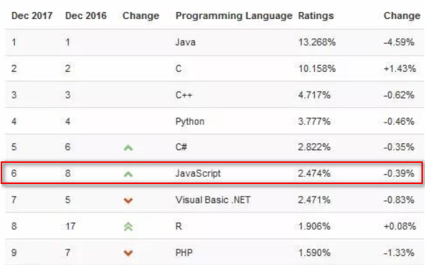
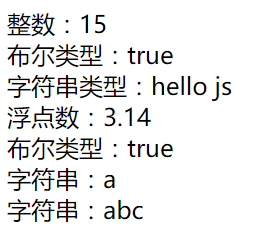
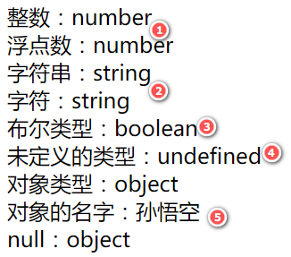
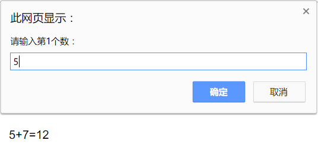
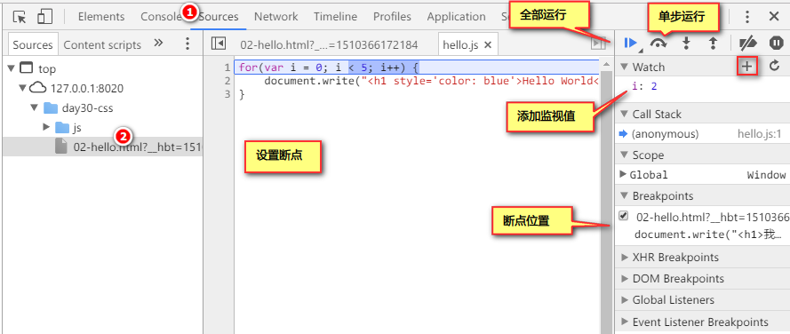
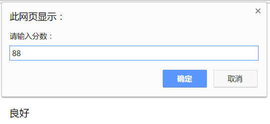
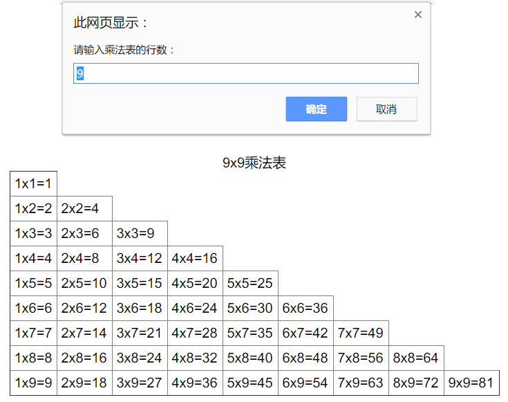

# JavaScript基础编程

## 学习目标：

1. 能够说出五种原始的数据类型(掌握)
2. 能够使用JS中常用的运算符(掌握)
3. 能够使用JS中的流程控制语句(掌握)
4. 能够在JS中定义命名函数和匿名函数(重点)
5. 能够使用JS中常用的事件(重点)
6. 能够使用数组中常用的方法(了解)
7. 能够使用日期对象常用的方法(了解)

------

# 第1章 JavaScript概述

## 1.1 javascript的作用

| 技术       | 作用                                                        |
| ---------- | ----------------------------------------------------------- |
| HTML       | 用于创建网页的结构                                          |
| CSS        | 对页面进行美化                                              |
| JavaScript | 用于与用户进行交互(校验表单，动态修改内存中的html和css代码) |

##  1.2 javaScript初体验

#### 案例需求：

​	使用JavaScript对表单进行验证：用户名不能为空，如果为空，则表单不能提交。并弹出错误信息框，如果不为空，则表单提交给服务器。

#### 案例效果：


#### 案例分析：

1) 表单提交的时候会激活onsubmit事件，如果这个事件返回false，则表单不能提交。

2) 写一个函数，得到文本框中的值，如果值为空，则弹出信息框，表单不能提交。

#### 实现代码：

```html
<!DOCTYPE html>
<html lang="en">
<head>
    <meta charset="UTF-8">
    <title>Title</title>
</head>
<body>
<h3>用户登录</h3>
<form action="server" onsubmit="return checkUser()">
    用户名：<input type="text" id="user"> <input type="submit" value="登录">
</form>
<script type="text/javascript">
    function checkUser() {
        var user = document.getElementById("user").value;
        if (user == "") {
            alert("用户名不能为空");
            return false;
        }
    }
</script>
</body>
</html>
```

## 1.3 javascript的基本概述

​	最初这种语言名字叫：LiveScript，最初由网景公司开发，后来这家公司被美国在线收购。JavaScript运行在浏览器端，而Java运行服务器端。以下是JS语言在所有语言中的排行榜。



## 1.4 javascript的特点

|     特点     | **Java**                              | **JavaScript**                                       |
| :----------: | ------------------------------------- | ---------------------------------------------------- |
| **面向对象** | 完全面向对象的语言：继承、封装、多态  | 基于对象的语言，不完全符合面向对象的思想             |
| **运行方式** | 编译型，运行过程需要生成字节码文件    | 解释型语言，不会生成中间文件，解释一定行数，再执行。 |
|  **跨平台**  | 安装了JVM就可以运行在不同的操作系统中 | 只要有浏览器的地方就可以运行                         |
|  **大小写**  | 区分大小写                            | 区分大小写                                           |
| **数据类型** | 强类型语言，不同的数据类型有严格区分  | 弱类型语言，不同类型的数据可以直接赋值给同一个变量。 |

## 1.5 javascript的语法组成

| **组成部分**        | **作用**                                   |
| --------------- | ---------------------------------------- |
| **ECMA Script** | 构成了JS核心的语法基础                             |
| **BOM**         | Browser Object Model 浏览器对象模型，用来操作浏览器上的对象 |
| **DOM**         | Document Object Model 文档对象模型，用来操作网页中的元素  |

------

# 第2章 JavaScript的基础语法

## 2.1 javascript的编写方式

1) 写在HTML内部的脚本

2) 以js文件的形式单独存在HTML的外部，使用的时候导入进来即可。

### &lt;script&gt;标签的说明：

1) \<script>中的src属性和type属性：
	src：要导入的外部JS文件
	type： 指定脚本的类型，固定值：text/javascript
2) \<script>标签个数：
	在一个HTML网页中可以出现多个script标签，每个标签中的脚本都会依次执行。
3)  出现的位置：
	可以出现在网页中的任意位置，甚至是html标签之外
4) 关于语句后面的分号：
	如果一条语句一行，可以省略分号，但不建议省略。

## 2.2 javascript的注释

| 语言             | 注释语法                       |
| -------------- | -------------------------- |
| **HTML**       | \<!-- 注释 -->               |
| **CSS**        | /* 注释 */                   |
| **JavaScript** | // 单行注释   <br /> /*多行注释 */ |

## 2.3 变量

### 2.3.1 变量的定义

| **数据类型** | **Java中定义变量**       | **JS中定义变量**      |
| -------- | ------------------- | ---------------- |
| **整数**   | int i = 5;          | var i = 5;       |
| **浮点数**  | float f = 3.14;     | var f = 3.14;    |
| **布尔**   | boolean b = true;   | var b = true;    |
| **字符**   | char c = 'a';       | var c = 'a';     |
| **字符串**  | String str = "abc"; | var str = "abc"; |

### 2.3.2  关于JS的弱类型

同一变量可以接受不同的数据类型。

### 2.3.3  字符和字符串类型的说明

 JS中只有字符串类型，没有字符类型，**字符串既可以使用双引号，也可以使用单引号。**

###  2.3.4   变量定义的特点

​       1) var关键字不是必须的，可以省略，但不建议省略

​       2) 变量名可以重复定义

​       3) 大括号不会影响到变量的使用范围

### 2.3.5 案例：输出不同类型的数据

#### 案例需求：

分别输出每一种类型JS的变量

#### 案例效果：



#### 案例代码：

```html
<!DOCTYPE html>
   <html>
   	<head>
   		<meta charset="UTF-8">
   		<title>输出变量</title>
   	</head>
   	<body>
   		<script type="text/javascript">
   			//变量的定义
   			var i = 15;
   			var f = 3.14;
   			var b = true;
   			{
   				var c = "a";
   			}
   			var str = 'abc';
   			
   			document.write("整数：" + i + "<br/>");
   			
   			var i = true;
   			document.write("布尔类型：" + i + "<br/>");
   			var i = "hello js";
   			document.write("字符串类型：" + i + "<br/>");
   			
   			document.write("浮点数：" + f+ "<br/>");
   			document.write("布尔类型：" + b+ "<br/>");
   			document.write("字符串：" + c+ "<br/>");
   			document.write("字符串：" + str+ "<br/>");
   			
   			{
   				var a = 3+ 5;
   			}
   			document.write("a=" + a + "<br/>");

   		</script>
   	</body>
</html>
```

   ## 2.4   数据类型

   ### 2.4.1   五种原始数据类型：

| **关键字**       | **说明**                                   |
| ------------- | ---------------------------------------- |
| **number**    | 数值型：整数和浮点数                               |
| **boolean**   | 布尔类型：true/false                          |
| **string**    | 字符串类型：包含字符和字符串                           |
| **object**    | 对象类型，定义对象语法：  var obj = { 属性名:属性值,     属性名:属性值  }; |
| **undefined** | 未定义的类型                                   |

   ###  2.4.2   typeof操作符

1. 作用：判断指定的变量数据类型

2. 写法：typeof(变量名) 或 typeof 变量名

3. null与undefined的区别：


-    null: 是一个object类型，但没有值


-    undefined：未初始化的类型，不知道是什么类型
###2.4.3 案例：数据类型的演示

#### 案例需求：

​	分别输出整数、浮点数、字符串(单引号和双引号)、布尔、未定义、对象、null的数据类型

#### 案例效果：



#### 案例代码：

```html
<!DOCTYPEhtml>
<html>
<head>
    <meta charset="UTF-8">
</head>
<body>
    <script type="text/javascript">
        var i = 5;
        document.write("整数：" + typeof(i)+ "<br/>");
        var f =3.14;
        document.write("浮点数：" + typeof(f) + "<br/>");
        var str ="abc";
        document.write("字符串：" + typeof(str) + "<br/>");
        var c ='a';
        document.write("字符串：" + typeof(c) + "<br/>");
        var b=true;
        document.write("布尔类型：" + typeof(b) + "<br/>");
        var u;
        document.write("未定义的类型：" + typeof(u) + "<br/>");
        //定义一个对象JSON对象
        var obj = {
            name: "孙悟空",
            age: 500
        };
        document.write("对象的类型：" + typeof(obj) + "<br/>");
        document.write("对象的名字：" + obj.name + "<br/>");
        var n = null;
        document.write("null：" + typeof(n) + "<br/>");
    </script>
</body>
</html>
```
### 2.4.3 字符串转换成数字类型

| **转换函数**         | **作用**                                   |
| ---------------- | ---------------------------------------- |
| **parseInt()**   | 将一个字符串转成整数，如果一个字符串包含非数字字符，那么parseInt函数会从首字母开始取数字字符，一旦发现非数字字符，马上停止获取内容。 |
| **parseFloat()** | 将一个字符串转成小数，转换原理同上。                       |
| **isNaN()**      | 转换前判断被转换的字符串是否是一个数字，非数字返回true            |

#### 代码演示：字符串转数字

```javascript
var a = "123abc123"; //字符串类型
var i = parseInt(a);
document.write(i+"<br/>"); 

var b = "3.14abc123";
i = parseFloat(b);
			
document.write(i);
			
//判断字符串是否为纯数字字符组成
var age = "1012";
document.write(isNaN(age));   //不是一个数字字符， 返回true.
```
## 2.5 常用运算符

### 2.5.1 算术运算符

算术运算符用于执行两个变量或值的运算。

赋值 **y = 5**, 以下表格将向你说明算术运算符的使用：

| **运算符** | **描述** | **例子**    | **y **值 | **x **值 |
| ------- | ------ | --------- | ------- | ------- |
| +       | 加法     | x = y + 2 | y = 5   | x = 7   |
| -       | 减法     | x = y - 2 | y = 5   | x = 3   |
| *       | 乘法     | x = y * 2 | y = 5   | x = 10  |
| /       | 除法     | x = y / 2 | y = 5   | x = 2.5 |
| %       | 余数     | x = y % 2 | y = 5   | x = 1   |
| ++      | 自增     | x = ++y   | y = 6   | x = 6   |
|         |        | x = y++   | y = 6   | x = 5   |
| --      | 自减     | x = --y   | y = 4   | x = 4   |
|         |        | x = y--   | y = 4   | x = 5   |

***任何类型的数据都可以使用算数运算符参与运算***

```javascript
//算术运算符
var a = 10; 
var b = false;
document.write(a+b);
```

### 2.5.2 赋值运算符

赋值运算符用于给 JavaScript 变量赋值。

给定 **x=10 **和**y=5**，下面的表格解释了赋值运算符：

| **运算符** | **例子** | **类似于** | **x值** |
| ---------- | -------- | ---------- | ------- |
| =          | x = y    | x = y      | x = 5   |
| +=         | x += y   | x = x + y  | x = 15  |
| -=         | x -= y   | x = x - y  | x = 5   |
| *=         | x *= y   | x = x * y  | x = 50  |
| /=         | x /= y   | x = x / y  | x = 2   |
| %=         | x %= y   | x = x % y  | x = 0   |

### 2.5.3 比较运算符

比较运算符用于逻辑语句的判断，从而确定给定的两个值或变量是否相等。

给定 **x=5**, 下表展示了比较运算符的使用：

| **运算符** | **描述**                       | **比较**  | **结果** |
| ---------- | ------------------------------ | --------- | -------- |
| ==         | 等于(只比较值的大小不比较类型) | x == 8    | false    |
|            |                                | x == “5”  | true     |
| ===        | 值及类型均相等（恒等于）       | x === "5" | false    |
|            |                                | x === 5   | true     |
| !=         | 不等于(比较值)                 | x != 8    | true     |
| !==        | 值与类型均不等（不恒等于）     | x !== "5" | true     |
|            |                                | x !== 5   | false    |
| >          | 大于                           | x > 8     | false    |
| <          | 小于                           | x < 8     | true     |
| >=         | 大于或等于                     | x >= 8    | false    |
| <=         | 小于或等于                     | x <= 8    | *true*   |

​	***数字可以与字符串进行比较，字符串可以与字符串进行比较。字符串与数字进行比较的时候会先把字符串转换成数字然后再进行比较***

```javascript
var a = 125;
var b  = "123";
document.write("字符串与数字比较的结果："+ (a>b)+"<br/>"); 
```

### 2.5.4 逻辑运算符

逻辑运算符用来确定变量或值之间的逻辑关系。

给定 **x=6 and y=3**, 以下实例演示了逻辑运算符的使用：

| 运算符 | 描述 | 例子                          |
| ------ | ---- | ----------------------------- |
| &&     | 和   | (x < 10 && y > 1) 为 true     |
| \|\|   | 或   | (x == 5 \|\| y == 5) 为 false |
| !      | 非   | !(x == y) 为 true             |

***逻辑运算符不存在单与&、单或|***

### 2.5.5 三目运算符/三元运算符

```javascript
var age = 39;
document.write("是成年人吗？"+ (age>=18?"是":"不是")+"\<br/>");
```

### 2.5.6 案例：运算符的演示

#### 案例需求：

输入2个数字计算它们的和，并且将结果输出到网页上

#### 案例效果：



#### 案例分析：

1) 使用prompt方法输入两个数字

2) 得到数字之后，使用转换函数转成数字

3) 计算两个数的和

4) 将计算结果输出到网页上

#### 案例代码：

```html
<!DOCTYPE html>
<html>
	<head>
		<meta charset="UTF-8">
		<title>运算符</title>
	</head>
	<body>
		<script type="text/javascript">
			//用户输入2个数
			//window对象中的方法，弹出一个输入信息框，参数：信息提示，默认值，返回的是字符串类型
			var num1 = window.prompt("请输入第1个数：", "0");
			var num2 = window.prompt("请输入第2个数：", "0");
			//对2个数求和，使用全局函数进行转换
			var result = parseFloat(num1) + parseFloat(num2);
			
			//输出结果到网页上
			document.write(num1 + "+" + num2 + "=" + result);
		</script>
	</body>
</html>
```
## 2.6 在浏览器中的调试

IE、Chrome、FireFox中调试的快捷键：F12

### 2.6.1 设置断点

*注：设置断点以后要重新刷新页面才会在断点停下来*



### 2.6.2 语法错误

*注：如果有语法错误，浏览器会出现提示*


## 2.7 流程控制语句

高级语言中的三种基本结构：顺序、分支、循环

### 2.7.1  if判断

#### if 语句：

在一个指定的条件成立时执行代码。 
```javascript
if(条件表达式) {
	//代码块;
}
```
#### if...else 语句 

在指定的条件成立时执行代码，当条件不成立时执行另外的代码。
```javascript
if(条件表达式) {
	//代码块;
}
else {
	//代码块;
}
```
#### if...else if....else 语句 

使用这个语句可以选择执行若干块代码中的一个。
```javascript
if (条件表达式) {
	//代码块;
}
else if(条件表达式) {
	//代码块;
}
else {
	//代码块;
}
```
*条件判断可以使用非逻辑运算符*

| **数据类型**              | **为真** | **为假** |
| --------------------- | ------ | ------ |
| **number**            | 非0     | 0      |
| **string**            | 非空串    | 空串     |
| **undefined**         |        | 假      |
| **NaN(Not a Number)** |        | 假      |
| **object**            | 非null  | null   |

### 2.7.2   swtich多分支

#### 语法一：case后使用变量，与Java相同
```javascript
switch(变量名) {
  case 常量值:
     break;
  case 常量值：
     break;
  default:
      break;
}
```
#### 语法二：case后使用表达式
```javascript
switch(true) {  //这里的变量名写成true
  case 表达式:     //如：n > 5
	break;
  case 表达式:
	break;
  default:
    break;
}
```
### 2.7.3 案例：判断一个学生的等级

#### 案例需求：

​	通过prompt输入的分数，如果90~100之间，输出优秀。80~90之间输出良好。60~80输出及格。60以下输出不及格。其它分数输出:分数有误。

#### 案例效果：



#### 案例分析：

1) 使用prompt得到输入的分数

2) 使用switch对分数进行判断

3) 如果在90到100之间，则输出优秀，其它依次类推。

#### 案例代码：

```javascript
<!DOCTYPE html>
<html>
  <head>
    <meta charset="UTF-8">
    <title></title>
  </head>
  <body>
      <script type="text/javascript">
        //所有window对象的方法，window可以省略
        var score = window.prompt("请输入分数：");   //score是字符串类型
        switch (true){   
          //在switch中表达式中会自动转换
          case score >=90 && score <=100:
            document.write("优秀");
            break;
          case score >=60 && score <=90:
            document.write("良好");
            break;
          case score >=0 && score < 60:
            document.write("不及格");
            break;
          default:
            document.write("分数输入有误");
            break;
        }
      </script>
  </body>
</html>
```

### 2.7.4 循环

#### while语句：
当指定的条件为 true 时循环执行代码
```javascript
while (条件表达式) {
    需要执行的代码;
}
```
#### do-while语句：
最少执行1次循环
```javascript
do {
    需要执行的代码;
}
while (条件表达式)
```
#### for 语句
循环指定次数
```javascript
for (var i=0; i<10; i++) {
	需要执行的代码;
}
```
#### break和continue
- break: 跳出整个循环

- continue：跳出本次循环


### 2.7.5 案例：乘法表

#### 案例需求：

以表格的方式输出乘法表，其中行数通过用户输入

#### 案例效果：



#### 案例分析：

1) 由用户输入乘法表的行数

2) 使用循环嵌套的方式，每个外循环是一行tr，每个内循环是一个td

3) 输出每个单元格中的计算公式

#### 案例代码：

```html
<!DOCTYPE html>
<html>
<head>
	<meta charset="UTF-8">
	<title></title>
	<style type="text/css">
		table {
			margin: auto;
			/*变成细边框*/
			border-collapse: collapse;
		}
		
		td {
			/*内边距*/
			padding: 5px;
		}
	</style>
</head>
<body>
	<script type="text/javascript">
		var num = window.prompt("请输入乘法表的行数：", "9");
		document.write("<table border='1' cellspacing='0'>");
		document.write("<caption>9x9乘法表</caption>")
		//写1个9x9乘法表，没有表格
		for (var i = 1; i <= num; i++) {
			//外循环就是一行
			document.write("<tr>");
			for(var j=1; j<=i; j++) {
				document.write("<td>");
				document.write(j + "x" + i+ "=" + (i*j));
				document.write("</td>");
			}
			document.write("</tr>");
		}
		document.write("</table>");
	</script>
</body>
</html>
```

## 2.8 函数的使用(重要)

### 2.8.1 函数的基本概述

​	函数是当它被调用时可重复使用的代码块，JS中的函数类似于Java中的方法。

​	函数有两种定义方式：命名函数和匿名函数

### 2.8.2 函数的基本使用

#### 函数的格式

```javascript
function 函数名(参数列表) {
    函数体;
    [return 返回值];
}
```

#### 代码实现自定义函数

##### 需求：定义一个函数实现加法功能

```html
<!DOCTYPE html>
<html lang="en">
<head>
    <meta charset="UTF-8">
    <title>两个数相加的函数</title>
</head>
<body>
<script type="text/javascript">
    //函数的定义
    function add(m,n) {
        return m+n;
    }

    //函数的调用
    document.write("两个数的和：" + add(5,3));
</script>
</body>
</html>
```

#### 注意的事项

1. 形参的类型：在函数定义的时候不用指定类型，因为是可变类型

2. 函数的返回值：如果一个函数中需要返回值，直接使用return返回，如果没有返回值，不写return。
3. 关于函数的重载：在JS中没有函数的重载，同名的函数会覆盖原来的函数，调用的时候，只会调用最后1个函数，而且实参的个数与形参数的个数没有关系。
4. 所有函数的内部都有一个隐藏数组，名字叫：arguments，用来接收调用时提交的所有的参数。


#### 演示：定义一个函数，在函数的内部输出arguments的长度和数组中的每个元素。

```html
<!DOCTYPE html>
<html>
<head>
    <meta charset="UTF-8">
    <title>输出隐藏数组</title>
</head>
<body>
    <script type="text/javascript">
    	function sum (a,b) {
    		//在函数的内部输出arguments的长度和数组中的每个元素
    		document.write("arguments数组的长度：" + arguments.length + "<hr/>");
    		//输出每个元素
    		for (var i = 0; i < arguments.length; i++) {
    			document.write(arguments[i] + "<br/>");
    		}
    		document.write("a=" + a + "<br />");
    		document.write("b=" + b + "<br />");
    	}
    	//调用
    	sum(3,10,8);
    	//sum(3);
    </script>
</body>
</html>
```

### 2.8.3 匿名函数

#### 语法：

```javascript
var 变量名 = function(参数列表) {
	函数体;
}
```

#### 函数调用：

```javascript
//匿名函数
var sayHi = function(name) {
	window.alert("Hello, " + name);
};

//调用
sayHi("NewBoy");
```

### 2.8.4 变量的作用域

#### 局部 JavaScript 变量

​	在 JavaScript 函数内部声明的变量（使用 var）是局部变量，所以只能在函数内部访问它。（该变量的作用域是局部的）。您可以在不同的函数中使用名称相同的局部变量，因为只有声明过该变量的函数才能识别出该变量。只要函数运行完毕，本地变量就会被删除。

#### 全局 JavaScript 变量

​	不是声明在函数体内部的变量，网页上的所有脚本和函数都能访问它。

#### 向未声明的 JavaScript 变量来分配值

​	如果您把值赋给尚未声明的变量，该变量将被自动作为全局变量声明。	如：

```javascript
name="传智播客";    //注：前面没有var
```

​	将声明一个全局变量，哪怕这个变量是声明在函数内部它也是一个全局变量。

## 2.9 案例：实现轮播图

#### 案例需求：

实现每过3秒钟切换一张图片的效果，一共5张图片，当显示到最后1张的时候，再次显示第1张。

#### 案例效果：


#### 案例分析：

1. 创建HTML页面，页面中有一个div标签，div标签内包含一个img标签。

2. body的背景色为黑色；div的类样式为container：设置为居中，加边框，宽度为850px；img的id为pic，宽度850px;

3. 五张图片的名字依次是0~4.jpg，放在项目的img文件夹下，图片一开始的src为第0张图片。

4. 编写函数：changePicture()，使用setInterval()函数，每过3秒调用一次。

5. 定义全局变量：num=1。

6. 在changePicture()方法中，设置图片的src属性为img/num.jpg。

7. 判断num是否等于4，如果等于4，则num=0；否则num++。


#### 案例代码：

```html
<!DOCTYPE html>
<html lang="en">
<head>
    <meta charset="UTF-8">
    <title>轮播图</title>
    <style type="text/css">
        body {
            background-color: black;
        }

        .container {
            /*居中*/
            margin: auto;
            border: 1px solid black;
            width: 850px;
        }

        img {
            width: 850px;
        }
    </style>
    <script type="text/javascript">
        //全局变量
        var num=1;
        //改变图片的src属性
        function changePicture() {
            //得到图片的src属性，替换它的值
            document.getElementById("pic").src = "img/" + num + ".jpg";
            //如果图片到了第4张图片，则重新变成第1张，否则就加1
            if (num == 4) {
                num = 0;
            }
            else {
                num++;
            }
        }

        //每过3秒调用一次
        window.setInterval("changePicture()", 3000);
    </script>
</head>
<body>
    <div class="container">
        
    </div>
</body>
</html>
```

------

# 第3章 JavaScript的事件(非常重要)

## 3.1 事件的作用

​	事件是可以被 JavaScript 侦测/监听到的用户行为。

​	网页中的每个元素都可以产生某些可以触发 JavaScript 函数的事件。比方说，我们可以在用户点击某按钮时产生一个 onClick 事件来触发某个函数。

​	***注意：事件通常要与函数配合使用，当事件发生时函数才会执行。***

## 3.2 事件的注册方式

### 3.2.1 使用命名函数

这种方式事件的注册写在标签体内

```html
<input type="radio" name="gender"  value="男生" onclick="output(this.value)"/>男生
<input type="radio" name="gender"  value="女生" onclick="output(this.value)"/>女生
<script type="text/javascript">
    function output(value) {
        alert("我是" + value);
    }
</script>
```

### 3.2.2 使用匿名函数

```html
<input type="button" id="b1"value="点我" />
<script type="text/javascript">
//匿名函数的写法
document.getElementById("b1").onclick = function () {
    alert("我是按钮，被点击了");
}
</script>
```

## 3.3 常见的事件

| **属性**        | **描述**                 |
| --------------- | ------------------------ |
| **onblur**      | 元素失去焦点             |
| **onchange**    | 用户改变域的内容         |
| **onclick**     | 鼠标点击某个对象         |
| ondblclick      | 鼠标双击某个对象         |
| onfocus         | 元素获得焦点             |
| onkeydown       | 某个键盘的键被按下       |
| onkeyup         | 某个键盘的键被松开       |
| **onload**      | 某个页面或图像被完成加载 |
| onmousedown     | 某个鼠标按键被按下       |
| **onmouseout**  | 鼠标从某元素移开         |
| **onmouseover** | 鼠标被移到某元素之上     |
| onmouseup       | 某个鼠标按键被松开       |
| onsubmit        | 提交按钮被点击           |

## 3.4 事件的案例演示

#### 案例需求：

​	通过一个案例演示上面常用的事件

#### 案例效果：

​	


#### 案例代码：

```html
<!DOCTYPE html>
<html>
<head>
    <meta charset="UTF-8">
    <title></title>
    <script type="text/javascript">
        //单击事件
        function testClick() {
            alert("哎呀被点了..");
        }

        //双击事件
        function changeImage(imgObj) {
            imgObj.src = "img/2.jpg";
        }

        //获取焦点
        function clearText(inputObj) {
            inputObj.value = "";
        }

        //失去焦点
        function setData(inputObj) {
            inputObj.value = "请输入用户名...";
        }

        //下拉框内容发生变化的时候会触发
        function changeTest(selectObj) {
            alert("当前改变后内容是：" + selectObj.value);
        }

        //表单提交的时候触发的方法
        function submitTest() {
            //如果表单提交的时候触发的方法返回的是false，那么该表单不允许提交，返回true才允许提交。
            alert("表单马上要提交了..");
        }

        //加载事件
        function ready() {
            alert("页面的元素已经被加载完毕了..");
        }
    </script>
</head>
<body onload="ready()">
<input type="button" value="点我啊" onclick="testClick()"/><br/><br/>
<!-- this代表了当前的标签对象 -->
<br/><br/>

<input type="text" value="请输入用户名..." onfocus="clearText(this)" onblur="setData(this)"/><hr/>

省份：
<select onchange="changeTest(this)">
    <option value="bj">北京</option>
    <option value="sh">上海</option>
    <option value="gd">广东</option>
    <option value="hn">湖南</option>
</select> <br/>

<!-- 如果该表单需要根据触发函数的返回值决定是否可以提交，那么必须在触发方法之前加上return关键字-->
<form action="success.html" onsubmit=" return submitTest()">
    用户名：<input type="text" name="userName"/>
    <input type="submit" value="提交"/>
</form>
<br/>
</body>
</html>
```

------

# 第4章 JavaScript的内置对象(了解)

基本要求:能够对数组进行遍历即可。

## 4.1 数组对象

注：数组在JS中是一个类，通过构造方法创建对象。

### 4.1.1 数组的四种方式

| **创建数组的方式**         | **说明**                              |
| -------------------------- | ------------------------------------- |
| **new Array()**            | 无参的构造方法，创建一个长度为0的数组 |
| **new Array(5)**           | 有参的构造方法，指定数组的长度        |
| **new Array(2,4,10,6,41)** | 有参的构造方法，指定数组中的每个元素  |
| **[4,3,20,6]**             | 使用中括号的方式创建数组(掌握)        |

### 4.1.2 JS中数组的特点

1) 数组中的每个元素的类型是可以不同的。

2) 数组的长度可以动态变化

3) 数组中包含大量的方法，类似于Java中的集合，而Java中的数组没有方法。

```javascript
//1. 创建一个长度为0的数组
var arr = new Array();
//2. 有参的构造方法，指定数组的长度
var arr = new Array(5);
//3. 有参的构造方法，指定数组中的每个元素
var arr = new Array(2,4,10,6);

//4. 使用中括号的方式创建数组
var arr = [4,3,20,6];

//创建一个数组，每个元素都不相同
var arr = [4, 'a', true, new Date(), 3.14];

arr[3] = 100;
arr[5] = 99;
arr[7]= true;

document.write("数组的长度是：" + arr.length + "<hr/>");
//输出每个元素
for (var i = 0; i < arr.length; i++) {
	document.write(arr[i] + "&nbsp;");
}
```
### 4.1.2 常用方法(了解)

| **方法名**             | **功能**                                   |
| ------------------- | ---------------------------------------- |
| **concat()**        | 连接两个或更多的数组，并返回结果                         |
| **reverse()**       | 将数组进行反转                                  |
| **join(separator)** | 与split()功能相反，将数组通过分隔符，拼成一个字符串。           |
| **sort()**          | 对字符串数组进行排序  <br />如果要对数字进行排序，要指定比较器函数。<br />**sort(function(m,n))**  数字两两比较  <br />1)      如果m大于n，则返回正整数  <br />2)      如果m小于n，则返回负整数  <br />3)      如果m等于n，则返回0 |

### 4.1.3 常用方法的演示代码

```javascript
var a1 = [1, 1, 1];
var a2 = [2, 2];
//拼接，返回新的数组
var a3 = a1.concat(a2);
document.write("a3:  " + a3 + "<br/>");
//添加元素
var a4 = a3.concat(33, 44);
document.write("a4:  " + a4 + "<br />");
//反转
a4.reverse();
document.write("a4:  " + a4 + "<br />");

[1,2,3,4,5,6]------>"1#2#3#4#5#6"
//将数组使用分隔符拼成一个字符串，功能上与split相反
var str = a4.join("^_^");
document.write("字符串：" + str + "<br/>");

//排序
//a) . 给字符串数组排序
var arr = ['jack', 'Rose', "Tom", "Jerry", "Kate"];
document.write("排序前：" + arr + "<hr />");
arr.sort();
document.write("排序后：" + arr + "<hr />");

//b). 字符串类型的数字排序
var arr = ["200", "3", "1234", "89", "21"];
document.write("排序前：" + arr + "<hr />");
arr.sort();
document.write("排序后：" + arr + "<hr />");
//c). 数字排序，默认也是按字符串的大小排序
var arr = [30,26,6,110,1234];
document.write("排序前：" + arr + "<hr />");
//排序器
arr.sort(function (m,n) {
	return n-m;
});
document.write("排序后：" + arr + "<hr />");
```

## 4.2 日期对象(了解)

### 4.2.1 日期对象的创建

作用：Date 对象用于处理日期和时间。

#### 创建 Date 对象的语法：

```javascript
var myDate=new Date()
```

*注：Date 对象会自动把当前日期和时间保存为其初始值。*

### 4.2.2 日期对象的方法

| **方法名**               | **作用**                                   |
| --------------------- | ---------------------------------------- |
| **getFullYear()**     | 从 Date 对象以四位数字返回年份。                      |
| **getMonth()**        | 从 Date 对象返回月份 (0 ~ 11)。                  |
| **getDate()**         | 从 Date 对象返回一个月中的某一天 (1 ~ 31)。            |
| **getDay()**          | 从 Date 对象返回一周中的某一天 (0 ~ 6)。其中：0表示周日，1~6周一到周六 |
| **getHours()**        | 返回 Date 对象的小时 (0 ~ 23)。                  |
| **getMinutes()**      | 返回 Date 对象的分钟 (0 ~ 59)。                  |
| **getSeconds()**      | 返回 Date 对象的秒数 (0 ~ 59)。                  |
| **getMilliseconds()** | 返回 Date 对象的毫秒(0 ~ 999)。                  |
| **getTime()**         | 返回 1970 年 1 月 1 日至今的毫秒数。类似于Java中的System.currentTimeMillis() |
| **toLocaleString()**  | 根据本地时间格式，把 Date 对象转换为字符串。                |

时间戳:格林威治时间1970年1月1日0时0分0秒到现在的总毫秒数

时间戳的作用:解决时差问题

### 4.2.3 案例：输出现在的时间

#### 案例需求：

​	在浏览器上输出现在的时间

#### 案例效果：


#### 案例分析：

1) 创建日期对象

2) 调用上面的方法分别得到年、月、日、时、分、秒、星期

3) 对每种数值进行格式的处理

4) 输出拼接后的字符串

#### 案例代码：

```html
<!DOCTYPE html>
<html lang="en">
<head>
    <meta charset="UTF-8">
    <title>系统现在的时间</title>
</head>
<body>
<script type="text/javascript">
    var now = new Date();
    var arr = ['星期日', '星期一', '星期二', '星期三', '星期四', '星期五', '星期六'];
    var y = now.getFullYear();   //年
    var m = now.getMonth() + 1;   //月
    var d = now.getDate();      //日
    var h = now.getHours();      //时
    var mi = now.getMinutes();     //分
    var s = now.getSeconds();     //秒
    var w = now.getDay();       //周
    //对格式进行处理
    var month = m < 10 ? '0' + m : m;   //月
    var day = d < 10 ? '0' + d : d;   //日
    var hour = h < 10 ? '0' + h : h;  //小时
    var minutes = mi < 10 ? '0' + mi : mi;  //分钟
    var seconds = s < 10 ? '0' + s : s;  //秒
    var week = arr[w];  //周
    document.write("现在时间是：" + y + "年" + month + "月" + day + "日 " + hour + ":" + minutes + ":" + seconds + " " + week);
</script>
</body>
</html>
```
