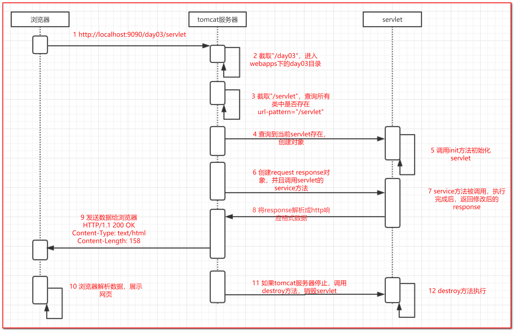
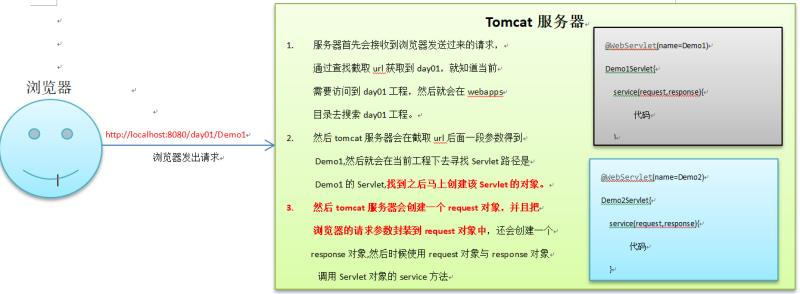

# Http协议&Tomcat服务器&servlet入门程序

# 学习目标

1.能够理解Http协议的请求和响应(理解)

2.能够知道http的get和post请求的区别(掌握)

3.能够理解软件的架构 (了解)

4.能够理解WEB资源概念 (了解)

5.能够理解WEB服务器(掌握服务器的作用)

6.能够启动关闭Tomcat服务器 (掌握)

7.能够解决Tomcat服务器启动时遇到的问题(掌握) 

​	1.没有配置JAVA_HOME或者环境变量

​	2.端口冲突

8.能够运用Tomcat服务器部署WEB项目 (掌握)

​	1.直接拷贝

​	2.通过配置虚拟路径的方式

9.能够使用idea编写servlet(重点)

10.能够使用idea配置tomcat方式发布项目(重点)

11.能够使用注解开发servlet(重点)

12.能够理解Servlet的生命周期(了解)

13.能够理解Servlet的运行原理(了解)

14.能够继承HttpServlet编写一个Servlet(非常重点)

15.能够理解Servlet的作用(重点)

​	1.接收请求

​	2.处理请求

​	3.做出响应

# 第1章 Http协议

## 1.1Http协议的概述

Http协议的全称是HyperText Transfer Protocol ,是用于在客户端和服务器端之间进行数据传输的一种协议。

### 1.1.1常见的几种协议

* 1.http协议
* 2.ftp协议:File Transfer Protocol
* 3.TCP/UDP协议
* 4.IPFS协议:星际文件协议(去中心化的文件传输协议) 

### 1.1.2 Http协议的版本

- 1.0
  - 请求 - 响应完毕后，连接关闭 ,如果还想接着请求，必须得重新连接
- 1.1  保持连接   (keep alive)
  - 请求 - 响应完毕后，连接未关闭 ，还可以继续发起请求

## 1.2请求部分(Request)

### 1.2.1请求的概述

请求是客户端发送给服务器的，其中包含了请求行、请求头、请求体，主要作用是将客户端的数据携带到服务器。

### 1.2.2请求的组成部分

#### 1.2.2.1请求行

请求行中主要包含:请求方式、url地址、协议版本

#### 1.2.2.2请求头

请求头是以"key:value"的形式往服务器端携带数据,常见的请求头及描述如下:见资料"header详解"

#### 1.2.2.3请求体

请求体是用于携带请求参数，"POST"请求方式包含请求体，而"GET"请求方式不包含请求体。

**跟请求体相关的请求头信息如下:**

```
Content-Type:表示请求体的内容的类型
Content-Length:表示请求体内容的长度
```

**问：get和post请求方式的区别？(掌握)**

如果是做数据的上传只能使用POST

答：

|                      | get请求方式 | post请求方式 |
| -------------------- | ----------: | :----------: |
| 数据长度是否有限制   |          是 |      否      |
| 是否包含请求体       |          否 |      是      |
| 数据是否暴露在地址栏 |          是 |      否      |

## 1.3响应部分(Response)

### 1.3.1响应的概述

响应中包含了服务器端给客户端的数据，响应一共分为三部分:响应行、响应头、响应体

### 1.3.2响应的组成部分

#### 1.3.2.1响应行

响应行中包括:响应状态码、状态码描述、协议版本

#### 常见的响应状态码如下

1. ```java
   200 OK
   请求已成功，请求所希望的响应头或数据体将随此响应返回。出现此状态码是表示正常状态。
   ```

2. ```java
   302 Move temporarily 重定向，请求的资源临时从不同的 URI响应请求。
   ```

3. ```java
   304 Not Modified  从缓存中读取数据，不从服务器重新获取数据。（不管）
   ```

4. ```java
   403 Forbidden  服务器已经理解请求，但是拒绝执行它。
   ```

5. ```java
   404 Not Found  请求失败，请求所希望得到的资源未被在服务器上发现。
   ```

   

   ```java
   500 Internal Server Error  服务器遇到了一个未曾预料的状况，导致了它无法完成对请求的处理。
   ```

#### 1.3.2.2响应头

响应头也是以key:value的形式携带数据到客户端，常见的响应头见"header详解"

#### 1.3.2.3响应体

响应体中的数据是用于直接显示在客户端或者给客户端下载的内容，是通过流的形式传入到客户端的。

跟响应体相关的响应头有如下一些:

```
Content-Type:表示响应体的内容类型
Content-Length:表示响应体的内容的长度
```


# 第2章 Tomcat服务器

## 2.1 软件的架构

### 2.1.1 网络应用程序（软件）的组成

网络中有很多的计算机，它们直接的信息交流，我们称之为：交互。  
在互联网交互的过程的有两个非常典型的交互方式——B/S 交互模型和C/S 交互模型。

**什么是B/S 交互模型？**

答：Browser和Server，就是浏览器和服务器交互模型。

优点:1.开发周期短、开发成本小。2.不受系统和平台的限制，只需要浏览器。3.一般不用更新

缺点:1.用户体验差   2.服务器压力很大

**什么是C/S 交互模型？**

答：Client和Server,就是客户端（例如：百度网盘）和服务器交互模型。

优点:1.服务器压力小一些。2.用户体验好，对网速的要求没有那么高。

缺点:1.开发成本高。2.对客户端的系统和平台有要求。3.占用客户端的存储空间。


**B/S 和C/S交互模型相同点和不同点：**

**相同点：**

1. **都是基于请求-响应交互模型，即：**

   **浏览器（客户端） 向 服务器发送 一个 请求。**

   **服务器 向 浏览器（客户端）回送 一个 响应 。**

2. **必须先有请求 再有响应** 

3. **请求和响应成对出现** 

**不同点：**

1. **实现C/S模型需要用户在自己的操作系统安装各种客户端软件（百度网盘、腾讯QQ等）；实现B/S模型，只需要用户在操作系统中安装浏览器即可。**


注：B/S模型可以理解为一种特殊C/S模型。


## 2.2 web资源的类别

Web资源就是存放在服务器上的资源

### 2.2.1 静态资源
      指web页面中供人们浏览的数据始终是不变。比如：HTML、CSS、JS、图片、音频、视频。

### 2.2.2 动态资源

      指web页面中供人们浏览的数据是由程序产生的，不同时间点访问web页面看到的内容各不相同。
比如：你在不同时间搜索微博的热门话题内容是不一样的，每天的天气情况也是变化的。这些数据由程序生成，JSP/Servlet、等技术都可以完成。

	总结：
		静态资源的数据都是写死在页面上的固定不变。
		动态资源浏览器访问的结果是变化的（动态web资源你的数据都是程序读取数据库、xml等文件生成的数据）。
​	接下来主要学习动态web资源。      

## 2.3 服务器的概念

### 2.3.1 什么是服务器

​	服务器就是一个软件，任何电脑只需要安装上了服务器软件，然后该电脑的指定目录下的资源就能提供对外访问的资源。

## 2.4 服务器的作用

### 2.4.1服务器的作用

**提供计算服务的设备，服务类型有很多，常见的有：数据库服务器、应用服务器、ftp服务器、dns服务器等。**


## 2.5 常见的应用服务器软件
### 2.5.1 常见的服务器软件介绍
1. **WebLogic**

   ​	Oracle公司的产品，是目前应用最广泛的Web服务器，支持J2EE规范。WebLogic是用于开发、集成、部署和管理大型分布式Web应用、网络应用和数据库应用的Java应用服务器。

2. **WebSphere**

   ​       IBM公司的WebSphere，支持JavaEE规范。WebSphere 是随需应变的电子商务时代的最主要的软件平台，可用于企业开发、部署和整合新一代的电子商务应用。

3. **Glass Fish**

   ​      最早是Sun公司的产品，后来被Oracle收购，开源，中型服务器。

4. **JBoss** 

   ​      JBoss公司产品，开源，支持JavaEE规范，占用内存、硬盘小，安全性和性能高。

5. **Tomcat**

   ​    中小型的应用系统，免费开源，支持JSP和Servlet。	

   ​    注意：今天我们学习和使用的是tomcat服务器。

## 2.6 tomcat服务器软件安装和介绍(掌握)

Tomcat基本概述：	

​	Tomcat服务器是一个免费的开放源代码的Web应用服务器。Tomcat是Apache软件基金会（Apache Software Foundation）的Jakarta项目中的一个核心项目，由Apache、Sun和其他一些公司及个人共同开发而成。由于有了Sun的参与和支持，最新的Servlet 和JSP规范总是能在Tomcat中得到体现。

​	因为Tomcat技术先进、性能稳定，而且免费，因而深受Java爱好者的喜爱并得到了部分软件开发商的认可，是目前比较流行的Web应用服务器。

### 2.6.1 tomcat服务器软件下载

1. **先去官网下载：http://tomcat.apache.org/，选择tomcat8版本（红框所示）**：

   

2. **选择要下载的文件（红框所示）**：

   

    tar.gz 文件 是linux操作系统下的安装版本

    exe文件是window操作系统下的安装版本

    zip文件是window操作系统下压缩版本（我们选择zip文件）

   

3. **下载完成**：


### 1.6.2 tomcat服务器软件安装
1. **直接解压当前这个tomcat压缩包**：
2. **配置环境变量**：

   tomcat运行依赖于java环境：
   		

### 2.6.3 启动与关闭tomcat服务器
1. **启动tomcat服务器**

   查找tomcat目录下bin目录，查找其中的startup.bat命令，双击启动服务器：
   

   启动效果：
   

   

   

2. **测试访问tomcat服务器**

   打开浏览器在，在浏览器的地址栏中输入：

   http://127.0.0.1:8080

   http://localhost:8080

   

   注： Localhost相当于127.0.0.1

   

3. **关闭tomcat服务器**


​	查找tomcat目录下bin目录，查找其中的shutdown.bat命令，双击关闭服务器：


### 2.6.4 tomcat安装常见的问题
1. **无法启动（闪退：cmd命令窗口出现一下，就消失）**：

   主要原因：没有配置JAVA_HOME环境变量。
   JAVA_HOME 环境变量 中配置的是JDK的安装目录，不包含bin目录，不是tomcat的安装目录。

   闪退的原因查看：可以在startup.bat文件末尾书写pause命令。让运行的窗口暂停。

   效果：
   

   

2. **端口被占用导致启动失败**

   如果启动的时候，发生异常问题，这时有可能是端口被占用。

   Tomcat服务器在启动的时候默认占用本地的8080端口，如果这个端口被占用，启动的时候就会报错。

   报错内容可以通过查询tomcat目录下的logs目录中Catalina.当前系统年月日.log文件查看，如下图：

   

   我们需要做的是查看本地端口使用情况，关闭占用端口的程序：
   在dos窗口中输入  netstat –nao 就可以查看当前端口的占用情况：

   

   使用任务管理器---->选择详细信息---->查看pid为11604（查询出来的										值），关闭结束进程即可：

   

   注意：如果这个进程是操作系统的任务进程，这时一般是不能停止这个进程。

   如果是系统进程占用端口，那么我们只能换一个端口，下面看如何修改端口：

   

3. **修改tomcat启动端口**

   Tomcat服务器的配置文件，全部都在tomcat的安装目录下conf目录下：


​	server.xml:服务器端口配置、服务器自身配置文件

​	打开server.xml，修改服务器端口：


​	修改tomcat的端口为9090：

​	修改完server.xml文件必须重启服务器才能有效。
​	通过浏览器的地址栏访问测试：http://localhost:9090

### 2.6.5 tomcat目录介绍


## 2.7 tomcat的发布方式
### 1.7.1 在webapps文件夹下面直接发布

​	**只要将准备好的web资源直接复制到tomcat/webapps文件夹下，就可以通过浏览器使用http协议访问获取**


创建aaa文件夹：

定义一个html文件，内容为：

```html
 <h1>Hello Tomcat</h1>
```

http://localhost:8080/itheima58/hello.html

http://localhost:8080代表找到本机的端口号为8080 的Tomcat服务器

/itheima58 项目名

/hello.html 项目中的某个资源


### 2.7.2 使用虚拟路径的方式发布项目（两种方式）
1. **第一种：配置server.xml，添加context标签**

   第一步：在c盘work目录下创建一个文件夹为aa，在aa文件夹中添加一个1.html文件内容为：hello world！！！

   ​	

   

   ​	第二步：在tomcat/conf/server.xml中找到<Host>标签，添加<Context>标签，如图所示：

   **注：这一种方式有一个缺点，就是server.xml是tomcat核心文件一旦出错，导致整个tomcat无法启动。**

   

2. **第二种：配置独立xml文件**

   第一步：在tomcat/conf目录下新建一个Catalina目录（如果已经存在无需创建）
   
   ​第二步：在Catalina目录下创建localhost目录
   
   ​第三步：在localhost中创建xml配置文件，名称为：second（注：这个名称是浏览器访问路径）
   
   ​第四步：添加xml文件的内容为：

   <Context docBase="C:\work\bb" />

   第五步：在C:\work\bb下创建1.html，内容为“hello tomcat！！！”，访问测试
   

**第二种发布方式的优点：无需重启服务器自动加载和卸载项目**

演示：
在second.xml创建一个bak文件夹，将second.xml移动到bak文件夹之后：

服务器自动卸载项目：

将second.xml移动回到localhost目录下：

服务器自动加载项目（需要等待一会儿时间）：


### 2.8 tomcat总结

1. **设计目的：**

   Tomcat是一个免费的开源的Servlet容器，实现了JAVAEE规范，遵循http协议的的服务器

2. **存放内容：**

   tomcat可以存放静态和动态资源

   

3. **应用场景：**

   tomcat用来部署javaweb应用程序

4. **怎么部署JavaWeb应用**

   1. 拷贝项目到WebApps目录
   2. 通过虚拟路径部署

# 第3章Servlet
## 3.1 Servlet2.5实现Hello world例子(了解)
### 3.1.1 servlet的基本概述
Servlet 运行在服务端的Java小程序，是sun公司提供一套规范，用来处理客户端请求、响应给浏览器的动态资源。但servlet的实质就是java代码，通过java的API动态的向客户端输出内容

1. **查阅JavaEE手册（帮助文档）阅读Servlet规范**：

   

   

   **根据文档总结，书写servlet一个三个步骤**：

   **1）创建一个class实现servlet接口**

   **2）重写service方法**

   **3）创建的类必须在web.xml文件中做配置**

   

2. **为什么要做配置？**

   答：必须将请求路径和java程序的对应关系建立起来。

### 3.1.2 servlet与普通的java程序的区别
​	1.必须实现servlet接口
​	2.必须在servlet容器（服务器）中运行
​	3.servlet程序可以接收用户请求参数以及向浏览器输出数据

### 3.1.3 代码实现servlet的步骤

1. 创建web工程
2. 在cn.itcast.web包下创建一个类实现 Servlet接口
3. 实现service方法
4. 在web.xml中配置书写好的servlet

### 3.1.4 servlet代码实现

1. **创建web工程**

   

   
   
   

   

2. **在cn.itcast.web包下创建一个类实现Servlet接口**

   

   servlet代码：

```java
package cn.itcast.web;

import javax.servlet.*;
import javax.servlet.http.HttpServlet;
import javax.servlet.http.HttpServletRequest;
import javax.servlet.http.HttpServletResponse;
import java.io.IOException;
	
public class DemoServlet implements Servlet{
	
  @Override
  public void init(ServletConfig servletConfig) throws ServletException {
  }

  @Override
  public ServletConfig getServletConfig() {
    return null;
  }
	
  @Override
  public void service(ServletRequest servletRequest, ServletResponse servletResponse) throws ServletException, IOException {
    System.out.println("第一个servlet程序");
  }

  @Override
  public String getServletInfo() {
    return null;
  }

  @Override
  public void destroy() {
  }
}
```


​	Web.xml配置（该文件在web/WEB-INF 文件夹下）：

```java
<?xml version="1.0" encoding="UTF-8"?>
  <web-app xmlns="http://java.sun.com/xml/ns/javaee"
  xmlns:xsi="http://www.w3.org/2001/XMLSchema-instance"
    xsi:schemaLocation="http://java.sun.com/xml/ns/javaee
      http://java.sun.com/xml/ns/javaee/web-app_2_5.xsd"
version="2.5">
	<servlet>
  		<servlet-name>DemoServlet</servlet-name>
 		 <servlet-class>cn.itcast.web.DemoServlet</servlet-class>
    </servlet>
    <servlet-mapping>
    	<servlet-name>DemoServlet</servlet-name>
    	<url-pattern>/demo</url-pattern>
    </servlet-mapping>
</web-app>
```


###	3.1.4 idea配置tomcat方式发布
​	Servlet已经书写完成，接下来，我们要将书写好的servlet发布到tomcat上去。
​	接下里我们要将idea和tomcat集成到一起，可以通过idea就控制tomcat的启动和关闭：
1. **添加tomcat服务器部署项目**

   
   
   
   
   
   
   
   

   点击OK设置完成！

   

2. **启动服务器：**

   

3. **浏览器测试访问：**

   http://localhost:9090/servlet/demo

4. **控制台打印效果：**

   

## 3.2 Servlet3.0实现Hello world例子
### 3.2.1 Servlet2.5与Servlet3.0的区别

**Servlet3.0相较于Servlet2.5：**

​	**新增了一些注解，简化的javaweb代码开发，可以省略web.xml配置文件**
​	**支持异步处理（多线程技术）**
​	**支持可插性特性（书写的代码编译后生成的class文件可以直接部署到其他项目的，自动加载执行）**


### 3.2.2 代码实现Servlet3.0步骤（注解配置servlet演示）

1. **创建JavaEE7工程**
2. 创建servlet，在@WebServlet注解中添加urlPatterns = "/hello"，作为请求路径

### 3.2.3  注解开发servlet代码演示

1. **创建JavaEE7工程：**

   

   

   

   

2. 注解开发servlet代码演示：

   ```java
   package cn.itcast.web;
   
   import javax.servlet.*;
   import javax.servlet.annotation.WebServlet;
   import java.io.IOException;
   
   //name = "HelloServlet"：servlet名称，相当于web.xml中的<servlet-name>
   //urlPatterns = "/hello"：servlet的访问路径，相当于<url-pattern>
   @WebServlet(name = "HelloServlet",urlPatterns = "/hello")
   public class HelloServlet implements Servlet {
       @Override
       public void init(ServletConfig servletConfig) throws ServletException {
   
       }
   
       @Override
       public ServletConfig getServletConfig() {
           return null;
       }
   
       @Override
       public void service(ServletRequest servletRequest, ServletResponse servletResponse) throws ServletException, IOException {
           System.out.println("HelloServlet执行.......");
       }
   
       @Override
       public String getServletInfo() {
           return null;
       }
   
       @Override
       public void destroy() {
   
       }
   }
   
   ```

   配置tomcat服务器启动测试（配置过程之前已经展示，这里不再重复）

   浏览器地址栏输入：http://localhost:8080/servlet2/hello

   测试成功：

   ## 4.1  Servlet生命周期的概述

   ### 4.1.1 什么是生命周期

   ​	一个对象从创建到消亡的过程，就是生命周期。因此，对Servlet生命周期的学习，我们就是研究Servlet什么时候生，什么时候死。

   ## 4.2  servlet生命周期相关的方法

   ​	首先我们来回顾servlet接口的文档内容，其中一部分如图所示：

   

   ### 4.2.1 API 介绍

   ​	上图中，我们注意到两个点，servlet的创建和销毁由两个相关的方法init方法和destroy方法

   1. ```java
      void destroy() 销毁servlet的方法
      ```

   2. ```java
      void init(ServletConfig config)  初始化servlet的方法
      ```

   

   我们可以调用测试一下这两个方法：

   ### 4.2.2 使用步骤

   1. 创建LifeCircleServlet初始化
   2. 复写init、service、destroy方法
   3. 访问servlet测试初始化LifeCircleServlet
   4. 关闭服务器测试销毁LifeCircleServlet

   

   ### 5.2.3 演示代码

   ```java
   package cn.itcast.web;
   
   import javax.servlet.ServletException;
   import javax.servlet.ServletRequest;
   import javax.servlet.ServletResponse;
   import javax.servlet.annotation.WebServlet;
   import javax.servlet.http.HttpServlet;
   import javax.servlet.http.HttpServletRequest;
   import javax.servlet.http.HttpServletResponse;
   import java.io.IOException;
   
   @WebServlet(name = "LifeCircleServlet",urlPatterns = "/life")
   public class LifeCircleServlet extends HttpServlet {
   
       @Override
       public void init() throws ServletException {
           super.init();
           System.out.println("LifeCircleServlet初始化。。。");
       }
   
       @Override
       public void service(ServletRequest req, ServletResponse res) throws ServletException, IOException {
           System.out.println("LifeCircleServlet执行。。。");
       }
   
       @Override
       public void destroy() {
           super.destroy();
           System.out.println("LifeCircleServlet销毁。。。");
       }
   }
   
   ```

   

   效果：

   ```java
   访问servlet：
   LifeCircleServlet初始化。。。
   LifeCircleServlet执行。。。
     
   关闭tomcat服务器：
   LifeCircleServlet销毁。。。
   ```

   

   

   ## 4.3  servlet生命周期流程

   虽然简单使用过了servlet生命周期相关的方法，但是servlet从创建到销毁的过程对大家来说还是没说清楚，因此，我们以时序图的方式给大家展示了servlet的运行过程，注意图中每一步都由序号，按照序号查看每一个步骤。

   

   附：servlet在初始化一次之后，就不再创建，因此如果多次访问同一个servlet的效果是这样的：

   ```java
   LifeCircleServlet初始化。。。
   LifeCircleServlet执行。。。
   LifeCircleServlet执行。。。
   LifeCircleServlet执行。。。
   ```

   因此servlet是一个单例对象。

## 3.5Servlet的三种url-pattern的配置方式

* 1.全路径匹配

```
"/demo"
```


* 2.目录匹配

```
/demo/*
```


* 3.扩展名匹配

```
"*.jsp"、"*.avi"
```

## 3.6 Servlet的体系结构

### 3.6.1 什么是Servlet的体系结构

目前我们已经学会创建一个类实现sevlet接口的方式开发Servlet程序，实现Servlet接口的时候，我们必须实现接口的所有方法。但是，在servlet中，真正执行程序逻辑的是service，对于servlet的初始化和销毁，由服务器调用执行，开发者本身不需要关心。因此，有没有一种更加简洁的方式来开发servlet程序呢？

我们先来查阅API回顾Servlet接口：

官方推荐使用继承的方式，继承GenericServlet 或者HttpServlet来实现接口，那么我们接下来再去查看一下这两个类的API：

GenericServlet ：

GenericServlet 是一个类，它简化了servlet的开发，已经提供好了一些servlet接口所需的方法，我们开发者只需要重写service方法即可

我们来使用GenericServlet 创建servlet：

1. 创建一个类
2. 继承GenericServlet
3. 重写service方法

```java
package cn.itcast.web;

import javax.servlet.GenericServlet;
import javax.servlet.ServletException;
import javax.servlet.ServletRequest;
import javax.servlet.ServletResponse;
import javax.servlet.annotation.WebServlet;
import java.io.IOException;

@WebServlet(name = "GenericDemoServlet",urlPatterns = "/generic")
public class GenericDemoServlet extends GenericServlet {
    @Override
    public void service(ServletRequest servletRequest, ServletResponse servletResponse) throws ServletException, IOException {
        System.out.println("GenericDemoServlet执行.......");
    }
}

```

虽然，GenericServlet已经简化了servlet开发，但是我们平时开发程序需要按照一种互联网传输数据的协议来开发程序——http协议，因此，sun公司又专门提供了HttpServlet，来适配这种协议下的开发。

HttpServlet：

继承HttpServlet，我们需要重写doGet、doPost等方法中一个即可，根据Http不同的请求，我们需要实现相应的方法。

我们来使用HttpServlet创建servlet：	

1. 创建一个类
2. 继承HttpServlet
3. 重写doGet方法

```java
package cn.itcast.web;

import javax.servlet.ServletException;
import javax.servlet.annotation.WebServlet;
import javax.servlet.http.HttpServlet;
import javax.servlet.http.HttpServletRequest;
import javax.servlet.http.HttpServletResponse;
import java.io.IOException;

@WebServlet(name = "HttpDemoServlet",urlPatterns = "/http")
public class HttpDemoServlet extends HttpServlet {
    @Override
    protected void doGet(HttpServletRequest req, HttpServletResponse resp) throws ServletException, IOException {
        System.out.println("HttpDemoServlet执行.......");
    }
}
```

通过以上两个API阅读，同学们注意一个细节HttpServlet是GenericServlet的子类，它增强了GenericServlet一些功能，因此，在后期使用的时候，我们都是选择继承HttpServlet来开发servlet程序。


虽然目前开发servlet的选择继承类，已经确定，但是另一个问题一直还在我们头脑中，那就是我们学的这些浏览器、服务器、servlet等，到底是如何运行的？


那么接下来，我们来看看servlet的运行原理。

## 3.7 servlet运行原理



**总结**

```
通过上述流程图我们重点需要掌握如下几个点：
	1. Servlet对象是由服务器创建
	2. request与response对象也是由tomcat服务器创建
	3. request对象封装了浏览器过来的所有请求信息，response对象代表了服务器的响应信息。
```

VPN网址:https://dotunnel005.com

VPN优惠码:667010