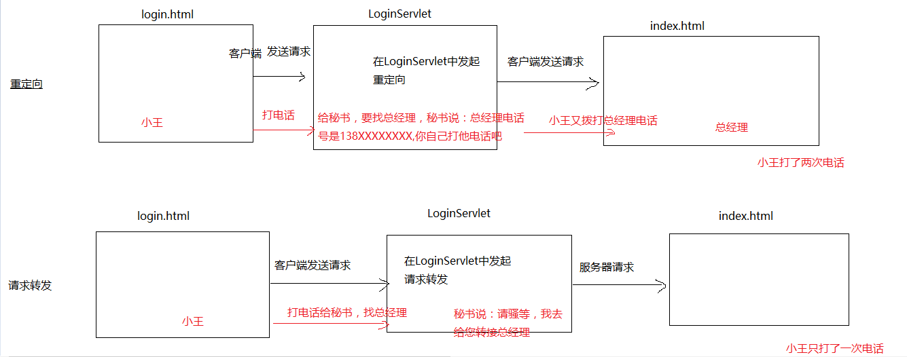

# Request学习

# 学习目标

1.能够使用Request对象获取HTTP协议请求内容(掌握)(包含请求行、请求头、请求体的信息)

2.能够处理HTTP请求参数的乱码问题 (掌握)

3.能够使用Request域对象 (掌握)

4.能够使用Request对象做请求转发(掌握)

5.能够完成登录案例

6.能够理解相对路径和绝对路径(了解)

# 第1章 request对象获取请求信息

## 1.1 request对象的基本概念

1. **什么是HttpServletRequest？**

   **HttpServletRequest对象代表客户端的请求，当客户端通过HTTP协议访问服务器时，HTTP请求中的所有信息都封装在这个对象中，开发人员通过这个对象的方法，可以获得客户这些信息。**

   以下是API文档中的介绍：

   

   通过文档阅读可以注意到一个细节HttpServletReuqest不是相关请求的顶级接口，它继承自父接口——ServletRequest：

   

   **通过Request对象进行的常用操作:**

   **获取客户机信息**

   **获取请求头信息**

   **获取请求参数**

   **利用请求域传递对象**

2. HttpServlet有许多的API我们从何学起？

   答：我们按照学习http请求组成部分，按——请求行、请求头、请求体顺序学习。

## 1.2 request获取请求行信息

### 1.2.1 请求行的组成元素（通过request获取请求行数据）
      在http协议中我已经看到了http协议中请求行的内容——分为请求方式、请求路径、协议版本。在HttpServletRequest概述中我们知道浏览器与请求相关的数据封装在request中，因此，接下来我们学习如何使用request对象获取请求行的数据。

### 3.2.2 API介绍

1. ```java
   String getMethod() 	获取请求方式的类型（重要）
   ```

2. ```java
   String getRequestURI()  获取请求行中的资源名部分:/项目名/资源名
   ```

3. ```java
   StringBuffer getRequestURL()  获取客户端发出请求完整URL:http://localhost:8080/项目名:资源名
     (重要)
   注：
   	uri: 统一资源标识符,用来标识一个资源,资源路径。
   	url: 统一资源定位符,是一种具体的URI,可以用来标识一个资源.并且指明了如何定位一个资源.
   ```

4. ```java
   String getProtocol()  获取当前协议的名称和版本(了解)
   ```

5. ```java
   String getRemoteAddr()	获取客户端的IP地址
   ```


### 3.2.3 使用步骤
1. 创建DemoServlet
2. 在DemoServlet中的doGet或者doPost方法的参数列表，已经包含了request对象，调用方法即可。
3. 将数据打印在控制台

### 3.2.4 演示代码


```java
package cn.itcast.web;

import javax.servlet.ServletException;
import javax.servlet.annotation.WebServlet;
import javax.servlet.http.HttpServlet;
import javax.servlet.http.HttpServletRequest;
import javax.servlet.http.HttpServletResponse;
import java.io.IOException;

@WebServlet(name = "DemoServlet",urlPatterns = "/demo")
public class DemoServlet extends HttpServlet {
    protected void doPost(HttpServletRequest request, HttpServletResponse response) throws ServletException, IOException {
        doGet(request,response);
    }

    protected void doGet(HttpServletRequest request, HttpServletResponse response) throws ServletException, IOException {

        /**
         * 1.   String getMethod()
                获取请求方式的类型
         * */
        String method = request.getMethod();
        System.out.println("获取请求方式的类型:"+method);

        /**
         * 2.   String getRequestURI()
                获取请求行中的资源名部分
         * */
        String requestURI = request.getRequestURI();
        System.out.println("获取请求行中的资源名部分:"+requestURI);

        /**
         * 3.   StringBuffer getRequestURL()
                获取客户端发出请求完整URL
         * */
        StringBuffer getRequestURL = request.getRequestURL();
        System.out.println("获取客户端发出请求完整URL:"+getRequestURL);

        /**
         * 4.   String getProtocol()
                获取当前协议的名称和版本
         * */
        String getProtocol = request.getProtocol();
        System.out.println("获取当前协议的名称和版本:"+getProtocol);

        /**
         * 5.   String getRemoteAddr()
                获取IP地址
         * */
        String getRemoteAddr = request.getRemoteAddr();
        System.out.println("获取IP地址:"+getRemoteAddr);

    }
}
```

效果一：测试地址——http://localhost:9090/day02/demo

```java
获取请求方式的类型:GET
获取请求行中的资源名部分:/day02/demo
获取客户端发出请求完整URL:http://localhost:9090/day02/demo
获取当前协议的名称和版本:HTTP/1.1
获取IP地址:0:0:0:0:0:0:0:1
```


效果二：测试地址——http://127.0.0.1:9090/day02/demo

```java
获取请求方式的类型:GET
获取请求行中的资源名部分:/day02/demo
获取客户端发出请求完整URL:http://127.0.0.1:9090/day02/demo
获取当前协议的名称和版本:HTTP/1.1
获取IP地址:127.0.0.1
```

问：为什么要测试两次？

答：同学们观察下两次打印的IP地址会发现不一样，因此，注意，Localhost和127.0.0.1效果一致，但是localhost默认使用ipv6本机地址——0:0:0:0:0:0:0:1，而127.0.0.1是ipv4的本机地址。

##	1.3 request获取请求头信息
### 1.3.1 获取请求头信息常用的方法

#### 1.3.1.1 API介绍

1. ```java
   String getHeader(String name)  以String 的形式返回指定请求头的值
   ```

2. ```java
   Enumeration getHeaderNames() 返回此请求包含的所有头名称的枚举(了解即可)
   ```


#### 3.3.1.2 使用步骤

1. 创建DemoServlet2
2. 在DemoServlet2中的doGet或者doPost方法的参数列表，已经包含了request对象。因此，调用方法即可。
3. 将结果打印在控制台


#### 3.3.1.3 演示代码


```java
package cn.itcast.web;

import javax.servlet.ServletException;
import javax.servlet.annotation.WebServlet;
import javax.servlet.http.HttpServlet;
import javax.servlet.http.HttpServletRequest;
import javax.servlet.http.HttpServletResponse;
import java.io.IOException;
import java.util.Enumeration;

@WebServlet(name = "DemoServlet2",urlPatterns = "/demo2")
public class DemoServlet2 extends HttpServlet {
    protected void doPost(HttpServletRequest request, HttpServletResponse response) throws ServletException, IOException {
        doGet(request,response);
    }

    protected void doGet(HttpServletRequest request, HttpServletResponse response) throws ServletException, IOException {

        /**
         * 1.   String getHeader(String name)
                以 String 的形式返回指定请求头的值
         * */
        String header = request.getHeader("User-Agent");
        System.out.println("getHeader:"+header);
        System.out.println();
        /**
         * 2.  Enumeration getHeaderNames()
               返回此请求包含的所有头名称的枚举
         * */
        Enumeration<String> headerNames = request.getHeaderNames();
        while (headerNames.hasMoreElements()){
            System.out.println("getHeaderNames:"+headerNames.nextElement());
        }

    }
}
```
效果：

```java
getHeader:Mozilla/5.0 (Windows NT 10.0; WOW64) AppleWebKit/537.36 (KHTML, like Gecko) Chrome/63.0.3239.132 Safari/537.36

getHeaderNames:host
getHeaderNames:connection
getHeaderNames:cache-control
getHeaderNames:user-agent
getHeaderNames:upgrade-insecure-requests
getHeaderNames:accept
getHeaderNames:accept-encoding
getHeaderNames:accept-language
getHeaderNames:cookie

```


### 3.3.2 案例：使用referer实现防盗链

#### 3.3.2.1 案例需求

1. 问：什么是盗链？

   答：如下图所示。

   

2. 问：如何防止盗链？

   答：在上图中用户一共发送两次请求，第一次访问正规服务器中的download.jsp页面，

   第二次访问盗链者服务器中的download.jsp页面，二个download.jsp页面虽然内容相同，

   但来源不相同。

   如果download.jsp中的请求，来源于盗链者服务器，我们就显示不可以下载；

   如果download.jsp中的请求，来源于正规服务器，我们就显示可以下载；

   ​

#### 3.3.2.2 案例效果

​	两次请求同一个域名，显示可以下载

​	两次请求同不同域名，显示无法下载

#### 3.3.2.3 案例分析

1. 创建一个DownloadServlet。
2. 使用request对象的getHeader方法获取referer请求头信息。
3. 通过referer判断请求的来源地址，判断是否与当前项目统一。


#### 3.3.2.4 实现步骤

1. servlet演示代码：

   ```java
   /**
    *  使用referer实现防盗链
    *  用户->download.jsp->DownloadServlet
    */
   @WebServlet(name = "DownloadServlet",urlPatterns = "/DownloadServlet")
   public class DownloadServlet extends HttpServlet {
       protected void doPost(HttpServletRequest request, HttpServletResponse response) throws ServletException, IOException {
           this.doGet(request,response);
       }

       protected void doGet(HttpServletRequest request, HttpServletResponse response) throws ServletException, IOException {
           response.setContentType("text/html;charset=UTF-8");
           PrintWriter writer = response.getWriter();

           //获取请求头referer
           String referer = request.getHeader("referer");
           //如果请求头referer存在，且请求来源于正规服务器的download.jsp页面的话
           if("http://127.0.0.1:8080/day41/download.jsp".equals(referer)){
               //没有盗链，在浏览器中显示可以下载
               writer.write("可以下载");
           }else{
               //请求来源于盗链者服务器的download.jsp页面的话
               writer.write("这是盗链，不可以下载");
           }

           writer.flush();
           writer.close();
       }
   }
   ```

   ​

2. 测试：

   第一次访问正规服务器中的download.jsp页面，并发出下载请求，正规服务器中的DownloadServlet通过验证referer的来源是否合理，这次下载请求来源合理，所以显示“可以下载”。

   ​


​	测试：

​        第二次访问盗链者服务器中的download.jsp页面，并发出下载请求，

​        正规服务器中的DownloadServlet通过验证referer的来源是否合理，这次下载请求来源不合理，

​        所以显示“这是盗链，不可以下载”。


### 3.3.3 案例：获取用户当前使用的浏览器版本

#### 3.3.3.1 案例需求

​	获取用户当前使用的浏览器版本

#### 3.3.3.2 案例效果


#### 3.3.3.3 案例分析

1. 创建UserAgentServlet
2. 调用request的getHeader方法，获取消息头User-Agent
3. 打印在控制台上


#### 3.3.3.4 实现步骤

1. servlet演示代码：

```java
package cn.itcast.web;

import javax.servlet.ServletException;
import javax.servlet.annotation.WebServlet;
import javax.servlet.http.HttpServlet;
import javax.servlet.http.HttpServletRequest;
import javax.servlet.http.HttpServletResponse;
import java.io.IOException;

@WebServlet(name = "UserAgentServlet",urlPatterns = "/userAgent")
public class UserAgentServlet extends HttpServlet {
    protected void doPost(HttpServletRequest request, HttpServletResponse response) throws ServletException, IOException {
        doGet(request, response);
    }

    protected void doGet(HttpServletRequest request, HttpServletResponse response) throws ServletException, IOException {
        String header = request.getHeader("User-Agent");
        System.out.println("当前用户浏览器相关信息："+header);
    }
}
```


## 3.4 获取请求参数(重点)

​	学习完了对请求行和请求头的内容，最后一部分就是请求体了，在请求体中，包含的是用户通过浏览器发送的请求参数，因此，我们主要学习的就是获取请求参数的方法。

### 3.4.1 获取请求参数使用方法

#### 3.4.1.1 API介绍

1. ```java
   String getParameter(String name)  根据表单的name属性 获取对应的值
   ```

2. ```java
   String[] getParameterValues(String name)  获取name相同的所有value 例如复选框。
   ```

3. ```java
   Map	getParameterMap()  参数名作为key，参数值作为value，封装到map中。
   ```


#### 3.4.1.2 使用步骤

1. 准备html页面：getParam.html

   ```java
   <!DOCTYPE html>
   	<html lang="en">
   	<head>
   	    <meta charset="UTF-8">
   	    <title>Title</title>
   	</head>
   	<body>
   	<form action="/day02/getParam" method="post">
   	    用户名：<input type="text" name="username"><br>
   	    爱    好：<input type="checkbox" name="hobby" value="football">足球
   	    <input type="checkbox" name="hobby" value="basketball">篮球<br>
   	    <input type="submit" value="提交">
   	</form>
   	</body>
   </html>
   ```

   ​

2. 创建GetParameterServlet

3. 再GetParameterServlet中的doGet和doPost方法的参数列表，已经包含了request对象，调用相应方法即可。


#### 3.4.1.3 演示代码

```java
	package cn.itcast.web;
	
	import javax.servlet.ServletException;
	import javax.servlet.annotation.WebServlet;
	import javax.servlet.http.HttpServlet;
	import javax.servlet.http.HttpServletRequest;
	import javax.servlet.http.HttpServletResponse;
	import java.io.IOException;
	import java.util.Map;
	
	@WebServlet(name = "GetParameterServlet",urlPatterns = "/getParam")
	public class GetParameterServlet extends HttpServlet {
	    protected void doPost(HttpServletRequest request, HttpServletResponse response) throws ServletException, IOException {
	        doGet(request,response);
	    }
	
	    protected void doGet(HttpServletRequest request, HttpServletResponse response) throws ServletException, IOException {
	        /**
	         * 1.   String	getParameter(String name) 
	                根据表单的name属性 获取对应的值
	         * */
	        String username = request.getParameter("username");
	        System.out.println(username);
	        /**
	         * 2.   String[]	getParameterValues(String name)
	                获取name相同的所有value 例如复选框。
	         * */
	        String[] hobbies = request.getParameterValues("hobby");
	        for (String hobby : hobbies) {
	            System.out.println(hobby);
	        }
	
	        /**
	         * 3.	Map	getParameterMap() 
	                参数名作为key，参数值作为value，封装到map中。
	         * */
	        Map<String, String[]> map = request.getParameterMap();
	        for (String key : map.keySet()) {
	            for (String s : map.get(key)) {
	                System.out.println(s);
	            }
	        }
	    }
	}
```


### 3.4.2 乱码解决

#### 3.4.2.1 请求参数乱码的由来

我们在输入一些中文数据提交给服务器的时候，服务器解析显示出来的一堆无意义的字符，就是乱码。
那么这个乱码是如何出现的呢？如下图所示：


有乱码那么必须处理乱码，不同的请求方式处理乱码操作不同。

在Tomcat8及以后，只有post方式发起的请求会发生乱码，，GET方式发起的请求不会发生乱码。

在Tomcat7及以前的版本上，无论是GET方式还是POST方式都会发生中文乱码。


#### 3.4.2.2 API介绍

1. ```java
   void setCharacterEncoding(String env)
   设置请求体的编码
   ```


#### 3.4.2.3 使用步骤

1. 创建EncodingServlet
2. 在EncodingServlet的doPost或者doGet方法中第一行，调用setCharacterEncoding方法设置编码
3. 然后获取请求参数


#### 3.4.2.4 注意事项

1. 获取请求参数之后，调用setCharacterEncoding方法无效


#### 3.4.2.5 演示代码

```java
package cn.itcast.web;


import javax.servlet.ServletException;
import javax.servlet.annotation.WebServlet;
import javax.servlet.http.HttpServlet;
import javax.servlet.http.HttpServletRequest;
import javax.servlet.http.HttpServletResponse;
import java.io.IOException;

@WebServlet(name = "EncodingServlet",urlPatterns = "/encoding")
public class EncodingServlet extends HttpServlet {
    protected void doPost(HttpServletRequest request, HttpServletResponse response) throws ServletException, IOException {
       doGet(request, response);
    }

    protected void doGet(HttpServletRequest request, HttpServletResponse response) throws ServletException, IOException {
        
        //处理post请求乱码
        request.setCharacterEncoding("utf-8");
        String username = request.getParameter("username");
        System.out.println(username);
    }
}

```


### 3.4.3 案例：使用BeanUtils封装表单提交的数据到javaBean对象中

#### 3.4.3.1 案例需求

​	**现在我们已经可以使用request对象来获取请求参数，但是，如果参数过多，我们就需要将数据封装到对象。**
	**以前封装数据的时候，实体类有多少个字段，我们就需要手动编码调用多少次setXXX方法，因此，我们需要BeanUtils来解决这个问题。**


#### 3.4.3.2 案例效果

​	**使用BeanUtils，完成数据的封装到实体类。**

#### 3.4.3.3 案例分析

1. 设置一个登录页面准备提交表单数据（username、password）
2. 导入BeanUtils相关jar包
3. 创建Servlet获取请求参数
4. 调用BeanUtils.populate方法封装数据


#### 3.4.3.4 实现步骤

1. **准备登录页面：**

   ```java
   <!DOCTYPE html>
   <html lang="en">
   <head>
       <meta charset="UTF-8">
       <title>Title</title>
   </head>
   <body>
   <form action="/day02/login" method="post">
       <table>
           <tr>
               <td>用户名</td>
               <td><input type="text" name="username"/></td>
           </tr>
           <tr>
               <td>密码</td>
               <td><input type="password" name="password"/></td>
           </tr>
           <tr>
               <td></td>
               <td><input type="submit" value="登录"/></td>
           </tr>
       </table>
   </form>
   </body>
   </html>
   ```

   ​

2. **在web目录下创建WEB-INF\lib文件夹，导入BeanUtils相关jar包**

   ```java
   commons-beanutils-1.8.3.jar
   commons-logging-1.1.1.jar
   ```

   ​

3. **注意：导入完成还要关联jar包到项目**

    

      
      
      
      点击OK，完成关联。

4. 导入实体类User

   ```java
   package cn.itcast.domain;

   public class User {

   	private int id;
   	private String username;
   	private String password;
   	public int getId() {
   		return id;
   	}
   	public void setId(int id) {
   		this.id = id;
   	}
   	public String getUsername() {
   		return username;
   	}
   	public void setUsername(String username) {
   		this.username = username;
   	}
   	public String getPassword() {
   		return password;
   	}
   	public void setPassword(String password) {
   		this.password = password;
   	}
   	@Override
   	public String toString() {
   		return "User [id=" + id + ", username=" + username + ", password=" + password + "]";
   	}
   }

   ```

   ​

5. servlet代码：封装表单数据到User对象

   ```java
   package cn.itcast.web;

   import cn.itcast.domain.User;
   import org.apache.commons.beanutils.BeanUtils;
   import javax.servlet.ServletException;
   import javax.servlet.annotation.WebServlet;
   import javax.servlet.http.HttpServlet;
   import javax.servlet.http.HttpServletRequest;
   import javax.servlet.http.HttpServletResponse;
   import java.io.IOException;
   import java.lang.reflect.InvocationTargetException;
   import java.util.Map;

   @WebServlet(name = "LoginServlet",urlPatterns = "/login")
   public class LoginServlet extends HttpServlet {
     protected void doPost(HttpServletRequest request, HttpServletResponse response) throws ServletException, IOException {
       doGet(request,response);
     }
     protected void doGet(HttpServletRequest request, HttpServletResponse response) throws ServletException, IOException {
       //获取请求参数
       Map<String, String[]> map = request.getParameterMap();
       //创建要封装数据的对象
       User user = new User();
       //封装前打印一次数据
       System.out.println(user);
       try {
         //封装数据
         BeanUtils.populate(user, map);
       } catch (Exception e) {
         e.printStackTrace();
       }

       //封装后打印一次数据
       System.out.println(user);
     }
   }
   ```

   效果：

      

   ​


## 3.5 request的其他作用

### 3.5.1 获取工程名字

#### 3.5.1.1 API介绍

1. ```java
   String getContextPath()  获取工程名字
   ```

#### 3.5.1.2 使用步骤

1. 创建ContextPathServlet
2. 直接通过request对象调用getContextPath方法获取项目路径
3. 打印在控制台上


#### 3.5.1.3 演示代码

```java
package cn.itcast.web;

import javax.servlet.ServletException;
import javax.servlet.annotation.WebServlet;
import javax.servlet.http.HttpServlet;
import javax.servlet.http.HttpServletRequest;
import javax.servlet.http.HttpServletResponse;
import java.io.IOException;

@WebServlet(name = "ContextPathServlet",urlPatterns = "/context")
public class ContextPathServlet extends HttpServlet {
    protected void doPost(HttpServletRequest request, HttpServletResponse response) throws ServletException, IOException {
        doGet(request, response);
    }

    protected void doGet(HttpServletRequest request, HttpServletResponse response) throws ServletException, IOException {
       //获取当前项目路径
        String contextPath = request.getContextPath();
        System.out.println(contextPath);
    }
}

```


### 3.5.2 作为域对象

问：什么是域对象？

答：域对象是一个容器，这种容器主要用于servlet与servlet之间的数据传输使用的

昨天学习使用的域对象是ServletContext，它的作用域是:整个项目中，所有Servlet共享

request域对象的作用域是一次请求中

#### 3.5.2.1 API介绍

1. ```java
   void setAttribute(String name, Object o)  设置数据到request域
   ```

2. ```java
   Object getAttribute(String name)  从request域获取数据
   ```

3. ```java
   void removeAttribute(String name)  从request域移除数据
   ```


#### 3.5.2.2 使用步骤

1. 创建ScopeServlet
2. 调用request对象存（setAttribute）取（getAttribute）删（removeAttribute）方法
3. 在保存和删除方法调用完成之后，都是的获取方法获取数据，打印在控制台上

#### 3.5.2.3 注意事项

​	**以上三个方法都是操作request中域对象的数据，与请求参数无关。**

#### 3.5.2.4 演示代码

```java
package cn.itcast.web;

import javax.servlet.ServletException;
import javax.servlet.annotation.WebServlet;
import javax.servlet.http.HttpServlet;
import javax.servlet.http.HttpServletRequest;
import javax.servlet.http.HttpServletResponse;
import java.io.IOException;

@WebServlet(name = "ScopeServlet",urlPatterns = "/scope")
public class ScopeServlet extends HttpServlet {
    protected void doPost(HttpServletRequest request, HttpServletResponse response) throws ServletException, IOException {
        doGet(request, response);
    }

    protected void doGet(HttpServletRequest request, HttpServletResponse response) throws ServletException, IOException {
        //存入数据
        request.setAttribute("name","张三");
        //获取数据
        String name1 = (String) request.getAttribute("name");
        System.out.println(name1);
        //移除数据
        request.removeAttribute("name");
        String name2 = (String) request.getAttribute("name");
        System.out.println(name2);
    }
}
```


### 3.5.3  请求转发

#### 3.5.3.1 什么是请求转发？


#### 3.5.3.2 API介绍

1. ```java
   RequestDispatcher getRequestDispatcher(String path) 获取请求转发器（request对象方法）
   ```

2. ```java
   void forward(ServletRequest request, ServletResponse response) 将请求转发到另一个资源（servlet）上（RequestDispatcher对象的方法）
   ```


#### 3.5.3.3 使用步骤

1. 先通过请求对象获取转发器
2. 再调用转发器转发方法，转发请求​


#### 3.5.3.4 演示代码

1. DispatcherServlet：

   ```java
   package cn.itcast.web;

   import javax.servlet.ServletException;
   import javax.servlet.annotation.WebServlet;
   import javax.servlet.http.HttpServlet;
   import javax.servlet.http.HttpServletRequest;
   import javax.servlet.http.HttpServletResponse;
   import java.io.IOException;

   @WebServlet(name = "DispatcherServlet",urlPatterns = "/dispatcher")
   public class DispatcherServlet extends HttpServlet {
       protected void doPost(HttpServletRequest request, HttpServletResponse response) throws ServletException, IOException {
           doGet(request, response);
       }

       protected void doGet(HttpServletRequest request, HttpServletResponse response) throws ServletException, IOException {
           System.out.println("对用户请求第一次处理");
           request.setAttribute("result","test_data");
           request.getRequestDispatcher("/test").forward(request,response);
       }
   }
   ```

   ​

2. TestServlet:

   ```java
   package cn.itcast.web;
     
   import javax.servlet.ServletException;
   import javax.servlet.annotation.WebServlet;
   import javax.servlet.http.HttpServlet;
   import javax.servlet.http.HttpServletRequest;
   import javax.servlet.http.HttpServletResponse;
   import java.io.IOException;

   @WebServlet(name = "TestServlet",urlPatterns = "/test")
   public class TestServlet extends HttpServlet {
       protected void doPost(HttpServletRequest request, HttpServletResponse response) throws ServletException, IOException {
           doGet(request, response);
       }

       protected void doGet(HttpServletRequest request, HttpServletResponse response) throws ServletException, IOException {
   		System.out.println("对用户请求第二次处理");
           String result = (String) request.getAttribute("result");
           response.getWriter().write(result);

       }
   }
   ```

   ​

### 3.5.4请求转发和重定向的区别



####3.5.4.1重定向 

1. 发了两次请求(会发起一次新的请求)     重点
2. 地址栏会变成第二次发出的请求地址
3. 效率稍低一点(因为它会发起两次请求)
4. request的存值不能在重定向跳转到的页面中获取 重点
5. 可以跳转任何项目 (重定向是在客户端发起的请求)    重点

####3.5.4.2请求转发

1. 发一次请求(将原来的请求转发到目标页面)    重点
2. 地址栏不变，还是之前请求的地址
3. 效率更高
4. request里面存值，可以在后面转发的页面中使用（很重要）
5. 只能跳转本项目内部资源(因为是服务器直接转发的)**注意**      重点


### 3.5.4 案例： 实现登录功能

#### 3.5.4.1 案例需求

​	实现用户登录功能。

#### 3.5.4.2 案例效果

​	用户名和密码正确，显示登录成功

​	用户名和密码错误，显示登录失败

#### 3.5.4.3 案例分析

1. 设置一个登录页面准备提交表单数据（username、password）


1. 导入相关jar包（BeanUtils、druid、mysql驱动、JDBCTempldate）


1. 登录案例流程图：

   

   ​

#### 3.5.4.4 实现步骤

1. 准备登录页面：

    ```java
          <!DOCTYPE html>
          <html lang="en">
          <head>
              <meta charset="UTF-8">
              <title>Title</title>
          </head>
          <body>
          <form action="/day02/login" method="post">
              <table>
                  <tr>
                      <td>用户名</td>
                      <td><input type="text" name="username"/></td>
                  </tr>
                  <tr>
                      <td>密码</td>
                      <td><input type="password" name="password"/></td>
                  </tr>
                  <tr>
                      <td></td>
                      <td><input type="submit" value="登录"/></td>
                  </tr>
              </table>
          </form>
          </body>
          </html>
    ```

          ​

2. 在web目录下创建WEB-INF\lib文件夹，导入相关jar包（今天资料文件夹中有）

    ```java
          commons-beanutils-1.8.3.jar
          commons-logging-1.1.1.jar
          druid-1.0.9.jar
          mysql-connector-java-5.1.18-bin.jar
          spring-beans-4.2.4.RELEASE.jar
          spring-core-4.2.4.RELEASE.jar
          spring-jdbc-4.2.4.RELEASE.jar
          spring-tx-4.2.4.RELEASE.jar  
    ```

          （注意：导入完成还要关联jar包到项目）

3. 导入实体类User（今天资料文件夹中有）

    ```java
          package cn.itcast.domain;
    
          public class User {
    
          	private int id;
          	private String username;
          	private String password;
          	public int getId() {
          		return id;
          	}
          	public void setId(int id) {
          		this.id = id;
          	}
          	public String getUsername() {
          		return username;
          	}
          	public void setUsername(String username) {
          		this.username = username;
          	}
          	public String getPassword() {
          		return password;
          	}
          	public void setPassword(String password) {
          		this.password = password;
          	}
          	@Override
          	public String toString() {
          		return "User [id=" + id + ", username=" + username + ", password=" + password + "]";
          	}
          }
    ```

          ​

4. 导入配置文件（c3p0_config.xml）和工具类（JDBCUtil）（今天资料文件夹中有）：


5. JDBCUtils

6. servlet代码：

    ```java
          package cn.itcast.web;
    
             import cn.itcast.dao.UserDao;
             import cn.itcast.dao.impl.UserDaoImpl;
             import cn.itcast.domain.User;
             import org.apache.commons.beanutils.BeanUtils;
    
             import javax.servlet.ServletException;
             import javax.servlet.annotation.WebServlet;
             import javax.servlet.http.HttpServlet;
             import javax.servlet.http.HttpServletRequest;
             import javax.servlet.http.HttpServletResponse;
             import java.io.IOException;
             import java.util.Map;
    
             @WebServlet(name = "LoginServlet",urlPatterns = "/login")
             public class LoginServlet extends HttpServlet {
                 protected void doPost(HttpServletRequest request, HttpServletResponse response) throws ServletException, IOException {
                     doGet(request,response);
                 }
    
                 protected void doGet(HttpServletRequest request, HttpServletResponse response) throws ServletException, IOException {
                     //获取请求参数
                     Map<String, String[]> map = request.getParameterMap();
                     //创建要封装数据的对象
                     User user = new User();
                     try {
                         //封装数据
                         BeanUtils.populate(user, map);
                     } catch (Exception e) {
                         e.printStackTrace();
                     }
                     //用dao查询数据库
                     UserDao userDao = new UserDaoImpl();
                     User loginUser = userDao.login(user);
                     response.setContentType("text/html;charset=utf-8");
                     if(loginUser != null){
                         response.getWriter().write("登录成功！！！");
                     }else{
                         request.setAttribute("name",request.getParameter("username"));
                         request.getRequestDispatcher("/loginFail").forward(request,response);
                     }
                 }
             }
    ```


      ================================================================================
    
      package cn.itcast.web;
      import javax.servlet.ServletException;
      import javax.servlet.annotation.WebServlet;
      import javax.servlet.http.HttpServlet;
      import javax.servlet.http.HttpServletRequest;
      import javax.servlet.http.HttpServletResponse;
      import java.io.IOException;
    
      @WebServlet(name = "LoginFailServlet",urlPatterns = "/loginFail")
      public class LoginFailServlet extends HttpServlet {
         protected void doPost(HttpServletRequest request, HttpServletResponse response) throws ServletException, IOException {
         doGet(request,response);
       }
         protected void doGet(HttpServletRequest request, HttpServletResponse response) throws ServletException, IOException {
         String name = (String) request.getAttribute("name");
         response.getWriter().write("用户："+name+"登录失败！！！");
       }
      }
   ```

   ​

7.  dao代码
      实现类：
      package cn.itcast.dao.impl;
      import cn.itcast.dao.UserDao;
      import cn.itcast.domain.User;
      import cn.itcast.utils.JDBCUtils;
      import org.springframework.jdbc.core.BeanPropertyRowMapper;
      import org.springframework.jdbc.core.JdbcTemplate;

      public class UserDao{

        private JdbcTemplate template = new JdbcTemplate(JDBCUtils.getDataSource());
        public User findUser(User user) {
          String sql = "select * from user where username = ? and password = ?";
          try {
            User query = template.queryForObject(sql, new BeanPropertyRowMapper<User>(User.class), user.getUsername(), user.getPassword());
            return query;
          }catch (Exception e){
            e.printStackTrace();
            return null;
          }
        }
      }
   ```

   

 ### 3.6 相对路径和绝对路径(了解)

#### 3.6.1 相对路径

相对路径是不以"/"开头的路径写法

相对路径相对的是当前资源的url路径，如果目标资源在当前资源的上一级则使用"../"先找到上一级目录;如果目标资源和当前资源处于同一级则直接使用目标资源的名称，如果目标资源在当前资源的下一级则先找到目标资源的上一级。

#### 3.6.2绝对路径

绝对路径是以"/"开头的路径写法，当请求转发的时候省略掉项目的根路径，只需要写"/资源路径"

当重定向或者其他情况下，省略掉服务器根路径，需要写"/项目路径/资源路径"


万一还是弄不懂，那么你就使用完整的url路径


