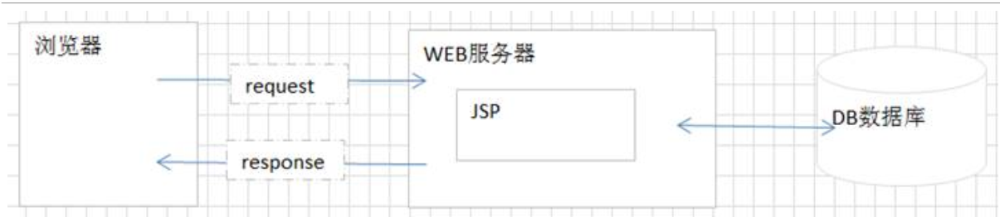
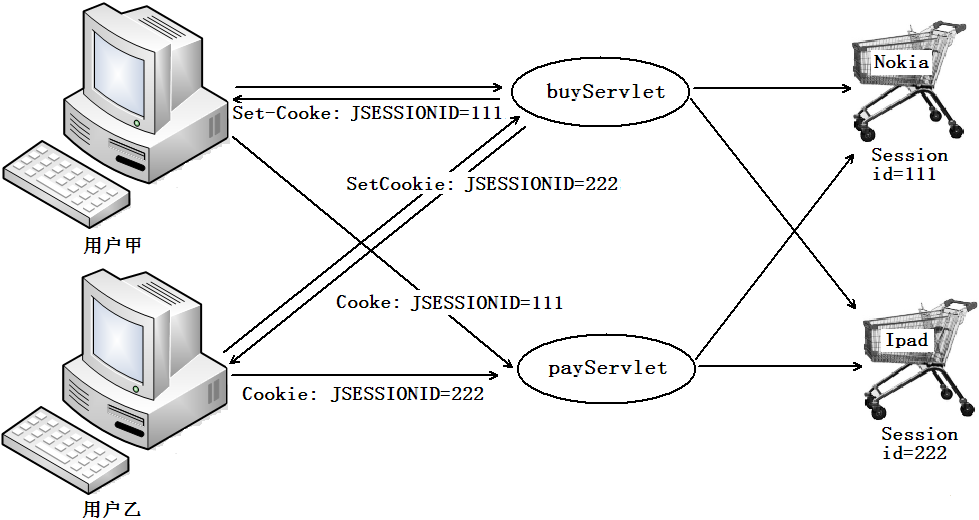

# Cookie和Session&JSP

# 学习目标

1.能够说出会话的概念(了解)

2.能够说出cookie的概念(了解)

3.能够创建、发送、接收、删除cookie(掌握)

4.能够说出cookie执行原理(了解)

5.能够说出jsp的优势(了解)

6.能够编写jsp代码片段、声明、脚本表达式(掌握)

7.能够说出session的概念(了解)

8.能够获取session对象、添加、删除、获取session中的数据(掌握)

9.能够完成登录验证码案例(掌握)

# 第1章会话的基本概念

## 1.1 什么是会话	
在日常生活中，从拨通电话到挂断电话之间的一连串的你问我答的过程就是一个会话。Web应用中的会话过程类似于生活中的打电话过程，它指的是一个客户端（浏览器）与Web服务器之间连续发生的一系列请求和响应过程，例如，一个用户在某网站上的整个购物过程就是一个会话。

在打电话过程中，通话双方会有通话内容，同样，在客户端与服务器端交互的过程中，也会产生一些数据。例如，用户甲和乙分别登录了购物网站，甲购买了一个Nokia手机，乙购买了一个Ipad，当这两个用户结账时，Web服务器需要对用户甲和乙的信息分别进行保存。在前面章节讲解的域对象中，HttpServletRequest对象和ServletContext对象都可以对数据进行保存，但是这两个对象都不可行，具体原因如下：

（1）客户端请求Web服务器时，针对每次HTTP请求，Web服务器都会创建一个HttpServletRequest对象，该对象只能保存本次请求所传递的数据。由于购买和结账是两个不同的请求，因此，在发送结账请求时，之前购买请求中的数据将会丢失。

（2）使用ServletContext对象保存数据时，由于同一个Web应用共享的是同一个ServletContext对象，因此，当用户在发送结账请求时，由于无法区分哪些商品是哪个用户所购买的，而会将该购物网站中所有用户购买的商品进行结算，这显然也是不可行的。

（3）为了保存会话过程中产生的数据，在Servlet技术中，提供了两个用于保存会话数据的对象，分别是Cookie和Session。关于Cookie和Session的相关知识，将在下面的小节进行详细讲解。



Servlet的会话技术主要有**cookie**与**session**两种  。


# 第2章 cookie

## 2.1 cookie的概念

### 2.1.1 什么是cookie

​	cookie就是服务器存放在浏览器(客户端)的一小份数据(只能是字符串，并且不超过4kb)，以后浏览器(客户端)每次访问这个服务器都会将cookie携带过来。

​	cookie实际上就可以看成一门客户端缓存技术。


## 2.2 cookie的应用场景(一般用来存放一些简单的配置信息)

1. 记住用户名

   

2. 自动登录（记住用户名和密码）

   


3.保存电影的播放进度。

## 2.3 cookie的基本使用

### 2.3.1 cookie常用的方法介绍

#### 2.3.1.1 API介绍

1. ```java
   Cookie:
       Cookie(String name, String value)  创建cookie对象
       String getName()   获取cookie的名称
       String getValue()  获取cookie的值
       void setPath(String uri)   设置cookie的路径——浏览器根据这个路径判断那些cookie要发送给服务器
   ```

2. ```java
   HttpServletResponse：
     	void addCookie(Cookie cookie)   将cookie发送给浏览器
   ```

3. ```java
   HttpServletRequest：
     	Cookie[] getCookies()  获取浏览器发送的cookie
   ```


#### 2.3.1.2 使用步骤

1. 在CookieServlet1创建cookie
2. 在CookieServlet1设置cookie路径为当前项目根路径：“/day04”
3. 在CookieServlet1使用response对象将cookie发送给浏览器
4. 在CookieServlet2通过request对象获取浏览器发送的cookie
5. 打印在控制台上


#### 2.3.1.3 演示代码

CookieServlet1：

```java
package cn.itcast.web;

import javax.servlet.ServletException;
import javax.servlet.annotation.WebServlet;
import javax.servlet.http.Cookie;
import javax.servlet.http.HttpServlet;
import javax.servlet.http.HttpServletRequest;
import javax.servlet.http.HttpServletResponse;
import java.io.IOException;

@WebServlet(name = "CookieServlet1",urlPatterns = "/cookie1")
public class CookieServlet1 extends HttpServlet {
    protected void doPost(HttpServletRequest request, HttpServletResponse response) throws ServletException, IOException {
        doGet(request, response);
    }

    protected void doGet(HttpServletRequest request, HttpServletResponse response) throws ServletException, IOException {
        //创建cookie
        Cookie cookie = new Cookie("username","tom");
        //设置cookie的路径——浏览器根据这个路径判断那些cookie要发送给服务器
        cookie.setPath("/day04");
        //将cookie发送给浏览器
        response.addCookie(cookie);
    }
}
```


CookieServlet2：

```java
package cn.itcast.web;

import javax.servlet.ServletException;
import javax.servlet.annotation.WebServlet;
import javax.servlet.http.Cookie;
import javax.servlet.http.HttpServlet;
import javax.servlet.http.HttpServletRequest;
import javax.servlet.http.HttpServletResponse;
import java.io.IOException;

@WebServlet(name = "CookieServlet2",urlPatterns = "/cookie2")
public class CookieServlet2 extends HttpServlet {
    protected void doPost(HttpServletRequest request, HttpServletResponse response) throws ServletException, IOException {
        doGet(request, response);
    }

    protected void doGet(HttpServletRequest request, HttpServletResponse response) throws ServletException, IOException {
        //获取浏览器发送的cookie
        Cookie[] cookies = request.getCookies();
        if(cookies != null){
            for (Cookie coo : cookies) {
                if("username".equals(coo.getName())){
                    //打印cookie的名称和值
                    System.out.println(coo.getName()+":"+coo.getValue());
                }
            }
        }
    }
}
```


#### 2.3.1.4 cookie技术原理分析


### 2.3.2 删除cookie

#### 2.3.2.1 API介绍

1. ```java
   void setMaxAge(int expiry)  设置cookie的最大生存时间（单位：秒）
   ```

2. ```java
   void setPath(String uri)   设置cookie的路径——浏览器根据这个路径判断那些cookie要发送给服务器
   ```


#### 2.3.2.2 使用步骤

1. 创建cookie对象
2. 设置生存时间
3. 设置cookie的路径
4. 发送cookie给浏览器


#### 2.3.2.3 注意事项

1. cookie的生存时间单位为：秒
2. 要删除已经存在的cookie，后一个用来覆盖cookie必须名称与路径与原来的cookie一致


#### 2.3.2.4 演示代码

```java
package cn.itcast.web;

import javax.servlet.ServletException;
import javax.servlet.annotation.WebServlet;
import javax.servlet.http.Cookie;
import javax.servlet.http.HttpServlet;
import javax.servlet.http.HttpServletRequest;
import javax.servlet.http.HttpServletResponse;
import java.io.IOException;

@WebServlet(name = "MaxAgeServlet",urlPatterns = "/maxage")
public class MaxAgeServlet extends HttpServlet {
    protected void doPost(HttpServletRequest request, HttpServletResponse response) throws ServletException, IOException {
        doGet(request, response);
    }

    protected void doGet(HttpServletRequest request, HttpServletResponse response) throws ServletException, IOException {
        //创建cookie
       /* Cookie cookie = new Cookie("name","tom");
        //设置cookie的生存时间
        cookie.setMaxAge(60*60*24*7);
        //设置cookie的路径
        cookie.setPath("/day04");
        //发送cookie给浏览器
        response.addCookie(cookie);*/
        //=====如果需要立刻删除cookie======
        //创建空数据的cookie，名称保持一致
        Cookie cookie = new Cookie("name","");
        //设置cookie的生存时间为0立刻死亡
        cookie.setMaxAge(0);
        //设置cookie的路径,与原来的cookie路径保持一致
        cookie.setPath("/day04");
        //发送cookie给浏览器
        response.addCookie(cookie);
    }
}
```


### 2.3.3 案例:记录用户上一次访问时间

#### 2.3.3.1 案例需求

​	展示用户上一次访问服务器的时间

#### 2.3.3.2 案例效果

​	展示用户上一次访问服务器的时间	

#### 2.3.3.3 案例分析


#### 2.3.3.4 实现代码

```java
package cn.itcast.web;

import java.io.IOException;
import java.text.SimpleDateFormat;
import java.util.Date;

import javax.servlet.ServletException;
import javax.servlet.annotation.WebServlet;
import javax.servlet.http.Cookie;
import javax.servlet.http.HttpServlet;
import javax.servlet.http.HttpServletRequest;
import javax.servlet.http.HttpServletResponse;
@WebServlet(name = "TimeServlet",urlPatterns = "/time")
public class TimeServlet extends HttpServlet {

	public void doGet(HttpServletRequest request, HttpServletResponse response) throws ServletException, IOException {
		//第一次访问操作
		// 1 获取用户当前访问的时间
		 Date date = new Date();
		 //格式化时间数据(注意：在cookie值中不能使用分号（;）、逗号（,）、等号（=）以及空格，否则会出现异常)
		 SimpleDateFormat format = new SimpleDateFormat("yyyy-MM-dd/hh:mm:ss");
		 String format1 = format.format(date);
		 System.out.println(format1);
		// 2 将数据存入cookie
		 Cookie cookie = new Cookie("time", format1);
		 cookie.setMaxAge(60*60*24);
		// 3 将数据发送给浏览器
		 response.addCookie(cookie);
		
		//第二次访问操作
		 //获取cookie数组
		 Cookie[] cookies = request.getCookies();
		if(cookies != null) {
			for (Cookie cookie2 : cookies) {
				//选择获取名称为time的cookie
				if("time".equals(cookie2.getName())) {
					//将数据发送页面
					response.getWriter().write(cookie2.getValue());
				}
			}
		}
	}

	public void doPost(HttpServletRequest request, HttpServletResponse response) throws ServletException, IOException {
		doGet(request, response);
	}

}
```


#### 2.3.3.5 注意事项

​	在**上面的案例中我们给cookie添加数据的时候需要注意数据的内容，上面提到的——在cookie值中不能使用分号（;）、逗号（,）、等号（=）以及空格。**

如果存入的数据不合法，会出现一个错误：

```java
java.lang.IllegalArgumentException: 
	An invalid character [32] was present in the Cookie value
```


​	**那么如果我们一定要保存非法数据在cookie中，该如何操作呢？**

​	**答：cookie对于基本符号、数字、和字母是可以存储的，因此，我们只需要将非法数据转换成符号、数字、和字母形式存储，要使用的时候再转换成正常的中文（解码）即可。**

​	那么，最后的问题就是，我们如何对中文数据进行编码和解码呢？我们需要来学习一些新的对象和方法。

##### 2.3.3.5.1 API介绍

1. ```java
   URLEncoder类：
   	static String encode(String s, String enc)  将指定的字符串，按指定的编码表编码
   ```

2. ```java
   URLDecoder类：
   	static String decode(String s, String enc)  将指定的字符串，按指定的编码表解码
   ```

   

##### 2.3.3.5.2 使用步骤

1. 在创建cookie之前将数据编码
2. 将编码后的数据存入cookie
3. 获取到cookie之后，解码数据，获取正常中文内容

##### 2.3.3.5.3 注意事项

1. 编码解码两次操作要使用同一个编码表

##### 2.3.3.5.4 演示代码

```java
package cn.itcast.web;

import java.io.IOException;
import java.net.URLDecoder;
import java.net.URLEncoder;
import java.text.SimpleDateFormat;
import java.util.Date;

import javax.servlet.ServletException;
import javax.servlet.annotation.WebServlet;
import javax.servlet.http.Cookie;
import javax.servlet.http.HttpServlet;
import javax.servlet.http.HttpServletRequest;
import javax.servlet.http.HttpServletResponse;
@WebServlet(name = "TimeServlet",urlPatterns = "/time")
public class TimeServlet extends HttpServlet {

	public void doGet(HttpServletRequest request, HttpServletResponse response) throws ServletException, IOException {
		//第一次访问操作
		// 1 获取用户当前访问的时间
		 Date date = new Date();
		// 2 格式化时间数据(时间转换成含有非法字符形式)
		 SimpleDateFormat format = new SimpleDateFormat("yyyy年MM月dd日 ;,= hh时mm分ss秒");
		 String format1 = format.format(date);
		 System.out.println(format1);

		// 3 将数据进行编码
		String encode = URLEncoder.encode(format1, "utf-8");
		// 4 将数据存入cookie
		 Cookie cookie = new Cookie("time",encode );
		 cookie.setMaxAge(60*60*24);
		// 5 将数据发送给浏览器
		 response.addCookie(cookie);
		
		//第二次访问操作
		 //获取cookie数组
		 Cookie[] cookies = request.getCookies();
		if(cookies != null) {
			for (Cookie cookie2 : cookies) {
				//选择获取名称为time的cookie
				if("time".equals(cookie2.getName())) {
					//由于数据之前经过编码，现在要还原的中文数据
					String decode = URLDecoder.decode(cookie2.getValue(), "utf-8");
					//将数据发送页面
					response.setContentType("text/html;charset=utf-8");
					response.getWriter().write(decode);
				}
			}
		}
	}

	public void doPost(HttpServletRequest request, HttpServletResponse response) throws ServletException, IOException {
		doGet(request, response);
	}

}
```


### 2.4封装CookieUtil工具类

```
public class CookieUtil {
	/**
	 * 创建并配置Cookie
	 * @param name  cookie的name
	 * @param value  cookie的value
	 * @param time  有效期，秒
	 * @param path  有效范围
	 * @return
	 */
	public static Cookie createCookie(String name,String value,int time,String path){
		Cookie cookie = new Cookie(name, value);
		//Cookie的一些其他设置，可以设置最大有效期，可以设置有效范围(在哪里能够获取到该Cookie信息)
		//设置有效期
		cookie.setMaxAge(time);
		//设置有效范围
		cookie.setPath(path);//只能在CookieDemo02这个Servlet中获取该Cookie的信息
		return cookie;
	}
	public static String getCookieValue(HttpServletRequest request,String cookieName){
		Cookie[] cookies = request.getCookies();
		String value = null;
		if (cookies != null) {
			for (Cookie cookie : cookies) {
				if (cookieName.equals(cookie.getName())) {
					//确实是咱们要获取的那个名为username的cookie对象
					value = cookie.getValue();
				}
			}
		}
		return value;
	}
}
```

Cookie的使用原则:

	1. 数据必须是一定要存放客户端
	2. 数据一定要是字符串类型

# 第3章 jsp的基本入门

## 3.1 jsp简介
### 3.1.1 jsp的概念

HTML代码与Java代码共同存在，其中，HTML代码用来实现网页中静态内容的显示，Java代码用来实现网页中动态内容的显示。为了与传统HTML有所区别，JSP文件的扩展名为.jsp。

JSP技术所开发的Web应用程序是基于Java的，它可以用一种简捷而快速的方法从Java程序生成Web页面，其使用上具有如下几点特征：

l **跨平台：**由于JSP是基于Java语言的，它可以使用Java API，所以它也是跨平台的，可以应用于不同的系统中，如Windows、Linux等。当从一个平台移植到另一个平台时，JSP和JavaBean的代码并不需要重新编译，这是因为Java的字节码是与平台无关的，这也应验了Java语言“一次编译，到处运行”的特点。

l **业务代码相分离：**在使用JSP技术开发Web应用时，可以将界面的开发与应用程序的开发分离开。开发人员使用HTML来设计界面，使用JSP标签和脚本来动态生成页面上的内容。在服务器端，JSP引擎（或容器，本书中指Tomcat）负责解析JSP标签和脚本程序，生成所请求的内容，并将执行结果以HTML页面的形式返回到浏览器。

l **组件重用：**JSP中可以使用JavaBean编写业务组件，也就是使用一个JavaBean类封装业务处理代码或者作为一个数据存储模型，在JSP页面中，甚至在整个项目中，都可以重复使用这个JavaBean，同时，JavaBean也可以应用到其他Java应用程序中。

l **预编译：**预编译就是在用户第一次通过浏览器访问JSP页面时，服务器将对JSP页面代码进行编译，并且仅执行一次编译。编译好的代码将被保存，在用户下一次访问时，会直接执行编译好的代码。这样不仅节约了服务器的CPU资源，还大大的提升了客户端的访问速度。

jsp是sun公司研发的，java server page

asp是.net里面的技术

php

### 3.1.2 为什么要诞生JSP

​	我们先来设计一个场景，完成一个需求：准备一个页面，根据页面的上链接的请求，展示不同古代美女的名称。

#### 3.1.2.1 准备页面

```html
<html>
<head>
<meta http-equiv="Content-Type" content="text/html; charset=UTF-8">
<title>Insert title here</title>
</head>
<body>
<!-- 需求：根据不同请求参数，显示不同古代美女名称 -->
<a href="/day04/test?param=1">美女1</a>
<a href="/day04/test?param=2">美女2</a>
<a href="/day04/test?param=3">美女3</a>
</body>
</html>
```

#### 3.1.2.2 演示servlet

```java
package cn.itcast.web;

import java.io.IOException;
import javax.servlet.ServletException;
import javax.servlet.annotation.WebServlet;
import javax.servlet.http.HttpServlet;
import javax.servlet.http.HttpServletRequest;
import javax.servlet.http.HttpServletResponse;


@WebServlet(name = "TestServlet",urlPatterns = "/test")
public class TestServlet extends HttpServlet {

	public void doGet(HttpServletRequest request, HttpServletResponse response) throws ServletException, IOException {
		String parameter = request.getParameter("param");
		//处理响应的乱码
		response.setContentType("text/html;charset=utf-8");
		if("1".equals(parameter)) {
			response.getWriter().write("<h1><font color='red'>西施</font></h1>");
		}else if("2".equals(parameter)) {
			response.getWriter().write("<h1><font color='red'>貂蝉</font></h1>");
		}else if("3".equals(parameter)) {
			response.getWriter().write("<h1><font color='red'>王昭君</font></h1>");
		}else {
			response.getWriter().write("参数不合法");
		}
	}

	public void doPost(HttpServletRequest request, HttpServletResponse response) throws ServletException, IOException {
		doGet(request, response);
	}

}
```

​	**通过书写servlet代码，我们发现一个问题：** 
 		**使用response对象，向页面输出内容，需要拼接html标签，这个操作十分麻烦。**

​	因此我们需要一个解决方案，那么这个解决方案应该满足什么条件呢？

​		**应该有以下两点：**

​			**1 必须不再拼接html，使用字符串向页面输出代码**

​			**2 需要保留servlet可以通过代码，动态生成网页的功能**

​	**满足这两点的正式我们要学习的JSP技术：它可以简化html书写，同时动态生成页面。**


### 3.1.3 体验jsp

#### 3.1.3.1 创建JSP文件


```jsp
<html>
<head>
  <title>测试jsp</title>
</head>
<body>
   <%
     Date date = new Date();
     SimpleDateFormat dateFormat = new SimpleDateFormat("yyyy-MM-dd HH:mm:dd");
     String curTime = dateFormat.format(date);
     request.setAttribute("curTime",curTime);
    %>

    当前系统时间：<span style="color: red"><%=request.getAttribute("curTime") %></span>
</body>
</html>
```

在地址栏输入jsp文件名称访问即可。

效果：


## 3.2 jsp的执行原理(了解)

通过上述的体验jsp之后，我们发现jsp真的非常厉害，既可以编写java代码也可以直接编写html代码，相对servlet更加方便，那么**jsp为什么可以直接使用reqeust 与直接编写html代码呢**


依据上图的流程，C:\Users\ztl\.IntelliJIdea2017.3\system\tomcat\Unnamed_javase\work\Catalina\localhost\webtest\org\apache\jsp找到了生成的java文件，其中一部分内容如下图：


​	我们可以看到当前的jsp文件被翻译成了一个类，这个类继承HttpJspBase类，那么这个HttpJspBase类又是什么？

​	注意jsp的翻译有服务器完成，HttpJspBase类一定也是tomcat服务器的内容，顺着org.apache.jasper.runtime.HttpJspBase这个类全名，我们找到这个类的源码：


​	通过观察源码，**我们发现JSP其实底层就是一个servlet**。通过观察源码，我们发现我们刚刚编写的所有代码都在该Servlet里面的service方法内部。


**总结：**

​	**1.** jsp之所以可以编写html代码，其实本质上也是类似我们使用Servlet直接输出的。

​	**2.**jsp之所以直接使用 直接使用request对象，是因为我们自己编写的代码全部都落入到了service方法内部，在service方法内部一开始就已经声明了request等对象了。


## 3.3 jsp的基本语法
### 3.3.1 jsp注释

#### 3.3.1.1 JSP注释格式

​		<%-- jsp注释  --%>

#### 3.3.1.2 JSP注释的使用

**jsp文件**：

~~~java
<%@ page contentType="text/html;charset=UTF-8" language="java" %>
<html>
  <head>
    <title>注释</title>
  </head>
  <body>
      <!---这个是html注释-->
      <%-- 这个是jsp的注释--%>
  </body>
</html>
~~~


访问页面测试：没有任何内容显示，那么也就说html与jsp注释都生效, 但是点击查看源码的时候我们发现我们只能查看到html的注释，jsp的注释根本就看不到。 


**总结**

​	**1.** jsp的注释不会显示在源码上，更加安全。

​	**2.** 如果在jstl标签体内使用html的注释将会失效，所以在jsp页面中推荐使用jsp的注释。


### 3.3.2 jsp书写java代码的三种方式

​	在之前的演示中，我的jsp已经可以向页面输出一个html内容，但是这个还不够，jsp应该还要有像servlet一样可以通过代码，动态生成网页的功能。servlet是使用java代码生成动态网页的，因此，接下来，我们要学习如何在jsp页面使用java代码。


#### 3.3.2.1 脚本片段

##### 3.3.2.1.1  脚本片段格式

​	格式：<%  Java代码片段  %>

​	实际上是运行在翻译成的Java类中的Service方法中

​	jsp文件内容：

```jsp
<%@ page contentType="text/html;charset=UTF-8" language="java" %>
<html>
<head>
    <title>书写java代码的三种方式</title>
</head>
<body>
    <%-- 脚本片段 --%>
    <% int x = 10; %>
</body>
</html>
```

​	翻译成java文件：	


```
	总结:在脚本片段中书写的Java代码，会翻译到java文件中的_jspService方法中。
```


##### 3.3.2.1.2 脚本片段作用

```
	在jsp翻译后的_jspService方法中，嵌入java代码
```

##### 3.3.2.1.3 脚本片段使用注意事项

​	脚本片段可以分开书写，最终是组合在一起的，示例：

​	脚本片段内容：

```jsp
  <% for(int j = 0 ; j < 5 ;j++)%>
```

​	效果：

```java
Hello World!!!
Hello World!!!
Hello World!!!
Hello World!!!
Hello World!!!
```

​	java源码:


#### 3.3.2.2 脚本声明

​	脚本片段虽然可以嵌入java代码，但是如果，我们要给当前的jsp中定义一些方法或者成员变量，就行需要一个新的技术——脚本声明。

##### 3.3.2.2.1 脚本声明格式 

​	格式：<%!  书写Java代码  %>

​	jsp文件内容：

```jsp
<%@ page contentType="text/html;charset=UTF-8" language="java" %>
<html>
<head>
    <title>书写java代码的三种方式</title>
</head>
<body>
    <%! int i = 0 ;%>
</body>
</html>

```

​	翻译成java文件：	


```
总结：脚本声明书写的java代码会翻译在类的成员位置上。
```


##### 3.3.2.2.2 脚本声明作用

```
在类的成员位置上声明方法和变量
```


##### 3.3.2.2.3 脚本声明使用注意事项

```
声明方法的时候，不要声明与jsp翻译的java文件中默认的一些方法或者变量同名的方法或者变量。
```


#### 3.3.2.3 脚本表达式

​	虽然脚本声明和脚本片段已经可以书写Java代码了，但是如果我们要使用java代码向页面输出一些内容，还是需要使用原来的response对象，比较繁琐，因此，我们需要一个更加简便的方式，可以代替response向页面输出内容——这个就是脚本表达式。

##### 	3.3.2.3.1 脚本表达式格式

​	格式：<%= 表达式 %>

​	jsp文件内容：

```jsp
<%@ page contentType="text/html;charset=UTF-8" language="java" %>
<html>
<head>
    <title>书写java代码的三种方式</title>
</head>
<body>
    
    <%-- 脚本表达式 --%>
    <%= "传智播客" %>
</body>
</html>
```

​	翻译成java文件：在_jspService方法中，找到了我们书写的内容


​	上图的中的out对象是什么？

​	答：out对象的类型是JspWriter，通过查阅JAVAEE文档发现其父类是java.io.Writer，是一个Writer 字符流。

​	页面输出：

​	


```
	总结：脚本表达式书写的java代码，会翻译到java文件中的_jspService方法内，被out.print输出到页面。
```

##### 3.3.2.3.2 脚本表达式作用

```
	代替response向页面输出内容
```

##### 3.3.2.3.3 脚本表达式使用注意事项

```
	使用表达式向页面输出内容的时候，不要同时使用response对象向页面输出内容，会出现页面内容输出顺序和代码顺序不一致。
```


# 第4章 session(就是我们要学习的第三个域对象)

## 4.1 session的基本概念


当人们去医院就诊时，就诊病人需要办理医院的就诊卡，该卡上只有卡号，而没有其它信息。但病人每次去该医院就诊时，只要出示就诊卡，医务人员便可根据卡号查询到病人的就诊信息。Session技术就好比医院发放给病人的就医卡和医院为每个病人保留病例档案的过程。当浏览器访问Web服务器时，Servlet容器就会创建一个Session对象和ID属性，其中，Session对象就相当于病历档案，ID就相当于就诊卡号。当客户端后续访问服务器时，只要将标识号传递给服务器，服务器就能判断出该请求是哪个客户端发送的，从而选择与之对应的Session对象为其服务。

需要注意的是，由于客户端需要接收、记录和回送Session对象的ID，因此，通常情况下，Session是借助Cookie技术来传递ID属性的。

为了使读者更好的理解Session，接下来，以网站购物为例，通过一张图来描述Session保存用户信息的原理，具体如图5-5所示。





​                                                           图1-1         Session保存用户信息的过程

在图5-5中，用户甲和乙都调用buyServlet将商品添加到购物车，调用payServlet进行商品结算。由于甲和乙购买商品的过程类似，在此，以用户甲为例进行详细说明。当用户甲访问购物网站时，服务器为甲创建了一个Session对象（相当于购物车）。当甲将Nokia手机添加到购物车时，Nokia手机的信息便存放到了Session对象中。同时，服务器将Session对象的ID属性以Cookie (Set-Cookie: JSESSIONID=111)的形式返回给甲的浏览器。当甲完成购物进行结账时，需要向服务器发送结账请求，这时，浏览器自动在请求消息头中将Cookie (Cookie: JSESSIONID=111)信息回送给服务器，服务器根据ID属性找到为用户甲所创建的Session对象，并将Session对象中所存放的Nokia手机信息取出进行结算。 


### 4.1.1 什么要存在Session 

l  使用servlet生成验证码时，我们需要在服务器记录一份生成的随机字符，当用户提交填写的数据时，将用户输入的数据和服务器缓存的数据进行比对。

l  将随机字符串保存在ServletContext中或者request中是否可以?

n  将数据存放到ServletContext，多个用户共享一个验证码。


n  将数据存放到request作用域，多次请求不能共享数据。


 我们发现将数据保存到ServletContext和request中是存在问题的，那么就需要使用会话技术保存用户的私有信息.

​	

域对象的对比:

ServletContext:作用范围是整个项目的生命周期中

request:一次请求中

session:一次会话中

## 4.2 session的与cookie的区别

|           | cookie | session |
| --------- | :----: | ------: |
| 会话数据保存的位置 |  浏览器   |     服务器 |
| 数据的安全性    |  不安全   |      安全 |
| 存储数是否有限制  |   有    |       无 |

## 4.3 session的应用场景

1. 保存购物车数据(一般也使用数据库)
2. 保存用户浏览器记录数据(一般使用数据库)
3. 保存用户登录信息数据(很重要，也就是说登录成功之后用户信息要保存在session中)
   1. 登录成功之后，一定要将user对象存放到session
4. 保存验证码(也很常见)

## 4.4 session的基本使用

### 4.4.1 session存储数据与 获取数据

#### 4.4.1.1 API介绍

1. HttpServletRequest 

   ```java
    HttpSession getSession()  获取session对象 
   ```

   

2. HttpSession

   ```java
    void setAttribute(String name, Object value) 在session中保存数据
    
    Object getAttribute(String name)  从session中获取数据
    
    void removeAttribute(String name)  从session中移除数据
   ```

   

#### 4.4.1.2 使用步骤

1. 在SessionServlet通过request对象获取session对象
2. 在SessionServlet调用session的setAttribute保存数据
3. 在SessionServlet调用session的getAttribute获取数据
4. 在SessionServlet1通过request对象获取session对象
5. 在SessionServlet1调用session的removeAttribute移除数据
6. 在SessionServlet1调用session的getAttribute获取数据


#### 4.4.1.3 注意事项

1. getAttribute方法返回值是Object，因此需要将返回值强制转换才能方便使用。


#### 4.4.1.3 演示代码

SessionServlet：

```java
package cn.itcast.web;

import javax.servlet.ServletException;
import javax.servlet.annotation.WebServlet;
import javax.servlet.http.HttpServlet;
import javax.servlet.http.HttpServletRequest;
import javax.servlet.http.HttpServletResponse;
import javax.servlet.http.HttpSession;
import java.io.IOException;

@WebServlet(name = "SessionServlet",urlPatterns = "/session")
public class SessionServlet extends HttpServlet {
    protected void doPost(HttpServletRequest request, HttpServletResponse response) throws ServletException, IOException {
        doGet(request, response);
    }

    protected void doGet(HttpServletRequest request, HttpServletResponse response) throws ServletException, IOException {
        //获取session对象
        HttpSession session = request.getSession();
        //添加数据
        session.setAttribute("addr","广州");
        
    }
}
```

SessionServlet1:

```java
package cn.itcast.web;

import javax.servlet.ServletException;
import javax.servlet.annotation.WebServlet;
import javax.servlet.http.HttpServlet;
import javax.servlet.http.HttpServletRequest;
import javax.servlet.http.HttpServletResponse;
import javax.servlet.http.HttpSession;
import java.io.IOException;

@WebServlet(name = "SessionServlet1",urlPatterns = "/session1")
public class SessionServlet1 extends HttpServlet {
    protected void doPost(HttpServletRequest request, HttpServletResponse response) throws ServletException, IOException {
        doGet(request, response);
    }

    protected void doGet(HttpServletRequest request, HttpServletResponse response) throws ServletException, IOException {
        //获取session对象
        HttpSession session = request.getSession();
      	//获取数据
        String addr = (String) session.getAttribute("addr");
        System.out.println(addr);
        //移除数据
        session.removeAttribute("addr");
        //再次获取，查看效果
        String addr1 = (String) session.getAttribute("addr");
        System.out.println(addr1);
    }
}
```


### 4.4.2 session的原理分析


### 4.4.3 session实现关闭浏览器继续可以访问数据

​	通过上面的原理图，我们发现记录sessionid的cookie在关闭浏览器之后就到期了，那么如果我们希望——关闭浏览器继续可以访问session数据，该怎么做呢？

#### 4.4.3.1 案例需求

​	关闭浏览器继续可以访问session数据

#### 4.4.3.2 案例效果

​	关闭浏览器继续可以访问session数据

#### 4.4.3.3 案例分析

1. 创建一个servlet

2. 通过request对象获取session的id

3. 自定义一个cookie对象，保存session的id，注意cookie名称为"JSESSIONID"，设置一个比较长的生存时间

4. 发送给浏览器

   

#### 4.4.3.4 代码实现

```java
package cn.itcast.web;

import java.io.IOException;
import javax.servlet.ServletException;
import javax.servlet.annotation.WebServlet;
import javax.servlet.http.Cookie;
import javax.servlet.http.HttpServlet;
import javax.servlet.http.HttpServletRequest;
import javax.servlet.http.HttpServletResponse;
import javax.servlet.http.HttpSession;
@WebServlet(name = "SessionServlet2",urlPatterns = "/session2")
public class SessionServlet2 extends HttpServlet {

	public void doGet(HttpServletRequest request, HttpServletResponse response) throws ServletException, IOException {
		//获取session对象
		HttpSession session = request.getSession();
		System.out.println(session);
		//自己创建一个cookie，要求被浏览器持久化保存起来（setMaxAge(10000)）放便后期使用
		Cookie cookie = new Cookie("JSESSIONID", session.getId());
		//活的久一点
		cookie.setMaxAge(10000);
		response.addCookie(cookie);
	}

	public void doPost(HttpServletRequest request, HttpServletResponse response) throws ServletException, IOException {
		doGet(request, response);
	}

}
```

访问一次服务器，然后关闭浏览器，再访问一次：两次session对象一致

```java
org.apache.catalina.session.StandardSessionFacade@49ef5434
org.apache.catalina.session.StandardSessionFacade@49ef5434
```


手动调用invalidate()方法也会销毁session对象。


什么情况能够让session销毁:

1. 关闭服务器

2. 手动用session调用invalidate()方法
3. 闲置30分钟

## 4.5 案例:使用session存储验证码完成登录功能

### 4.5.1 案例需求

1. 在登录页面用户登录的时候要查看到验证码，如图所示：

   

2. 在生成页面验证码图片的同时，使用session存储验证码

3. 在处理用户登录请求的时候，首先校验验证码

4. 校验通过才能执行登录操作

### 3.6.2 案例效果

​	用户提交验证码，与session中保存验证码校验一致才能登录

### 3.6.3 案例分析


### 3.6.4 代码实现

1. 页面

   ```html
   <%@ page language="java" import="java.util.*" pageEncoding="UTF-8"%>
   <html>
   <head>
       <meta http-equiv="Content-Type" content="text/html; charset=utf-8">
       <title>login</title>
       <script type="text/javascript">

           function changeCode(){
               document.getElementById("img").src = "/day04/checkcode?r="+new Date().getTime();
           }
       </script>
   </head>
   <body>
   <form action="/day04/login" method="post">
       <table>
           <tr><td>用户名：</td><td><input type="text" name="username"></td></tr>
           <tr><td>密码：</td><td><input type="password" name="password"></td></tr>
           <tr><td>验证码：</td><td><input type="text" name="code"></td></tr>
           <!-- 通过向服务器发送请求，从服务器获取验证码数据 -->
           <tr><td></td><td><a href="javascript:;" onclick="changeCode();">换一换</a><span><% if(request.getAttribute("msg")!=null){out.write(request.getAttribute("msg").toString());}%></span></td></tr>
           <tr><td></td><td><input type="submit" value="登陆"></td></tr>
       </table>
   </form>
   </body>
   </html>
   ```

   

2. 配置验证码servlet

   ```java
   package cn.itcast.web;

   import java.awt.Color;
   import java.awt.Font;
   import java.awt.Graphics;
   import java.awt.image.BufferedImage;
   import java.io.IOException;
   import java.util.Random;

   import javax.imageio.ImageIO;
   import javax.servlet.ServletException;
   import javax.servlet.annotation.WebServlet;
   import javax.servlet.http.HttpServlet;
   import javax.servlet.http.HttpServletRequest;
   import javax.servlet.http.HttpServletResponse;
   @WebServlet(name = "CheckcodeServlet",urlPatterns = "/checkcode")
   public class CheckcodeServlet extends HttpServlet {
   	private static final long serialVersionUID = 1L;

   	protected void doGet(HttpServletRequest request, HttpServletResponse response) throws ServletException, IOException {
   		//  创建画布
   		int width = 120;
   		int height = 40;
   		BufferedImage bufferedImage = new BufferedImage(width, height, BufferedImage.TYPE_INT_RGB);
   		//  获得画笔
   		Graphics g = bufferedImage.getGraphics();
   		//  填充背景颜色
   		g.setColor(Color.white);
   		g.fillRect(0, 0, width, height);
   		//  绘制边框
   		g.setColor(Color.red);
   		g.drawRect(0, 0, width - 1, height - 1);
   		//  生成随机字符
   		//  准备数据
   		String data = "ABCDEFGHIJKLMNOPQRSTUVWXYZabcdefghijklmnopqrstuvwxyz1234567890";
   		//  准备随机对象
   		Random r = new Random();
   		//  声明一个变量 保存验证码
   		String code = "";
   		//  书写4个随机字符
   		for (int i = 0; i < 4; i++) {
   			//  设置字体
   			g.setFont(new Font("宋体", Font.BOLD, 28));
   			//  设置随机颜色
   			g.setColor(new Color(r.nextInt(255), r.nextInt(255), r.nextInt(255)));

   			String str = data.charAt(r.nextInt(data.length())) + "";
   			g.drawString(str, 10 + i * 28, 30);

   			//  将新的字符 保存到验证码中
   			code = code + str;
   		}
   		//  绘制干扰线
   		for (int i = 0; i < 6; i++) {
   			//  设置随机颜色
   			g.setColor(new Color(r.nextInt(255), r.nextInt(255), r.nextInt(255)));

   			g.drawLine(r.nextInt(width), r.nextInt(height), r.nextInt(width), r.nextInt(height));
   		}

   		//  将验证码 打印到控制台
   		System.out.println(code);

   		//  将验证码放到session中
   		request.getSession().setAttribute("code_session", code);

   		//  将画布显示在浏览器中
   		ImageIO.write(bufferedImage, "jpg", response.getOutputStream());
   	}

   	protected void doPost(HttpServletRequest request, HttpServletResponse response) throws ServletException, IOException {
   		doGet(request, response);
   	}

   }
   ```

   

3. 登录servlet

   ```java
   package cn.itcast.web;

   import java.io.IOException;
   import java.io.PrintWriter;

   import javax.servlet.ServletException;
   import javax.servlet.annotation.WebServlet;
   import javax.servlet.http.HttpServlet;
   import javax.servlet.http.HttpServletRequest;
   import javax.servlet.http.HttpServletResponse;

   import cn.itcast.dao.UserDao;
   import cn.itcast.dao.impl.UserDaoImpl;
   import cn.itcast.domain.User;
   @WebServlet(name = "LoginServlet",urlPatterns = "/login")
   public class LoginServlet extends HttpServlet {

   	public void doGet(HttpServletRequest request, HttpServletResponse response) throws ServletException, IOException {
   		//用户请求中的验证码获取
   		String code = request.getParameter("code");
   		//获取session中保存的验证码
   		String code_session = (String)request.getSession().getAttribute("code_session");

   		//与session中保存的验证码进行校验
   		if(!code_session.equalsIgnoreCase(code)){
   			//验证码错误，告诉用户，页面提示
   			request.setAttribute("msg","验证码错误");
   			request.getRequestDispatcher("/login.jsp").forward(request,response);
   			return;
   		}
   		//验证码正确，登录逻辑执行
   		//获取用户名和密码
   		String username = request.getParameter("username");
   		String password = request.getParameter("password");
   		//调用Service方法，登录用户
   		UserDao userDao = new UserDaoImpl();

   	User loginUser = userDao.login(username,password);
   		if(loginUser == null){
   			request.setAttribute("msg","用户名或则密码错误");
   			request.getRequestDispatcher("/login.jsp").forward(request,response);
   			return;
   		}else{
   			//登陆成功，跳转主页
   			response.sendRedirect(request.getContextPath());
   			return;
   		}
   	}

   	public void doPost(HttpServletRequest request, HttpServletResponse response) throws ServletException, IOException {
   		doGet(request, response);
   	}

   }
   ```

   

4. dao：

   ```java
   接口：
   package cn.itcast.dao;

   import cn.itcast.domain.User;

   public interface UserDao {

   	/**
   	 * 查询用户名和密码是否匹配的方法
   	 * @param username
   	 * @param password
   	 * @return
   	 */
   	User login(String username, String password);

   }
   =================
     实现类：
   package cn.itcast.dao.impl;

   import cn.itcast.dao.UserDao;
   import cn.itcast.domain.User;
   import cn.itcast.utils.JDBCUtils;
   import org.springframework.jdbc.core.BeanPropertyRowMapper;
   import org.springframework.jdbc.core.JdbcTemplate;

   public class UserDaoImpl implements UserDao {

   	private JdbcTemplate template = new JdbcTemplate(JDBCUtils.getDataSource());
   	@Override
   	public User login(String username, String password) {
   		String sql = "select * from user where username = ? and password = ?";
   		try {
   			User query = template.queryForObject(sql, new BeanPropertyRowMapper<User>(User.class), username,password);
   			return query;
   		}catch (Exception e){
   			e.printStackTrace();
   			return null;
   		}
   	}

   }
   ```


​    什么时候Session会销毁:

1. session过期，闲置30分钟
2. 服务器关闭
3. session手动调用invalidate()方法