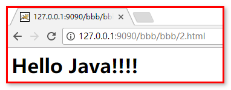

# 过滤器Filter

## 学习目标

1. 能够说出过滤器的作用以及应用场景(掌握) 
2. 能够编写过滤器(掌握)
3. 能够说出过滤器生命周期相关方法(了解)
4. 能够根据过滤路径判断指定的过滤器是否起作用(掌握过滤器的三种路径写法)
5. 能够说出什么是过滤器链(了解)
6. 能够编写过滤器解决全局乱码(掌握)
7. 能够完成自动登录案例(补充的)


# 第1 章过滤器简介

## 1.1 为什么要使用过滤器

在我们实际项目中，我们对访问某些资源的请求需要进条件的筛选、过滤。当这个请求满足特定的情况，才能让这个请求访问目标资源，如果不满足条件，就不让访问目标资源。比如说：对于访问管理员功能的请求，我们应该对这样的请求进行管理员权限的判断。如果当前用户拥有管理员权限，可以访问。反之不可以。我们java开发中需要很多这样过滤功能的操作，所以需要学习过滤器。

## 1.2 什么是过滤器

filter：它在Java中的体现是一个对象，本质是Java中预先定义好了不同的接口，可以过滤不同的内容，具体怎么过滤，需要使用者定义一个实现类，然后实现接口中的过滤方法，在方法中书写过滤的条件。filter是对客户端访问资源的过滤，符合条件放行，不符合条件不放行


# 第2章 过滤器的应用场景

## 2.1 过滤论坛中用户发表内容中的非法字符

当我们上论坛或者贴吧这类的网站浏览信息时，我们发现，很多评论有时候是携带脏词的。而这些脏词不能显示出来，使用**代替了。类似这类的脏词过滤，我们可以通过java中的过滤器，对请求参数中的脏词进行过滤。

## 2.2 登录权限检查

当客户端浏览器发出一个请求，这个请求在访问到正真的目标资源之前，我们需要进行登录权限的检查。如果已经登录，我们就让这个请求通过，访问资源；如果没有登录，我们不能让请求访问目标资源。这样的操作需要在访问具体资源进行条件的过滤，我们可以使用过滤器来完成。

## 2.3 统一解决全站的乱码问题


# 第3章 我的第一个过滤器开发步骤

## 3.1 Filter的API介绍


总结：

​	1.我们创建一个过滤器的话需要实现Filter这个接口

​	2.doFilter方法执行过滤器的功能


## 3.2 使用步骤

1. 创建一个类实现过滤器(Filter)接口
2. 注解配置过滤器拦截的请求路径（urlPatterns = "/demo1"）
3. 在doFilter方法中书写过滤任务
4. FilterChain.doFilter方法放行


## 3.3 注意事项

​	过滤器doFilter方法默认拦截请求，如果需要经过过滤器之后，可以继续访问资源，要使用filterChain放行。

## 3.4 代码演示

```java
package com.itheima.myfilter;

import javax.servlet.*;
import javax.servlet.annotation.WebFilter;
import java.io.IOException;

@WebFilter(filterName = "FilterDemo",urlPatterns = "/demo1")
public class FilterDemo1 implements Filter{

    @Override
    public void init(FilterConfig filterConfig) throws ServletException {

    }

    @Override
    public void doFilter(ServletRequest servletRequest, ServletResponse servletResponse, FilterChain filterChain) throws IOException, ServletException {
        System.out.println("FilterDemo执行。。。");
        //放行当前请求
        filterChain.doFilter(servletRequest,servletResponse);
    }

    @Override
    public void destroy() {

    }
}

```

# 第4章 过滤器的执行流程

## 4.1 生活案例类比过滤器流程

璐璐从广州开车到长沙，中途途径韶关收费站。如果这座收费站业务通过了，韶关收费站放行，璐璐方可到达长沙。但是如果没有通过韶关收费站的业务，就不能到达长沙目的地。而璐璐中途经过的收费站，就相当于我们java中的过滤器。


## 4.2 图解过滤器的执行流程


# 第5章 过滤器的生命周期

​	过滤器我们已经看到了他的执行流程，但是，过滤器只有被创建出来才能执行，因此，我们还要了解过滤器生命周期。它包括了init、doFilter、destroy三个方法。

## 5.1 init方法

### 5.1.1 API介绍


init方法是初始化方法。当过滤器被部署到web服务器时，服务器启动的时候执行一次。

### 5.1.2 使用步骤

1.创建过滤器

2.实现过滤器的init方法

### 5.1.3 案例代码

```java
package com.itheima.myfilter;

import javax.servlet.*;
import javax.servlet.annotation.WebFilter;
import java.io.IOException;

@WebFilter(filterName = "FilterDemo",urlPatterns = "/*")
public class FilterDemo1 implements Filter{

    @Override
    public void init(FilterConfig filterConfig) throws ServletException {
        System.out.print("过滤器初始化了");
    }

    @Override
    public void doFilter(ServletRequest servletRequest, ServletResponse servletResponse, FilterChain filterChain) throws IOException, ServletException {
       System.out.print("执行了过滤器");
      //放行请求
      filterChain.doFilter(servletRequest,servletResponse);
    }

    @Override
    public void destroy() {
       
    }
}
```

### 5.1.4 案例运行结果

重启服务器：查看控制台。说明过滤器在服务器启动的时候初始化，执行init方法。


## 5.2 doFilter方法

### 5.2.1 API介绍


只要一个请求符合Filter拦截路径，都会执行doFilter。需要注意的是:如果需要让这个请求通过过滤器，继续访问目标资源，一定得调用FilterChain对象的doFilter方法，要不然请求就被过滤器拦截了。FilterChain对象的doFilter方法表示对于请求放行。

### 5.2.2 使用步骤

1.创建一个过滤器

2.实现过滤器的doFilter方法

3.在web项目下再创建一个servlet资源。

### 5.2.3 案例代码

过滤器doFilter方法代码如下：

```java
package com.itheima.myfilter;

import javax.servlet.*;
import javax.servlet.annotation.WebFilter;
import java.io.IOException;

@WebFilter(filterName = "FilterDemo",urlPatterns = "/*")
public class FilterDemo1 implements Filter{

    @Override
    public void init(FilterConfig filterConfig) throws ServletException {
        System.out.print("过滤器初始化了");
    }

    @Override
    public void doFilter(ServletRequest servletRequest, ServletResponse servletResponse, FilterChain filterChain) throws IOException, ServletException {
        System.out.print("每次请求的路径被过滤器拦截的时候，都会执行过滤器的doFilter方法");
        //放行当前请求
        filterChain.doFilter(servletRequest,servletResponse);
    }

    @Override
    public void destroy() {
       
    }
}
```

servlet资源代码如下：

```java
package com.itheima.servlet;

import javax.servlet.ServletException;
import javax.servlet.annotation.WebServlet;
import javax.servlet.http.HttpServlet;
import javax.servlet.http.HttpServletRequest;
import javax.servlet.http.HttpServletResponse;
import java.io.IOException;

@WebServlet(name = "DemoServlet",urlPatterns = "/DemoServlet")
public class DemoServlet extends HttpServlet {
    protected void doPost(HttpServletRequest request, HttpServletResponse response) throws ServletException, IOException {
        doGet(request,response);
    }

    protected void doGet(HttpServletRequest request, HttpServletResponse response) throws ServletException, IOException {
        response.setContentType("text/html;charset=utf-8");
        response.getWriter().write("DemoServlet给出响应");
    }
}
```


### 5.2.4 运行结果

在浏览器多次输入http://localhost:9090/DemoServlet访问servlet资源

或者多次输入http://localhost:9090/访问首页index.jsp资源

浏览器能够访问到目标资源。

控制台结果如下：


### 5.2.5 案例改写

将doFilter方法中的 filterChain.doFilter(servletRequest,servletResponse);方法去掉。然后再次访问jsp或者servlet资源发现，过滤器依然会执行。但是浏览器上并不会访问到对应的jsp或者servlet资源。因为过滤器中没有将请求放行


## 5.3 destory方法

### 5.3.1 AP介绍


过滤器的销毁方法。服务器停止或者将项目从服务器中移除的时候，销毁过滤器，执行一次destory方法。

### 5.3.2 使用步骤

1.创建过滤器

2.实现destory方法

### 5.3.3 案例代码

过滤器代码：

```java
package com.itheima.myfilter;

import javax.servlet.*;
import javax.servlet.annotation.WebFilter;
import java.io.IOException;

@WebFilter(filterName = "FilterDemo",urlPatterns = "/*")
public class FilterDemo1 implements Filter{

    @Override
    public void init(FilterConfig filterConfig) throws ServletException {
        System.out.print("过滤器初始化了");
    }

    @Override
    public void doFilter(ServletRequest servletRequest, ServletResponse servletResponse, FilterChain filterChain) throws IOException, ServletException {
        System.out.print("每次请求的路径被过滤器拦截的时候，都会执行过滤器的doFilter方法");
        //放行当前请求
        filterChain.doFilter(servletRequest,servletResponse);
    }

    @Override
    public void destroy() {
        System.out.println("服务器停止的时候销毁过滤器，执行过滤器的desotory方法");
    }
}
```

### 5.3.4 运行结果

停止tomcat服务器：查看控制台


## 5.4 过滤器生命周期总结

1. 当服务器启动的时候，过滤器就被初始化了，执行过滤器的init方法
2. 每当一个请求的路径是满足过滤器的配置路径，那么就会执行一次过滤器的doFilter方法
3. 当服务器停止的时候，销毁过滤器，执行过滤器的destory方法


# 第6章 映射路径

假设有一个管理员权限的过滤器，它应该对用户发出的管理员功能的请求进行条件的过滤。但是当用户发出登录、注册等请求的时候，不应该进行过滤。所以我们过滤器，应该有选择的过滤器请求。这就需要学习配置过滤器不同的映射路径，从而让过滤器过滤希望过滤器的请求。

## 6.1 精确匹配模式(全路径匹配)

发出的路径需要与过滤器配置的路径完全一致，才能被这个过滤器过滤。如下4个案例

### 6.1.1 /index.jsp

1.创建一个过滤器UrlFilter，配合过滤器的过滤路径为/index.jsp,过滤器代码如下：

```java
package com.itheima.myfilter;

import javax.servlet.*;
import javax.servlet.annotation.WebFilter;
import java.io.IOException;

@WebFilter(filterName = "UrlFilter",urlPatterns = "/index.jsp")
public class UrlFillter implements Filter {
    public void destroy() {
    }

    public void doFilter(ServletRequest req, ServletResponse resp, FilterChain chain) throws ServletException, IOException {
        System.out.println("*********urlFilter拦截了请求***********");
        chain.doFilter(req, resp);
    }

    public void init(FilterConfig config) throws ServletException {

    }

}
```

在浏览器输入路径http://localhost:9090/index.jsp 的时候，才会经过当前过滤器。除了当前请求之外的请求都不会经过这个过滤器。因为过滤器配置的过滤路径/index.jsp只会对index.jsp这个首页的请求进行拦截过滤，其他请求不会拦截过滤。


### 6.1.3 /DemoServlet

1.修改UrlFilter过滤器的注解配置的过滤路径为/DemoServlet,代码如下:

```
@WebFilter(filterName = "UrlFilter",urlPatterns = "/DemoServlet")
```

2.DemoServlet资源就使用5.2.3案例中的DemoServlet

3浏览器发出请求http://localhost:9090/DemoServlet

查看控制台，发现当前请求会经过过滤器。除了访问index.html的请求外，其他请求都不会经过过滤器


## 6.2 模糊匹配模式(目录匹配)

### 6.2.1 /* 整个应用的配置

1.修改UrlFilter过滤器的注解配置的过滤路径为/*,代码如下:

```
@WebFilter(filterName = "UrlFilter",urlPatterns = "/*")
```

2.浏览器发出当前项目的任何请求都会经过当前过滤器

### 6.2.2 /admin/*  指定目录下的路径配置

1.修改UrlFilter过滤器的注解配置的过滤路径为/admin/*,代码如下:

```
@WebFilter(filterName = "UrlFilter",urlPatterns = "/admin/*")
```

2.浏览器发出当前项目下admin下的任何请求，都会经过过滤器。例如：

1.http://localhost:9090/admin/ss

2.http://localhost:9090/admin/bb/aa


## 6.3扩展名匹配

### 6.3.1  *.jsp

1.修改UrlFilter过滤器的注解配置的过滤路径为“*.jsp”,代码如下:

```
@WebFilter(filterName = "UrlFilter",urlPatterns = "*.jsp")
```

只有一".jsp"结尾的请求会被过滤

# 第7章 拦截方式

有了上面学习的映射路径，我们可以控制过滤器过滤指定的内容，但是我们在访问资源的时候，并不是每次都是之间访问，有时是以转发的方式访问的，这就需要我们要让过滤器可以区分不同的访问资源的方式，有不同的拦截方式。

## 7.1 REQUEST

REQUEST是默认的拦截方式：浏览器发出的请求都会进行拦截。不会拦截服务器端转发的请求
1.直接从地址栏访问index.jsp，Filter拦截
2.重定向到index.jsp，Filter拦截

### 7.1.1 浏览器地址栏访问代码演示

1.创建过滤器MethodFilter,配置过滤路径为/index.jsp，过滤器代码如下：

```java
package com.itheima.myfilter;

import javax.servlet.*;
import javax.servlet.annotation.WebFilter;
import java.io.IOException;

@WebFilter(filterName = "MethodFilter",urlPatterns = "/index.jsp")
public class MethodFilter implements Filter {
    public void destroy() {
    }

    public void doFilter(ServletRequest req, ServletResponse resp, FilterChain chain) throws ServletException, IOException {
        System.out.println("+++++++++MethodFilter过滤器执行了++++++++++");
        chain.doFilter(req, resp);
    }

    public void init(FilterConfig config) throws ServletException {

    }

}

```

2.浏览器发出请求http://localhost:9090/index.jsp，查看控制台：


### 7.1.2 重定向访问代码演示

1.创建RedirectServlet,重定向到index.jsp去，代码如下：

```java
package com.itheima.servlet;

import javax.servlet.ServletException;
import javax.servlet.annotation.WebServlet;
import javax.servlet.http.HttpServlet;
import javax.servlet.http.HttpServletRequest;
import javax.servlet.http.HttpServletResponse;
import java.io.IOException;

@WebServlet(name = "RedirectServlet",urlPatterns = "/RedirectServlet")
public class RedirectServlet extends HttpServlet {
    protected vopackage com.itheima.servlet;

import javax.servlet.ServletException;
import javax.servlet.annotation.WebServlet;
import javax.servlet.http.HttpServlet;
import javax.servlet.http.HttpServletRequest;
import javax.servlet.http.HttpServletResponse;
import java.io.IOException;

@WebServlet(name = "RedirectServlet",urlPatterns = "/RedirectServlet")
public class RedirectServlet extends HttpServlet {
    protected void doPost(HttpServletRequest request, HttpServletResponse response) throws ServletException, IOException {
        doGet(request,response);
    }

    protected void doGet(HttpServletRequest request, HttpServletResponse response) throws ServletException, IOException {
        System.out.println("RedirectServlet执行了，下面开始重定向到index.jsp去");
        response.sendRedirect(request.getContextPath()+"/index.jsp");
    }
}
```

2.浏览器地址栏输入地址http://localhost:9090/RedirectServlet，控制台结果如下


可以发现，在执行重定向的时候，执行了过滤器

## 7.2 请求转发

按照过滤器默认的拦截方式，我们只能拦截浏览器对服务器的之间访问，但是，如果是服务器资源之间使用转发的方式，就无法访问了，因此，我们还有一种forward拦截方式：当前拦截方式表示只有在进行请求的forward转发时，才会拦截请求进行过滤。
只在转发到index.jsp时，Filter拦截

### 7.2.1 forward转发代码演示

1.创建ForwardServlet，转发到index.jsp去，代码如下

```java
package com.itheima.servlet;

import javax.servlet.ServletException;
import javax.servlet.annotation.WebServlet;
import javax.servlet.http.HttpServlet;
import javax.servlet.http.HttpServletRequest;
import javax.servlet.http.HttpServletResponse;
import java.io.IOException;

@WebServlet(name = "ForwardServlet",urlPatterns = "/ForwardServlet")
public class ForwardServlet extends HttpServlet {
    protected void doPost(HttpServletRequest request, HttpServletResponse response) throws ServletException, IOException {
        doGet(request,response);
    }

    protected void doGet(HttpServletRequest request, HttpServletResponse response) throws ServletException, IOException {
        System.out.println("ForwardServlet执行了，下面开始转发请求到index.jsp去");
        request.getRequestDispatcher("/index.jsp").forward(request,response);
    }
}

```

2.浏览器地址栏输入地址：http://localhost:9090/ForwardServlet，查看控制台，发现请求转发到index.jsp,访问了index.jsp资源，但是并没有被MethodFilter过滤器拦截。这是因为默认的request拦截方式对于转发的请求不会进行拦截。


3.修改MethodFilter的拦截方式为forward。修改MethodFilter注解代码，添加代码dispatcherTypes = DispatcherType.FORWARD     

注解代码如下：

```
@WebFilter(filterName = "MethodFilter",urlPatterns = "/index.jsp",dispatcherTypes = DispatcherType.FORWARD)
```

4.重新启动服务器，浏览器再次访问请求：http://localhost:9090/ForwardServlet，查看控制台，发现当请求转发到index.jsp的时候，会经过过滤器的过滤。


## 7.3 两种拦截方式能否共存

那么有了两种拦截方式，两种拦截方式能否共存呢？答案是：可以的。

1. 在MethodFilter的dispatcherTypes中以数组的形式添加两个拦截方式

   ```java
   package com.itheima.myfilter;

   import javax.servlet.*;
   import javax.servlet.annotation.WebFilter;
   import java.io.IOException;

   @WebFilter(filterName = "MethodFilter",dispatcherTypes = {DispatcherType.FORWARD,DispatcherType.REQUEST},urlPatterns = "/*")
   public class MethodFilter implements Filter {
       public void destroy() {
       }

       public void doFilter(ServletRequest req, ServletResponse resp, FilterChain chain) throws ServletException, IOException {
           System.out.println("+++++++++MethodFilter过滤器执行了++++++++++");
           chain.doFilter(req, resp);
       }

       public void init(FilterConfig config) throws ServletException {

       }

   }
   ```

2. 浏览器再次访问请求：http://localhost:9090/ForwardServlet

   

   在转发前后都执行了过滤。


# 第8章 过滤器链

## 8.1 什么是过滤器链

璐璐从广州开车到长沙，途径韶关收费站，株洲收费站。韶关收费站收的是路过韶关的费用，株洲收费站收的是路过株洲的费用。如果这二座收费站业务通过了，方可到达长沙，只要其中一个收费站的业务没有通过，那么就不能到达长沙。而且，只有通过了韶关收费站，才能到达株洲收费站。

同样，我们java代码中，有时需要对同一个请求，进行多次不同业务的过滤，所以我们java代码中需要多个过滤器。只有所有的过滤器都对请求进行了放行，请求才能访问到目标资源，只要多个过滤器中只有一个过滤器不放行请求，那么这个请求都不能够访问到目标资源。多个过滤器组成的一个整体我们称为过滤器链。而且，过滤器链中的过滤器是一个一个的执行的，一个过滤器执行完毕之后，会执行下一个过滤器，后面没有过滤器了，才会访问到目标资源。只要其中一个过滤器没有放行，那么这个过滤器后面的过滤器也都不会执行了。


## 8.2 过滤器链的执行流程


# 第9章 案例:非法字符

## 9.1 案例需求

当用户发出非法言论的时候，提示用户言论非法。

## 9.2 案例效果

1.在表单中输入含有非法字符的言论，点击提交按钮


2.控制台显示如下：


## 9.3 案例分析

1.创建一个表单用于发表言论。

2.创建一个txt文件，其中存入非法字符。

3.创建一个Filter，拦截请求。在init方法中将txt文件中的非法字符读取到内存中。

4.获取请求中的参数，对请求的参数进行非法字符的校验。

5.如果言论中不含有非法字符，就放行。

6.如果言论中含有非法字符，就拦截，并且提示用户非法言论。

## 9.4 实现步骤

1.创建一个表单，用于发表言论

form2.jsp代码如下：

```html
<%@ page contentType="text/html;charset=UTF-8" language="java" %>
<html>
<head>
    <title>Title</title>
</head>
<body>
    <form method="post" action="${pageContext.request.contextPath }/IllegalServlet">
        请发表你的言论：<input type="text" name="message">
        <input type="submit" value="提交">
    </form>
</body>
</html>
```

2.创建一个txt文件，存入非法字符

例如：



3.创建一个servlet用于接受表单提交的内容

IllegalServlet代码如下：

```java
package com.itheima.servlet;

import javax.servlet.ServletException;
import javax.servlet.annotation.WebServlet;
import javax.servlet.http.HttpServlet;
import javax.servlet.http.HttpServletRequest;
import javax.servlet.http.HttpServletResponse;
import java.io.IOException;

@WebServlet(name = "/IllegalServlet",urlPatterns = "/IllegalServlet")
public class IllegalServlet extends HttpServlet {
    protected void doPost(HttpServletRequest request, HttpServletResponse response) throws ServletException, IOException {
        doGet(request,response);
    }

    protected void doGet(HttpServletRequest request, HttpServletResponse response) throws ServletException, IOException {
        response.getWriter().write("你的言论发表成功");
    }
}
```

4.创建一个过滤器，用来拦截请求，过滤请求中发表的言论的非法字符

IllegalFilter代码如下：

```java
package com.itheima.myfilter;

import javax.servlet.*;
import javax.servlet.annotation.WebFilter;
import javax.servlet.http.HttpServletRequest;
import javax.servlet.http.HttpServletResponse;
import java.io.*;
import java.util.ArrayList;
import java.util.List;

@WebFilter(urlPatterns = "/IllegalServlet",filterName = "IllegalFilter")
public class IllegalFilter implements Filter {
    //声明一个集合用来保存非法字符库
    private List<String> illegalWordsList = new ArrayList<>();
    @Override
    public void init(FilterConfig filterConfig) throws ServletException {
        //获取非法字符文件的绝对路径
        String path = filterConfig.getServletContext().getRealPath("/WEB-INF/classes/IllegalWords.txt");
        try {
            InputStreamReader isr = new InputStreamReader(new FileInputStream(path),"UTF-8");
            BufferedReader br = new BufferedReader(isr);
            String line = null;
            //将文件中的非法字符读取到内存中
            while ((line = br.readLine())!=null ){
                illegalWordsList.add(line);
            }
        }catch (Exception e){
            e.printStackTrace();
        }

    }

    @Override
    public void doFilter(ServletRequest servletRequest, ServletResponse servletResponse, FilterChain filterChain) throws IOException, ServletException {
        //将ServletRequest和ServletResponse强转成http协议的请求和响应对象
        HttpServletRequest request = (HttpServletRequest)servletRequest;
        HttpServletResponse response = (HttpServletResponse)servletResponse;
        response.setContentType("text/html;charset=utf-8");
        //获取请求中的参数
        request.setCharacterEncoding("utf-8");
        String message = request.getParameter("message");
        //遍历所有的非法字符，对用户发表的言论进行校验
        for (String word:illegalWordsList){
            System.out.println(message+":"+word+"====索引："+message.indexOf(word));
            if((message.indexOf(word))!=-1){
                response.getWriter().write("含有非法字符，请重新发表言论");
                return;
            }
        }
        filterChain.doFilter(servletRequest,servletResponse);
    }

    @Override
    public void destroy() {

    }
}
```

简单总结:

1. 过滤器的init方法只会执行一次。所以我们读取文件的代码就写到这里
2. 字符流、字节流的知识。
3. 使用类加载器将资源文件转换成流
4. 过滤器的doFilter()方法，每次有请求到达这个Filter都会调用。
5. 在doFilter()方法中，获取当前的请求的参数，判断这个参数中是否包含非法字符，如果不包含则放行，如果包含则直接响应给客户端"包含非法字符，禁止评论"，并且return 不走到放行的代码。

# 第10章 综合案例:解决全站乱码

## 10.1 案例需求

浏览器发出的任何请求，通过过滤器统一处理中文乱码。

## 10.2 案例效果

分别以get方式和post方式提交中文，servlet中不做中文乱码处理，直接获取参数，得到的参数不存在中文乱码问题。

## 10.3 案例分析

1.创建一个过滤器。

2.因为对所有的请求进行乱码的过滤，所以过滤器的过滤路径配置为/*

3.针对post请求处理乱码


## 10.4 实现步骤

1.创建一个form.jsp表单，用于测试过滤器解决乱码的功能


2.form.html代码：

```html
<%@ page contentType="text/html;charset=UTF-8" language="java" %>
<html>
<head>
    <title>Title</title>
</head>
<body>
    <form action="${pageContext.request.contextPath }/encoding" method="post">
        <input type="text" name="name"/>
        <input type="submit" value="提交"/>
    </form>
</body>
</html>
```

3.创建一个用于接收表单请求的EncodingServlet.

EncodingServlet代码：

```java
package com.itheima.servlet;

import javax.servlet.ServletException;
import javax.servlet.annotation.WebServlet;
import javax.servlet.http.HttpServlet;
import javax.servlet.http.HttpServletRequest;
import javax.servlet.http.HttpServletResponse;
import java.io.IOException;

@WebServlet(name = "EncodingServlet" , urlPatterns = "/encoding")
public class EncodingServlet extends HttpServlet {
    protected void doPost(HttpServletRequest request, HttpServletResponse response) throws ServletException, IOException {
        doGet(request,response);
    }

    protected void doGet(HttpServletRequest request, HttpServletResponse response) throws ServletException, IOException {
        //获取表单提交的参数
        String name = request.getParameter("name");
        System.out.println(name);
    }
}

```

4.创建EncodingFilter用于乱码处理的过滤器

EncodingFilter代码如下：

```java
package com.itheima.myfilter;

import javax.servlet.*;
import javax.servlet.annotation.WebFilter;
import javax.servlet.http.HttpServletRequest;
import java.io.IOException;

@WebFilter(filterName = "EncodingFilter",urlPatterns = "/*")
public class EncodingFilter implements Filter {
    public void destroy() {
    }

    public void doFilter(ServletRequest req, ServletResponse resp, FilterChain chain) throws ServletException, IOException {
       //首先
        HttpServletRequest request = (HttpServletRequest)req;
        resp.setContentType("text/html;charset=utf-8");
        //获取请求的方式
        String method = request.getMethod();
       if("post".equalsIgnoreCase(method)){
            //如果是post请求
            request.setCharacterEncoding("utf-8");
            chain.doFilter(request, resp);
            //结束当前方法
            return;
        }
        chain.doFilter(req, resp);
    }

    public void init(FilterConfig config) throws ServletException {

    }

}

```

5.浏览器访问form.jsp页面，表单提交方式为post，表单输入中文


6.点击提交按钮，查看控制台，post乱码问题得到解决


7.将表单的提交方式换成get，提交表单，查看控制台没有乱码问题。


### 登录权限的校验案例

### 自动登录案例

1. Cookie:保存用户名和密码
2. Filter过滤器

