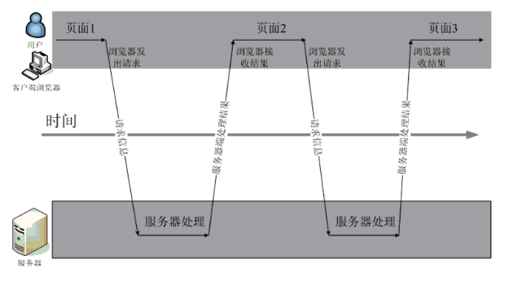

# AJAX&JSON

## 学习目标：

1. 能够理解异步的概念(掌握)
2. 能够了解原生js的ajax(了解)
3. 能够使用jQuery的$.get()进行访问(掌握)
4. 能够使用jQuery的$.post()进行访问(掌握)
5. 能够使用jQuery的$.ajax()进行访问(掌握)
6. 能够使用jQuery3.0的$.get()新增签名进行访问(了解)
7. 能够使用jQuery3.0的$.post()新增签名进行访问(了解)
8. 能够掌握json的三种数据格式(掌握)
9. 能够使用json转换工具Jackson进行json格式字符串的转换(掌握)
10. 能够完成用户名是否存在的查重案例(掌握)
11. 能够完成自动补全的案例(掌握)

# 第1章 ajax概述

## 1.1 什么是ajax

Ajax 即"Asynchronous Javascript And XML"（异步 JavaScript 和 XML），是指一种创建交互式网页应用的网页开发技术。Ajax = 异步 JavaScript 和 XML（标准通用标记语言的子集）。通过在后台与服务器进行少量数据交换，Ajax 可以使网页实现异步更新。这意味着可以在不重新加载整个网页的情况下，对网页的某部分进行更新。传统的网页（不使用 Ajax）如果需要更新内容，必须重载整个网页页面。


它就是一种前端的技术，这种技术能够让我们发送异步请求，并且处理服务器响应的数据(普通字符串、XML、Json)。

它能够实现网页的局部更新，以及多个请求同时进行

## 1.2 AJAX的应用场景

ajax的应用场景很多，常见的应用场景如下：

### 1.2.1 检查用户名是否已经被注册

很多站点的注册页面都具备自动检测用户名是否存在的友好提示，该功能整体页面并没有刷新，但仍然可以异步与服务器端进行数据交换，查询用户的输入的用户名是否在数据库中已经存在。


### 1.2.2 省市二联下拉框联动

很多站点都存在输入用户地址的操作，在完成地址输入时，用户所在的省份是下拉框，当选择不同的省份时会出现不同的市区的选择，这就是最常见的省市联动效果。


### 1.2.3 内容自动补全

不管是专注于搜索的百度，还是站点内商品搜索的京东，都有搜索功能，在i搜索框输入查询关键字时，整个页面没有刷新，但会根据关键字显示相关查询字条，这个过程是异步的。

**百度的搜索补全功能：**


**京东的搜索补全功能：**


## 1.3 同步方式与异步方式的区别

1. 异步请求是进行局部刷新，同步请求是进行整体刷新
2. 异步请求是有ajax的引擎发起的，同步请求是由浏览器发起的
3. 异步请求在请求发起之后还没收到响应之前还可以再次发起其它请求不影响当前页面的操作，而同步请求在发起之后，只有收到了响应后才能进行其它操作。

### 1.3.1 同步方式发送请求



发送一个请求，需要等待响应返回，然后才能够发送下一个请求，如果该请求没有响应，不能发送下一个请求，客户端会处于一直等待过程中。

### 1.3.2 异步方式发送请求


发送一个请求，不需要等待响应返回，随时可以再发送下一个请求，即不需要等待。


异步请求和同步请求的区别:

1. 异步请求可以进行局部刷新
2. 异步请求可以同时发起多个

# 第2章 js原生的ajax

## 2.1 js原生的ajax的开发步骤

1）创建Ajax引擎对象

```
var xhr = new XMLHTTPRequest();
```

2）为Ajax引擎对象绑定监听（监听服务器已将数据响应给引擎）,就相当于建立起与服务器的连接

```
xhr.open("请求方式","请求的路径")
```

3）发送请求

```
xhr.send()
```

4）接受响应数据

## 2.2 js原生的ajax的代码实现

### 2.2.1 js代码

```html
<!DOCTYPE html PUBLIC "-//W3C//DTD HTML 4.01 Transitional//EN" "http://www.w3.org/TR/html4/loose.dtd">
<html>
<head>
<meta http-equiv="Content-Type" content="text/html; charset=UTF-8">
<title>Insert title here</title>
<script type="text/javascript">
	
	function sendRequest(){
		//js的ajax访问
		//1）创建Ajax引擎对象
		var xmlhttp = new XMLHttpRequest();
		//2）绑定提交地址
		/*
			GET:请求方式
			url地址
			true是否异步 代表异步   false代表同步
		*/
		xmlhttp.open("GET","/AjaxDemo/ajaxServlet",true);
		//3）发送请求
		xmlhttp.send();
        
        //4）为Ajax引擎对象绑定监听（监听服务器已将数据响应给引擎）
		xmlhttp.onreadystatechange=function(){//引擎状态一改变就触发该事件
  			if (xmlhttp.readyState==4 && xmlhttp.status==200){
  				//5）接受响应数据
    			//获得服务器端返回给引擎对象的数据
    			alert(xmlhttp.responseText);
    		}
  		}
	}
</script>
</head>
<body>
	<input type="button" value="ajax异步访问服务器端" onclick="sendRequest()">
</body>
</html>
```

### 2.2.2 Servlet代码

```java
package com.itheima.servlet;

import java.io.IOException;
import javax.servlet.ServletException;
import javax.servlet.annotation.WebServlet;
import javax.servlet.http.HttpServlet;
import javax.servlet.http.HttpServletRequest;
import javax.servlet.http.HttpServletResponse;

@WebServlet("/ajaxServlet")
public class AjaxServlet extends HttpServlet {
	
	protected void doGet(HttpServletRequest request, HttpServletResponse response) throws ServletException, IOException {
		response.getWriter().write("ajax response data ...");
	}
	
	protected void doPost(HttpServletRequest request, HttpServletResponse response) throws ServletException, IOException {
		doGet(request, response);
	}

}

```

### 2.2.3 代码实现效果


# 第3章 jQuery框架的ajax

## 3.1 jQuery框架的ajax简介

jquery是一个优秀的js框架，自然对js原生的ajax进行了封装，封装后的ajax的操	作方法更简洁，功能更强大，与ajax操作相关的jquery方法有如下几种，但开发中	经常使用的有三种：

| 请求方式 | 语法                                          |
| -------- | --------------------------------------------- |
| GET请求  | $.get(url, *[data]*, *[callback]*, *[type]*)  |
| POST请求 | $.post(url, *[data]*, *[callback]*, *[type]*) |
| AJAX请求 | $.ajax([settings])                            |
| GET请求  | $.get([settings])                             |
| POST请求 | $.post([settings])                            |

## 3.2 GET请求方式

### 3.2.1 GET请求方式概述

通过远程 HTTP GET 请求载入信息。这是一个简单的 GET 请求功能，如需复杂的ajax参数设置请使用$.ajax。

### 3.2.2 GET请求方式语法

jQuery.get(url, [data], [callback], [type])

其中，参数说明如下：

| 参数名称 | 解释                                                         |
| -------- | ------------------------------------------------------------ |
| url      | 请求的服务器端url地址                                        |
| data     | 发送给服务器端的请求参数，格式可以是key=value，也可以是js对象(json) |
| callback | 当请求成功后的回掉函数，可以在函数体中编写我们的逻辑代码,在回调函数中可以获取响应数据 |
| type     | 预期的返回数据的类型，取值可以是 xml, html, script, json, text, _defaul等 |

### 3.2.3 GET请求方式代码

#### 3.2.3.1 js代码

```html
<!DOCTYPE html PUBLIC "-//W3C//DTD HTML 4.01 Transitional//EN" "http://www.w3.org/TR/html4/loose.dtd">
<html>
<head>
<meta http-equiv="Content-Type" content="text/html; charset=UTF-8">
<title>Insert title here</title>
<script type="text/javascript" src="jquery-3.3.1.js"></script>
<script type="text/javascript">
	function sendRequest(){
		$.get(
			"/AjaxDemo/ajaxServlet",
			"name=aobama&age=33",
			function(data){
				alert(data);
			},
			"text"
		);
	}
</script>
</head>
<body>
	<input type="button" value="ajax异步访问服务器端" onclick="sendRequest()">
</body>
</html>
```

#### 3.2.3.2 Servlet代码

```java
package com.itheima.servlet;

import java.io.IOException;
import javax.servlet.ServletException;
import javax.servlet.annotation.WebServlet;
import javax.servlet.http.HttpServlet;
import javax.servlet.http.HttpServletRequest;
import javax.servlet.http.HttpServletResponse;

@WebServlet("/ajaxServlet")
public class AjaxServlet extends HttpServlet {
	
	protected void doGet(HttpServletRequest request, HttpServletResponse response) throws ServletException, IOException {
		//获得请求参数
		String name = request.getParameter("name");
		String age = request.getParameter("age");
		response.getWriter().write("ajax response data ..."+ name +"..."+age);
	}
	
	protected void doPost(HttpServletRequest request, HttpServletResponse response) throws ServletException, IOException {
		doGet(request, response);
	}

}

```

#### 3.2.3.3 代码实现效果


## 3.3 POST请求方式

### 3.3.1 POST请求方式概述

通过远程 HTTP POST 请求载入信息。这是一个简单的 POST 请求功能，如需复杂的ajax参数设置请使用$.ajax。

### 3.3.2 POST请求方式语法

jQuery.post(url, [data], [callback], [type])

其中，参数说明如下：

| 参数名称 | 解释                                                         |
| -------- | ------------------------------------------------------------ |
| url      | 请求的服务器端url地址                                        |
| data     | 发送给服务器端的请求参数，格式可以是key=value，也可以是js对象(json) |
| callback | 当请求成功后的回掉函数，可以在函数体中编写我们的逻辑代码     |
| type     | 预期的返回数据的类型，取值可以是 xml, html, script, json, text, _defaul等 |

### 3.3.3 POST请求方式代码

#### 3.3.3.1 js代码

```html
<!DOCTYPE html PUBLIC "-//W3C//DTD HTML 4.01 Transitional//EN" "http://www.w3.org/TR/html4/loose.dtd">
<html>
<head>
<meta http-equiv="Content-Type" content="text/html; charset=UTF-8">
<title>Insert title here</title>
<script type="text/javascript" src="jquery-3.3.1.js"></script>
<script type="text/javascript">
	function sendRequest(){
		$.post(
			"/AjaxDemo/ajaxServlet",
			"name=haohao&age=33",
			function(data){
				alert(data);
			},
			"text"
		);
	}
</script>
</head>
<body>
	<input type="button" value="ajax异步访问服务器端" onclick="sendRequest()">
</body>
</html>
```

#### 3.3.3.2 Servlet代码

```java
package com.itheima.servlet;

import java.io.IOException;
import javax.servlet.ServletException;
import javax.servlet.annotation.WebServlet;
import javax.servlet.http.HttpServlet;
import javax.servlet.http.HttpServletRequest;
import javax.servlet.http.HttpServletResponse;

@WebServlet("/ajaxServlet")
public class AjaxServlet extends HttpServlet {
	
	protected void doGet(HttpServletRequest request, HttpServletResponse response) throws ServletException, IOException {
		//获得请求参数
		String name = request.getParameter("name");
		String age = request.getParameter("age");
		response.getWriter().write("ajax response data ..."+ name +"..."+age);
	}
	
	protected void doPost(HttpServletRequest request, HttpServletResponse response) throws ServletException, IOException {
		doGet(request, response);
	}

}

```

#### 3.3.3.3 代码实现效果


## 3.4 AJAX请求方式

### 3.4.1 AJAX请求方式概述

通过 HTTP 请求加载远程数据。jQuery 底层 AJAX 实现。简单易用的高层实现见get和post方法。$.ajax()方法可以更加详细的设置底层的参数。

### 3.4.2 AJAX请求方式语法

jQuery.ajax([settings])

其中，settings是一个js字面量形式的对象，格式是{name:value,name:value... ...}，常用的name属性名如下：

| 属性名称    | 解释                                                         |
| ----------- | ------------------------------------------------------------ |
| url         | 请求的服务器端url地址                                        |
| async       | (默认: true) 默认设置下，所有请求均为异步请求。如果需要发送同步请求，请将此选项设置为 false |
| data        | 发送到服务器的数据，可以是键值对形式，也可以是js对象形式(json) |
| type        | (默认: "GET") 请求方式 ("POST" 或 "GET")， 默认为 "GET"      |
| dataType    | 预期的返回数据的类型，取值可以是 xml, html, script, json, text, _defaul等 |
| success     | 请求成功后的回调函数                                         |
| error       | 请求失败时调用此函数(服务器异常时候的回调)                   |
| contentType | 表示请求参数的类型，默认是“ application/x-www-form-urlencoded” |

### 3.4.3 AJAX请求方式代码

#### 3.4.3.1 js代码

```html
<!DOCTYPE html PUBLIC "-//W3C//DTD HTML 4.01 Transitional//EN" "http://www.w3.org/TR/html4/loose.dtd">
<html>
<head>
<meta http-equiv="Content-Type" content="text/html; charset=UTF-8">
<title>Insert title here</title>
<script type="text/javascript" src="jquery-3.3.1.js"></script>
<script type="text/javascript">
	function sendRequest(){
		$.ajax({
			url:"/AjaxDemo/ajaxServlet",
			async:true,
			data:"name=haohao&age=33",
			type:"GET",
			dataType:"text",
			success:function(data){
				alert(data);
			},
			error:function(){
				alert("数据没有成功返回!")
			}
		});
	}
</script>
</head>
<body>
	<input type="button" value="ajax异步访问服务器端" onclick="sendRequest()">
</body>
</html>
```

#### 3.4.3.2 Servlet代码

```java
package com.itheima.servlet;

import java.io.IOException;
import javax.servlet.ServletException;
import javax.servlet.annotation.WebServlet;
import javax.servlet.http.HttpServlet;
import javax.servlet.http.HttpServletRequest;
import javax.servlet.http.HttpServletResponse;

@WebServlet("/ajaxServlet")
public class AjaxServlet extends HttpServlet {
	
	protected void doGet(HttpServletRequest request, HttpServletResponse response) throws ServletException, IOException {
		//获得请求参数
		String name = request.getParameter("name");
		String age = request.getParameter("age");
		response.getWriter().write("ajax response data ..."+ name +"..."+age);
	}
	
	protected void doPost(HttpServletRequest request, HttpServletResponse response) throws ServletException, IOException {
		doGet(request, response);
	}

}

```

#### 3.4.3.3 代码实现效果


## 3.5 jQuery3.0 的GET新增签名方式

### 3.5.1  jQuery3.0 的GET新增签名概述

jQuery 3 为jQuery.get()函数增加了新签名，从而使得它们和 $.ajax() 的接口风格保持一致。

### 3.5.2  jQuery3.0 的GET新增签名方式语法

jQuery.get([settings])

其中，settings是一个js字面量形式的对象，格式是{name:value,name:value... ...}，常用的name属性名如下：

| 属性名称 | 解释                                                         |
| -------- | ------------------------------------------------------------ |
| url      | 请求的服务器端url地址                                        |
| async    | (默认: true) 默认设置下，所有请求均为异步请求。如果需要发送同步请求，请将此选项设置为 false |
| data     | 发送到服务器的数据，可以是键值对形式，也可以是js对象形式     |
| dataType | 预期的返回数据的类型，取值可以是 xml, html, script, json, text, _defaul等 |
| success  | 请求成功后的回调函数                                         |
| error    | 请求失败时调用此函数                                         |

### 3.5.3  jQuery3.0 的GET新增签名方式代码

#### 3.5.3.1 js代码

```html
<!DOCTYPE html PUBLIC "-//W3C//DTD HTML 4.01 Transitional//EN" "http://www.w3.org/TR/html4/loose.dtd">
<html>
<head>
<meta http-equiv="Content-Type" content="text/html; charset=UTF-8">
<title>Insert title here</title>
<script type="text/javascript" src="jquery-3.3.1.js"></script>
<script type="text/javascript">
	function sendRequest(){
		$.get({
			url:"/AjaxDemo/ajaxServlet",
			async:true,
			data:"name=haohao&age=33",
			dataType:"text",
			success:function(data){
				alert(data);
			},
			error:function(){
				alert("数据没有成功返回!")
			}
		});
	}
</script>
</head>
<body>
	<input type="button" value="ajax异步访问服务器端" onclick="sendRequest()">
</body>
</html>
```

#### 3.5.3.2 Servlet代码

```java
package com.itheima.servlet;

import java.io.IOException;
import javax.servlet.ServletException;
import javax.servlet.annotation.WebServlet;
import javax.servlet.http.HttpServlet;
import javax.servlet.http.HttpServletRequest;
import javax.servlet.http.HttpServletResponse;

@WebServlet("/ajaxServlet")
public class AjaxServlet extends HttpServlet {
	
	protected void doGet(HttpServletRequest request, HttpServletResponse response) throws ServletException, IOException {
		//获得请求参数
		String name = request.getParameter("name");
		String age = request.getParameter("age");
		response.getWriter().write("ajax response data ..."+ name +"..."+age);
	}
	
	protected void doPost(HttpServletRequest request, HttpServletResponse response) throws ServletException, IOException {
		doGet(request, response);
	}

}

```

#### 3.5.3.3 代码实现效果


## 3.6 jQuery3.0 的POST新增签名方式

### 3.6.1  jQuery3.0 的POST新增签名概述

jQuery 3 为 jQuery.post() 函数增加了新签名，从而使得它们和 $.ajax() 的接口风格保持一致。

### 3.6.2  jQuery3.0 的POST新增签名方式语法

jQuery.post([settings])

其中，settings是一个js字面量形式的对象，格式是{name:value,name:value... ...}，常用的name属性名如下：

| 属性名称 | 解释                                                         |
| -------- | ------------------------------------------------------------ |
| url      | 请求的服务器端url地址                                        |
| async    | (默认: true) 默认设置下，所有请求均为异步请求。如果需要发送同步请求，请将此选项设置为 false |
| data     | 发送到服务器的数据，可以是键值对形式，也可以是js对象形式     |
| dataType | 预期的返回数据的类型，取值可以是 xml, html, script, json, text, _defaul等 |
| success  | 请求成功后的回调函数                                         |
| error    | 请求失败时调用此函数                                         |

### 3.6.3  jQuery3.0 的POST新增签名方式代码

#### 3.6.3.1 js代码

```html
<!DOCTYPE html PUBLIC "-//W3C//DTD HTML 4.01 Transitional//EN" "http://www.w3.org/TR/html4/loose.dtd">
<html>
<head>
<meta http-equiv="Content-Type" content="text/html; charset=UTF-8">
<title>Insert title here</title>
<script type="text/javascript" src="jquery-3.3.1.js"></script>
<script type="text/javascript">
	function sendRequest(){
		$.post({
			url:"/AjaxDemo/ajaxServlet",
			async:true,
			data:"name=haohao&age=33",
			dataType:"text",
			success:function(data){
				alert(data);
			},
			error:function(){
				alert("数据没有成功返回!")
			}
		});
	}
</script>
</head>
<body>
	<input type="button" value="ajax异步访问服务器端" onclick="sendRequest()">
</body>
</html>
```

#### 3.6.3.2 Servlet代码

```java
package com.itheima.servlet;

import java.io.IOException;
import javax.servlet.ServletException;
import javax.servlet.annotation.WebServlet;
import javax.servlet.http.HttpServlet;
import javax.servlet.http.HttpServletRequest;
import javax.servlet.http.HttpServletResponse;

@WebServlet("/ajaxServlet")
public class AjaxServlet extends HttpServlet {
	
	protected void doGet(HttpServletRequest request, HttpServletResponse response) throws ServletException, IOException {
		//获得请求参数
		String name = request.getParameter("name");
		String age = request.getParameter("age");
		response.getWriter().write("ajax response data ..."+ name +"..."+age);
	}
	
	protected void doPost(HttpServletRequest request, HttpServletResponse response) throws ServletException, IOException {
		doGet(request, response);
	}

}

```

#### 3.6.3.3 代码实现效果


# 第4章 json数据格式

## 4.1 什么是json

JSON(JavaScript Object Notation, JS 对象标记) 是一种轻量级的数据交换格式。它基于ECMAScript的一个子集，采用完全独立于编程语言的文本格式来存储和表示数据。简洁和清晰的层次结构使得 JSON 成为理想的数据交换语言。 易于人阅读和编写，同时也易于机器解析和生成，并有效地提升网络传输效率。

## 4.2 json的语法格式

json对象有两种数据格式，分别如下：

1. {key:简单数据类型的值,key:value}
2. {key:json对象},value也能是json对象
3. {key:[json对象,json对象]}

| 类型          | 语法                               | 解释                                    |
| ------------- | ---------------------------------- | --------------------------------------- |
| 对象类型      | {name:value,name:value...}         | 其中name是字符串类型，而value是任意类型 |
| 数组/集合类型 | [{},{}... ...] 或 {name:[]... ...} | 其中value是任意类型                     |

## 4.3 json格式和json解析练习

### 4.3.1 练习1

```html
<!DOCTYPE HTML PUBLIC "-//W3C//DTD HTML 4.01 Transitional//EN">
<html>
  <head>
    <title>json01</title>
    <meta http-equiv="keywords" content="keyword1,keyword2,keyword3">
    <meta http-equiv="description" content="this is my page">
    <meta http-equiv="content-type" content="text/html; charset=UTF-8">
  </head>
  <body>

  </body>
  
  <script language="JavaScript">
	/**
	 * 案例一
	 *  var person={key:value,key:value}
	 *  
	 * class Person{
	 * 	  String firstname = "张";
	 *    String lastname = "三丰";
	 *    Integer age = 100;
	 * }
	 * 
	 * Person p = new Person();
	 * System.out.println(p.firstname);
	 */
	
	 //json的定义
	 var person = {"firstname":"张","lastname":"三丰","age":100};
	 
	 //json解析
	 alert(person.firstname);
	 alert(person.lastname);
	 alert(person.age);
	
  </script>
</html>


```

### 4.3.2 练习2

```html
<!DOCTYPE HTML PUBLIC "-//W3C//DTD HTML 4.01 Transitional//EN">
<html>
<head>
<title>json02</title>
<meta http-equiv="keywords" content="keyword1,keyword2,keyword3">
<meta http-equiv="description" content="this is my page">
<meta http-equiv="content-type" content="text/html; charset=UTF-8">
</head>
<body>

</body>

<script language="JavaScript">
  	/**
	 * 案例二
	 *  [{key:value,key:value},{key:value,key:value}]
	 *  
	 */
	var json = [
					{"firstname":"张","lastname":"三丰","age":100},
					{"firstname":"张","lastname":"翠山","age":58},
					{"firstname":"张","lastname":"无忌","age":23}
	             ];
  	
  	for(var i=0;i<json.length;i++){
  		alert(json[i].lastname);
  	}
 
  </script>
</html>

```

### 4.3.3 练习3

```html
<!DOCTYPE HTML PUBLIC "-//W3C//DTD HTML 4.01 Transitional//EN">
<html>
  <head>
    <title>json03</title>
    <meta http-equiv="keywords" content="keyword1,keyword2,keyword3">
    <meta http-equiv="description" content="this is my page">
    <meta http-equiv="content-type" content="text/html; charset=UTF-8">
  </head>
  <body>

  </body>
  
  <script language="JavaScript">
   /**
	 * 案例三
	 * {
	 *   "param":[{key:value,key:value},{key:value,key:value}]
	 * }
	 *  
	 *  
	 */
	 
	 var json = {
			"baobao":[
			          	{"name":"小双","age":18,"addr":"扬州"},
			          	{"name":"建宁","age":18,"addr":"北京海淀"},
			          	{"name":"龙儿","age":38,"addr":"岛国"},
			          	{"name":"阿珂","age":17,"addr":"台湾"}
			          ]
	 }
	 
	 //全取
	 for(var i=0;i<json.baobao.length;i++){
		 alert(json.baobao[i].name);
	 }
	
  </script>
</html>


```

### 4.3.4 练习4

```html
<!DOCTYPE HTML PUBLIC "-//W3C//DTD HTML 4.01 Transitional//EN">
<html>
  <head>
    <title>insertBefore.html</title>
    <meta http-equiv="keywords" content="keyword1,keyword2,keyword3">
    <meta http-equiv="description" content="this is my page">
    <meta http-equiv="content-type" content="text/html; charset=UTF-8">
  </head>
  <body>

  </body>
  
  <script language="JavaScript">
   /**
	 * 案例四
	 * {
	 *   "param1":[{key:value,key:value},{key:value,key:value}],
	 *   "param2":[{key:value,key:value},{key:value,key:value}],
	 *   "param3":[{key:value,key:value},{key:value,key:value}]
	 * }
	 *  
	 *  
	 */
	 var json = {
				"baobao":[
				          	{"name":"小双","age":18,"addr":"扬州"},
				          	{"name":"建宁","age":18,"addr":"北京海淀"},
				          	{"name":"龙儿","age":38,"addr":"岛国"},
				          	{"name":"阿珂","age":17,"addr":"台湾"}
				          ],
				"haohao":[
							{"name":"楠楠","age":23,"addr":"北京昌平修正"},
							{"name":"倩倩","age":18,"addr":"上海"}
				          ]
		 }
	 
	 
	 //娶楠楠
	 alert(json.haohao[0].name);

  </script>
</html>

```

## 4.4 json的转换工具

### 4.4.1 json转换工具的概述

json的转换工具是通过java封装好的一些jar工具包，直接将java对象或集合转换成json格式的字符串。

### 4.4.2 常见的json转换工具

| 工具名称 | 介绍                                                 |
| -------- | ---------------------------------------------------- |
| Jsonlib  | Java 类库，需要导入的jar包较多                       |
| Gson     | google提供的一个简单的json转换工具                   |
| Fastjson | alibaba技术团队提供的一个高性能的json转换工具        |
| Jackson  | 开源免费的json转换工具，springmvc转换默认使用jackson |

### 4.4.3 开发步骤

1）导入json相关jar包


2）创建java对象或集合

3)   使用jackson的ObjectMapper对象的writeValueAsString方法进行转换

### 4.4.4 转换代码实现

```java
package com.itheima.json;

import java.util.ArrayList;
import java.util.HashMap;
import java.util.List;
import java.util.Map;

import com.fasterxml.jackson.core.JsonProcessingException;
import com.fasterxml.jackson.databind.ObjectMapper;

public class JacksonDemo {

	public static void main(String[] args) throws JsonProcessingException {
		
		//创建User对象
		User user = new User();
		user.setId("100");
		user.setUsername("haohao");
		user.setAge(33);
		//创建List集合
		List<String> arr = new ArrayList<>();
		arr.add("传智播客");
		arr.add("黑马程序员");
		arr.add("酷丁鱼");
		//创建Map集合
		Map<String,User> map = new HashMap<>();
		map.put("user", user);
		
		//转换
		ObjectMapper om = new ObjectMapper();
		String userJson = om.writeValueAsString(user);
		String arrJson = om.writeValueAsString(arr);
		String mapJson = om.writeValueAsString(map);
		
		System.out.println(userJson);
		System.out.println(arrJson);
		System.out.println(mapJson);
		
	}
	
}

```

### 4.4.5 转换控制台效果


# 第5章 综合案例

## 5.1 综合案例 ：检测用户名是否已经被注册

### 5.1.1 需求

在用户注册页面，输入用户名，当用户名输入框失去焦点时，发送异步请求，将输入框的用户名传递给服务器端进行是否存在的校验。

### 5.1.2 代码实现

#### 5.1.2.1 jsp代码

```html
<%@ page language="java" contentType="text/html; charset=UTF-8"
	pageEncoding="UTF-8"%>
<!DOCTYPE html>
<html>
<head></head>
<meta name="viewport" content="width=device-width, initial-scale=1">
<title>会员注册</title>
<script src="jquery-3.3.1.js" type="text/javascript"></script>

<script type="text/javascript">
	
	function checkUsername(obj){
		//获得该输入框的值
		var username = $(obj).val();
		//将username异步传递给服务器端进行校验 
		$.post(
			"${pageContext.request.contextPath}/user",		
			{"username":username},
			function(data){
				//判断data是true还是false字符串
				if(data.isExist){
					//输入的该用户名已经存在 给提示
					$("#usernameInfo").html("输入的该用户名已经存在").css("color","red");
				}else{
					$("#usernameInfo").html("该用户名可以使用").css("color","green");
				}
			},
			"json"
		);
	}
	
</script>


</head>
<body>
	<div>
		<font>会员注册</font>USER REGISTER
		<form class="form-horizontal" style="margin-top: 5px;">
			用户名<input type="text" name="username" onblur="checkUsername(this)" placeholder="请输入用户名">
			<span id="usernameInfo" style="color:red"></span><br/>
			密码<input type="password" placeholder="请输入密码"><br/>
			<input type="submit" value="注册"/>
		</form>
	</div>
</body>
</html>

```

#### 5.1.2.2 Servlet代码

```java
package com.itheima.servlet;

import java.io.IOException;

import javax.servlet.ServletException;
import javax.servlet.annotation.WebServlet;
import javax.servlet.http.HttpServlet;
import javax.servlet.http.HttpServletRequest;
import javax.servlet.http.HttpServletResponse;

@WebServlet("/user")
public class UserServlet extends HttpServlet {

	public void doGet(HttpServletRequest request, HttpServletResponse response) throws ServletException, IOException {
		//定义isExist true代表存在  false代表不存在
		boolean isExist = true;
		//获得输入的用户名
		String username = request.getParameter("username");
		if(!"haohao".equals(username)){
			isExist = false;
		}
		//回写存在状态
		String json = "{\"isExist\":"+isExist+"}";
		response.getWriter().write(json);
	}

	public void doPost(HttpServletRequest request, HttpServletResponse response) throws ServletException, IOException {
		doGet(request, response);
	}

}
```

### 5.1.3 代码效果


## 5.2 综合案例 ：内容自动补全

### 5.2.1 需求

在输入框输入关键字，下拉框中异步显示与该关键字相关的商品的名称

### 5.2.2 代码实现

#### 5.2.2.1 导入数据库脚本

导入素材文件夹中的demo.sql


#### 5.2.2.2 编写实体模型

```java
package com.itheima.autocomplate;

public class User {

	private int id;
	private String name;
	private String password;
	
	public int getId() {
		return id;
	}
	public void setId(int id) {
		this.id = id;
	}
	public String getName() {
		return name;
	}
	public void setName(String name) {
		this.name = name;
	}
	public String getPassword() {
		return password;
	}
	public void setPassword(String password) {
		this.password = password;
	}
	
}

```

#### 5.2.2.3 编写jsp页面

```html
<%@ page language="java" contentType="text/html; charset=UTF-8"
    pageEncoding="UTF-8"%>
<!DOCTYPE html PUBLIC "-//W3C//DTD HTML 4.01 Transitional//EN" "http://www.w3.org/TR/html4/loose.dtd">
<html>
<head>
<meta http-equiv="Content-Type" content="text/html; charset=UTF-8">
<title>Insert title here</title>
<style type="text/css">
	.content{
		width:643px;
		margin:200px auto;
		text-align: center;
	}
	input[type='text']{
		width:530px;
		height:40px;
		font-size: 14px;
	}
	input[type='button']{
		width:100px;
		height:46px;
		background: #38f;
		border: 0;
		color: #fff;
		font-size: 15px
	}
	.show{
		position: absolute;
		width: 535px;
		border: 1px solid #999;
		border-top: 0;
		display: none;
	}
</style>
<script type="text/javascript" src="jquery-3.3.1.js"></script>
<script type="text/javascript">
	function searchWord(obj){
		//获得当前关键字
		var word = $(obj).val();
		//发送ajax请求
		$.post(
			"${pageContext.request.contextPath}/search",
			"word="+word,
			function(data){
				if(data){
					var content = "";
					for(var i=0;i<data.length;i++){
						content+="<div>"+data[i].name+"</div>";
					}
					$("#show").html(content).show();
				}
			},
			"json"
		);
	}
</script>
</head>
<body>
	<div class="content">
		<br/><br/>
		<input type="text" name="word" onkeyup="searchWord(this)">
		<input type="button" value="搜索一下">
		<div class="show" id="show"></div>
	</div>
</body>
</html>
```

#### 5.2.2.4 编写Servlet

```java
package com.itheima.autocomplate;

import java.io.IOException;
import java.util.List;

import javax.servlet.ServletException;
import javax.servlet.annotation.WebServlet;
import javax.servlet.http.HttpServlet;
import javax.servlet.http.HttpServletRequest;
import javax.servlet.http.HttpServletResponse;

import com.fasterxml.jackson.databind.ObjectMapper;

@WebServlet("/search")
public class SearchServlet extends HttpServlet {
	
	protected void doGet(HttpServletRequest request, HttpServletResponse response) throws ServletException, IOException {
		//设置中文乱码
		request.setCharacterEncoding("UTF-8");
		//获得关键字
		String word = request.getParameter("word");
		//传递关键字到Service
		SearchService searchService = new SearchService();
		List<User> userList = searchService.search(word);
		//转换成json格式的字符串
		ObjectMapper om = new ObjectMapper();
		String json = om.writeValueAsString(userList);
		//设置response中文乱码
		response.setContentType("text/html;charset=UTF-8");
		response.getWriter().write(json);
	}

	protected void doPost(HttpServletRequest request, HttpServletResponse response) throws ServletException, IOException {
		doGet(request, response);
	}

}

```

#### 5.2.2.5 编写Service

```java
package com.itheima.autocomplate;

import java.sql.SQLException;
import java.util.List;

public class SearchService {

	public List<User> search(String word) {
		//调用dao层
		SearchDao searchDao = new SearchDao();
		List<User> userList = null;
		try {
			userList = searchDao.findUserByLikeName(word);
		} catch (SQLException e) {
			e.printStackTrace();
		}
		return userList;
	}
}
```

#### 5.2.2.6 编写Dao

```java
package com.itheima.autocomplate;

import java.sql.SQLException;
import java.util.List;

import org.springframework.jdbc.core.BeanPropertyRowMapper;
import org.springframework.jdbc.core.JdbcTemplate;

import com.itheima.utils.JdbcUtils;

public class SearchDao {

	public List<User> findUserByLikeName(String word) throws SQLException {
		//创建JdbcTemplate
		JdbcTemplate jdbcTemplate = new JdbcTemplate(JdbcUtils.getDataSource());
		String sql = "select * from user where name like ? limit 0,6";
		//执行查询操作
		List<User> list = jdbcTemplate.query(sql, new BeanPropertyRowMapper<User>(User.class),"%"+word+"%");
		return list;
	}

}

```

#### 5.2.2.7 JdbcUtils工具类

```java
package com.itheima.utils;

import java.io.IOException;
import java.io.InputStream;
import java.sql.Connection;
import java.sql.ResultSet;
import java.sql.SQLException;
import java.sql.Statement;
import java.util.Properties;

import javax.sql.DataSource;

import com.alibaba.druid.pool.DruidDataSourceFactory;

/*
	1. 声明静态数据源成员变量
	2. 创建连接池对象
	3. 定义公有的得到数据源的方法
	4. 定义得到连接对象的方法
	5. 定义关闭资源的方法
 */
public class JdbcUtils {
	// 1.	声明静态数据源成员变量
	private static DataSource ds;

	// 2. 创建连接池对象
	static {
		// 加载配置文件中的数据
		InputStream is = JdbcUtils.class.getResourceAsStream("/druid.properties");
		Properties pp = new Properties();
		try {
			pp.load(is);
			// 创建连接池，使用配置文件中的参数
			ds = DruidDataSourceFactory.createDataSource(pp);
		} catch (IOException e) {
			e.printStackTrace();
		} catch (Exception e) {
			e.printStackTrace();
		}
	}

	// 3. 定义公有的得到数据源的方法
	public static DataSource getDataSource() {
		return ds;
	}

	// 4. 定义得到连接对象的方法
	public static Connection getConnection() throws SQLException {
		return ds.getConnection();
	}

	// 5.定义关闭资源的方法
	public static void close(Connection conn, Statement stmt, ResultSet rs) {
		if (rs != null) {
			try {
				rs.close();
			} catch (SQLException e) {}
		}

		if (stmt != null) {
			try {
				stmt.close();
			} catch (SQLException e) {}
		}

		if (conn != null) {
			try {
				conn.close();
			} catch (SQLException e) {}
		}
	}

	// 6.重载关闭方法
	public static void close(Connection conn, Statement stmt) {
		close(conn, stmt, null);
	}
}

```

#### 5.2.2.8 配置文件

```properties
driverClassName=com.mysql.jdbc.Driver
url=jdbc:mysql://127.0.0.1:3306/demo
username=root
password=root
initialSize=5
maxActive=10
maxWait=3000
maxIdle=6
minIdle=3
```

### 5.2.3 代码效果

