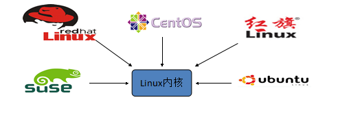
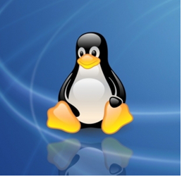
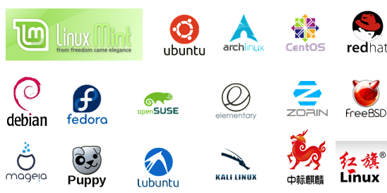
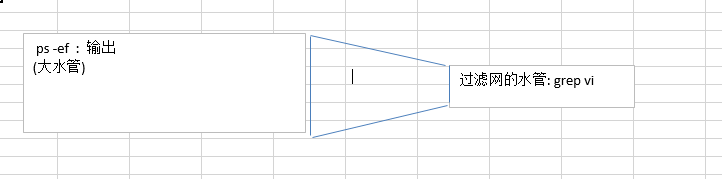

# day28 Linux

**今日案例任务**

- 安装虚拟机
- 安装Linux系统
- 学习Linux常用命令

**教学目标**

- 可以独立安装CentOS
- 熟练使用磁盘管理命令
- 熟练使用文件管理命令
- 熟练使用文档编辑命令
- 熟练使用系统命令
- 熟练使用备份压缩命令

### 一,Linux概述

#### 1.学习Linux之前先了解Unix     

​	Unix是一个强大的多用户、多任务操作系统。

​	于1969年在AT&T的贝尔实验室开发。

​	UNIX的商标权由国际开放标准组织（The Open Group）所拥有。

​	UNIX操作系统是商业版，需要收费，价格比Microsoft Windows正版要贵一些。

#### 2.Linux简介

​	Linux是基于Unix的

​	Linux是一种自由和开放源码的操作系统，存在着许多不同的Linux版本，但它们都使用了Linux内核。Linux可安装在各种计算机硬件设备中，比如手机(安卓)、平板电脑、路由器、台式计算机

​	



诞生于1991 年10 月5 日。是由芬兰赫尔辛基大学学生Linus Torvalds和后来加入的众多爱好者共同开发完成




#### 3.Linux的历史

​	Linux最初是由芬兰赫尔辛基大学学生Linus Torvalds由于自己不满意教学中使用的MINIX操作系统， 所以在1990年底由于个人爱好设计出了LINUX系统核心。后来发布于芬兰最大的ftp服务器上，用户可以免费下载，所以它的周边的程序越来越多，Linux本身也逐渐发展壮大起来，之后Linux在不到三年的时间里成为了一个功能完善，稳定可靠的操作系统.

#### 4.Linux系统的应用(了解)

+ 服务器系统 (Web应用服务器(Tomcat)、接口服务器、DNS(域名解析服务器)、FTP、数据库服务器等等)

  这是 Linux 当前最热门的应用了！ 承袭了 Unix 高稳定性的良好传统，Linux 上面的网络功能特别的稳定和强大！
  此外，由于 GNU 计划与Linux 的 GPL 授权模式，很多优秀的软件都在 Linux 上面发展，且这些在 Linux 上面的服务器软件几乎都是自由软件！因此，做为一部网络服务器，例如 WWW, Mail Server, File Server 等等，Linux 绝对是上上之选！当然，这也是 Linux 的强项

+ 关键任务的应用(金融数据库、大型企业网管环境)

  目前很多金融业界都已经使用 Linux 做为他们的关键任务应用。所谓的关键任务就是该企业最重要的业务！ 举例来说，金融业最重要的就是那些投资者、帐户的数据了，这些数据大多使用数据库系统来作为存取接口， 这些数据很重要吧！很多金融业将这么重要的任务交给了 Linux 了！

+ 学术机构的高效能运算任务

  由于Linux 的创造者本身就是个计算机性能力，所以Linux 有强大的运算能力;并且 Linux 具有支持度相当广泛的 GCC 编译软件， 因此 Linux 在这方面的优势可是相当明显的！

+ 嵌入式系统

  路由器、防火墙、手机(安卓系统,内核是Linux)、PDA、IP 分享器、交换器、家电用品的微电脑控制器等等。

+ 桌面应用系统 

+ 移动手持系统

#### 5.Linux的版本

Linux的版本分为两种：内核版本和发行版本；

+ 内核版本是指在Linus领导下的内核小组开发维护的系统内核的版本号 ；
+ 发行版本是一些组织和公司根据自己发行版的不同而自定的 

#### 6.Linux的主流版本




### 二.Linux的安装

#### 1.虚拟机的安装

##### 1.1什么是虚拟机

​	虚拟机：一台虚拟的电脑.

​	虚拟机软件:

​		 VmWare:收费的.微软公司

​		 VirtualBox:免费的.   Oracle公司的  mysql  oracle  


**如果电脑因为没有开启虚拟化，而无法安装虚拟机**

**那么我们需要到BIOS界面，开启计算机的虚拟化**

##### 1.2虚拟机的安装

​	参考《day26--01.VMware使用.pdf 》

#### 2. CentOS的安装

​	参考《day26--02.Linux(CentOS)安装.pdf》

#### 3.Linux的目录结构


​	/:根目录

​		root:超级管理员(root)的家

​		home:其他用户(普通用户)的家

​		etc:配置文件

​		usr:存放共享文件的(软件的安装路径)

​		lib:依赖库

### 三,Linux的远程访问

CRT软件

#### 1.安装一个远程访问的软件:CRT

#### 2.连接Linux

### 四, Linux的常用命令

#### 1,磁盘管理

##### 1.1.切换目录命令cd(change directory)

​	**cd app**	切换到app目录

​	**cd ..**         切换到上一层目录

​	cd /          切换到**系统根目录**

​	**cd ~**    	 切换到用户主目录(回到超级管理员的家)

​	cd -           切换到上一个所在目录(上一个操作的)(了解)

##### 1.2.列出文件列表的命令 ls ll dir

​	ls(list)是一个非常有用的命令，用来显示当前目录下的内容。配合参数的使用，能以不同的方式显示目录内容。

+ 格式

  ```
  ls[参数] [路径或文件名]
  ```

  **ls**		展示当前目录下资源（不包含隐藏的文件）(记住)

  ls -a		显示当前目录的所有文件或目录（包含隐藏的文件）, 文件带点的是隐藏文件

  **ls -l  	展示所有文件(不包含隐藏文件)的详细信息,  可以简写成 ll**

  **ll -h		在ll的基础上友好显示文件大小**(记住)

  ls -al	展示文件的详细信息（包含隐藏的文件）,可以简写成"ll -a"

  **ll -ah       展示文件的详细信息（包含隐藏的文件）,并友好显示文件大小**

##### 1.3.创建目录和移除目录mkdir rmdir

###### 1.3.1mkdir(make directory):  

+ 用来创建子目录.

  ```
  mkdir app 在当前目录下创建app目录

  mkdir –p app2/test  创建一个目录app2并且在app2目录中再创建一个test目录
  ```

  * 练习一:在root目录下创建一个"app"目录为
  * 练习二:在root目录下创建一个"app2"目录并在app2目录中创建一个test目录

###### 1.3.2rmdir(remove directory)

+ 用来删除“空”的子目录(了解)，注意只能删除空目录

  ```
  rmdir app   删除app目录
  ```


  * 练习:移除"app"目录

##### 1.4pwd(了解)

​	pwd:打印当前工作的目录

#### 2.文件浏览(cat、more、less、 tail)(不太重要)

先进入root目录,cd ~

##### 2.1cat(重点)

+ 用于显示文件的内容, 格式：cat[参数]<文件名>

  ```
  cat install.log    查看install.log的内容	
  ```

  * 练习:在root目录下，查看install.log文件的内容

##### 2.2more(掌握)

+ 分页查看。最开始是显示一页内容，然后按空格键显示下一页。回车显示下一行内容(逐行查看)。按 q 或者(Control+c)键退出查看。

  ```
  more install.log 
  ```

  * 练习:在root目录下,分页查看install.log文件的内容

##### 2.3less(跟more差不多)

+ 用法和more类似，不同的是less可以通过PgUp、PgDn键来控制上下翻页。

+ 按q就退出查看

  ```
  less install.log
  ```

##### 2.4tail(掌握)

tail命令是在实际使用过程中使用非常多的一个命令，它的功能是：用于显示文件后几行的内容。

+ tail -n 文件名:查看文件的末尾几行

  ```
  tail -10 install.log
  ```

  + 练习:在root目录下，查看install.log文件的最后10行

+ tail -f 文件名**:滚动的查看文件. 查看tomcat的日志(了解)

  ```
  tail -f catalina.log
  ```

  + ctrl+c 结束查看

#### 3.文件操作(很重要)

##### 3.1 touch创建一个空文件（掌握）

+ touch 文件名

  ```
  touch a.txt
  ```


  * 练习:在root目录下创建一个test1文件夹，在test1文件夹中创建一个a.txt文件

##### 3.2 mv(move) 移动文件  (掌握)  

- mv 文件 目录:移动到指定目录
  - 练习:在root目录下创建一个test2目录，将test1目录中的a.txt文件移动到test2目录
    - mv a.txt test2
- mv 文件 目录/文件名:移动到指定目录且重命名
  - 练习:在root目录下创建一个test3目录，将test2中的a.txt文件移动到test3目录并重命名为b.txt
- mv 目录 指定的目录:移动一个目录到指定的目录下
  - 练习:将test2目录移动到test1目录中
    - mv test2 test1
- mv 文件名 新文件名:重命名
  - 练习:将b.txt文件重命名为c.txt

##### 3.3 cp(copy) 拷贝文件    

- cp 文件 目录:把一个文件复制到某目录下
  - 练习:将test3目录中的c.txt文件，拷贝到test1目录
- cp 文件 目录/文件名:复制且重命名
  - 练习:将test1中的c.txt文件拷贝到test2目录，并重命名为d.txt
- cp 文件 新文件名 :当前目录下复制一个
  - 练习:在test2目录中，复制一个d.txt并命名为dd.txt
- cp -r 目录 新目录:递归复制目录
  - 练习:在root目录中创建一个test4目录，并将test3目录及该目录中的所有内容复制到test4中


##### 3.4 rm删除文件(既能删除文件又能删除非空文件夹)   

+ rm  文件;	删除文件，有询问是否删除，确定要删除则输入"y"，不想删除则输出"n"然后回车

  ```
  rm a.txt  删除a.txt文件
  ```

  + 练习:删除test3目录中的c.txt文件

+ rm -f 文件;不询问，直接删除

  ```
  rm -f a.txt  不询问，直接删除a.txt 
  ```

  + 练习:删除test1文件夹中的c.txt

+ rm -r 目录; 删除目录(递归删除,也就是删除非空目录)

  ```
  rm -r a; 递归删除a目录
  ```

  + 递归删除test1文件夹以及test1文件夹中的test2文件夹

+ rm -rf 目录; 不询问递归删除（慎用)，也就是直接删除非空目录

  ```
  rm -rf  test1  不询问递归删除
  rm -rf *   删除当前目录的所有文件
  rm -rf /*  自杀	*********(不要用)
  ```

#### 4.文件编辑(vi或者vim)（重点难点）      

##### 4.1vi编辑器

- 打开文件:vi file  ,处在普通模式
- 普通模式下，不能编辑文件，要切换到编辑模式才能编辑
  - 按i,可以从普通模式进入编辑模式
  - 普通模式常用的快捷键
    - yy:复制当前行
    - p:粘贴
    - dd:删除当前行


- 在编辑模式下，只能编辑，不能保存和退出。要切换到"底行模式"才能保存和退出

  - 1.不能从编辑模式直接进入底行模式，只能从命令模式进入底行模式，所以在编辑模式下要先按"Esc"键进入普通模式。
  - 2.在普通模式下，按"shift+:"进入底行模式

- 在底行(命令)模式下，有如下命令行

  - 1.wq    保存并退出(一般情况下都是使用这个)
  - 2.q        退出(不保存)
  - 3.q!       强制退出(出异常了就可以使用强制退出)

    - vi的模式

  练习:

  ```
  在root目录下,创建一个app的目录
  	mkdir app
  在app目录下创建一个a.txt
  	cd app
  	touch a.txt
  编辑a.txt, 内容是: hello world...
  	vi a.txt --打开文件(命令模式)
  	输入:i   -- 切换到编辑模式 
  	Esc     -- 切换到普通模式
  	:       -- 切换到底行模式
  	wq      -- 保存
  复制2行hello world...
  	vi a.txt 
  	yy  复制当前行
  	p    粘贴
  	:    切换到底行模式
  	wq	  保存退出
  再删除最后一行hello world
  	vi a.txt 
  	dd  删除
  ```

#### 5.打包压缩解压(重要)

​	tar命令它能够将用户所指定的文件或目录打包成一个文件，但不做压缩。

#####5.1打包压缩

压缩语法：tar    [参数]     打包压缩后的文件名     要打包压缩的文件，支持通配符*号

将多个文件打包并压缩成一个特定的文件


gz,zip等等压缩文件

参数解释：

1. -c  创建新的文件（打包压缩的必选项）
2. -x  取出文件中的内容（解包、解压的必选项）
3. -f   文件名由命令台设置（打包解包都需要的必选项）
4. -v  输出文件清单（可选项）
5. -z  自动识别压缩或解压（可选项），要加上z才压缩，不加则不压缩

命令：

```
cd /			定位于/目录
mkdir aaa		创建aaa目录	
cd    aaa		定位于aaa目录
touch a.java	创建a.java文件
touch b.java	创建b.java文件
touch c.java	创建c.java文件
tar   -cvf 	demo.tar   a.java  b.java  c.java 打包
或
tar   -zcvf		demo.tar.gz 	 ./*     将当前目录下的所有文件打包压缩成demo.tar.gz文件
```


##### 5.2解包解压(最重要)

解压语法：tar   [参数]    压缩文件

​                   解压后的文件在当前目录中

解压语法：tar    [参数]    压缩文件   –C/usr/local

​                   解压后的文件放入/usr/local目录中，注意-C是大写字母C，后面不用接空格符

将一个特定的文件解包成多个文件，放在指定的目录下

参数解释：

1. -c   创建新的文件（打包压缩的必选项）
2. -x   取出文件中的内容（解包解压的必选项）
3. -f   文件名由命令台设置（必选项）
4. -v   输出文件清单（可选项）
5. -z   自动识别压缩或解压（可选项），只有压缩包才能加z

命令：

```
cd  /soft					定位于/目录
rm -rf  ./*.java			强制式删除当前目录下所有扩展名为java的文件
tar  -xvf  demo.tar demo.tar 这个文件，解包里面的文件释放到当前目录下
tar  -zxvf  demo.tar.gz -C/usr/local	
                            demo.tar.gz这个压缩文件，解压里面的文件释放到/usr/local目录下
```


#### 5.系统命令

​	**ifconfig:查看当前网卡信息**

​	ping:检查网络是否通畅, ctrl+c:退出

​	halt:关机(不用)(Linux电脑不用关机)

​	reboot:重启(一般也不用)

​	**ps -ef:查看所有进程(很重要)**

​	**|:管道 前面的输出作为后面的输入-------->就是从|之前的命令查询到的结果中筛选出符合|之后的条件的内容**

​	**grep:查找指定的内容,grep -i:忽略大小写**

​	**kill -9 进程号(pid):杀死指定的进程(很重要)**

​	eg:

```
ps -ef | grep vi:  查看有vi的进程
```




上网:

账号：

密码：