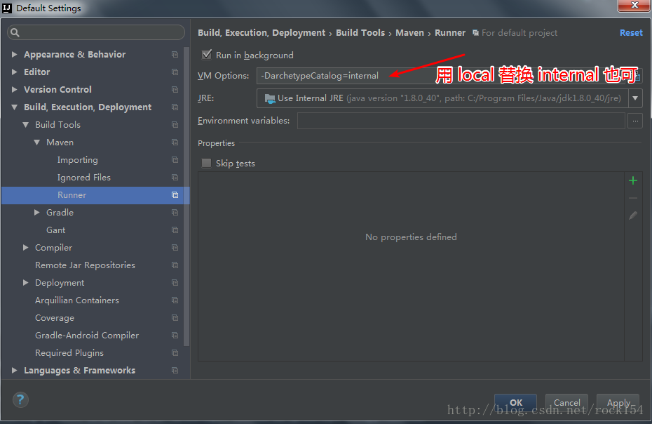

# Maven

## 学习目标：

1. 能够了解Maven的作用(了解)
2. 能够理解Maven仓库的作用(了解)
3. 能够理解Maven的坐标概念(了解)
4. 能够掌握Maven的安装(掌握)
5. 能够掌握IDEA配置本地Maven(掌握)
6. 能够使用IDEA创建javase的Maven工程(掌握)
7. 能够使用IDEA创建javaweb的Maven工程(掌握)
8. 能够自定义javeweb的Maven工程(了解)
9. 能够掌握依赖引入的配置方式(重点)
10. 能够了解依赖范围的概念(了解)

# 第1章 Maven概述

## 1.1 Maven的概念

Maven是项目进行模型抽象，充分运用的面向对象的思想，Maven可以通过一小段描述信息来管理项目的构建，报告和文档的软件项目管理工具。Maven 除了以程序构建能力为特色之外，还提供高级项目管理工具。由于 Maven 的缺省构建规则有较高的可重用性，所以常常用两三行 Maven 构建脚本就可以构建简单的项目。

## 1.2 Maven的作用

- maven对项目的第三方构件（jar包）进行统一管理。向工程中加入jar包不要手工从其它地方拷贝，通过maven定义jar包的坐标，自动从maven仓库中去下载到工程中。(很重要)


- maven提供一套对项目生命周期管理的标准，开发人员、和测试人员统一使用maven进行项目构建。项目生命周期管理：编译、测试、打包、部署、运行。
- maven对工程分模块构建，提高开发效率。

## 1.3 Maven的概念模型

- 项目对象模型 (Project Object Model)。POM对象模型，每个maven工程中都有一个pom.xml文件，定义工程所依赖的jar包、本工程的坐标、打包运行方式。
- 依赖管理系统（基础核心 ）。maven通过坐标对项目工程所依赖的jar包统一规范管理。
- maven定义一套项目生命周期。清理、初始化、**编译、测试**、报告 、**打包、**部署、站点生成。
- 一组标准集合。maven工程有自己标准的工程目录结构、定义坐标有标准。
- maven 管理项目生命周期过程都是基于插件完成的，例如：开发中使用插件。

## 1.4 Maven的仓库

| 仓库名称 | 作用                                                         |
| -------- | ------------------------------------------------------------ |
| 本地仓库 | 相当于缓存，工程第一次会从远程仓库（互联网）去下载jar 包，将jar包存在本地仓库（在程序员的电脑上）。第二次不需要从远程仓库去下载。先从本地仓库找，如果找不到才会去远程仓库找。 |
| 中央仓库 | 就是远程仓库，仓库中jar由专业团队（maven团队）统一维护。中央仓库的地址：http://repo1.maven.org/maven2/ |
| 远程仓库 | 在公司内部架设一台私服，其它公司架设一台仓库，对外公开。     |


## 1.5 Maven的坐标(重点)

Maven的一个核心的作用就是管理项目的依赖，引入我们所需的各种jar包等。为了能自动化的解析任何一个Java构件，Maven必须将这些Jar包或者其他资源进行唯一标识，这是管理项目的依赖的基础，也就是我们要说的坐标。包括我们自己开发的项目，也是要通过坐标进行唯一标识的，这样才能才其它项目中进行依赖引用。坐标的定义元素如下：

- groupId：定义当前Maven组织的名称 
- artifactId：定义项目模块 
- version：定义当前项目的当前版本 

例如：引用BeanUtils框架

```xml
<dependency>
    <groupId>commons-beanutils</groupId>
    <artifactId>commons-beanutils</artifactId>
    <version>1.9.1</version>
</dependency>
<!--引入druid-->
<dependency>
    <groupId>com.alibaba</groupId>
    <artifactId>druid</artifactId>
    <version>1.1.6</version>
</dependency>
```

# 第2章 Maven的安装

## 2.1 下载Maven


## 2.2 安装Maven

将Maven压缩包解压，即安装完毕


## 2.3 Maven目录介绍


## 2.4 配置环境变量


## 2.5 配置本地仓库

### 2.5.1 将软件文件夹中的Repository解压


### 2.5.2 配置本地仓库

在maven的安装目录中conf/ settings.xml文件，在这里配置本地仓库

```xml
<settings xmlns="http://maven.apache.org/SETTINGS/1.0.0"
          xmlns:xsi="http://www.w3.org/2001/XMLSchema-instance"
          xsi:schemaLocation="http://maven.apache.org/SETTINGS/1.0.0 http://maven.apache.org/xsd/settings-1.0.0.xsd">
  <!-- localRepository
   | The path to the local repository maven will use to store artifacts.
   |
   | Default: ${user.home}/.m2/repository
  <localRepository>/path/to/local/repo</localRepository>
  -->
  <localRepository>D:/java/LocalRepository/repository</localRepository>
```

## 2.6 测试Maven安装成功

打开cmd本地控制台，输入mvn -version


# 第3章 IDEA创建Maven工程

## 3.1 IDEA指定本地Maven


解决maven构建卡住的问题:

1再设置如下VM Options: **-DarchetypeCatalog=internal**。注意是File 菜单的Other settings - Default settings.


如果配置了第一步就已经生效了，可以不用配置第二步。 

2.将"archetype-catalog.xml"放置到"C:\Users\Administrator\.m2\repository\org\apache\maven\**archetype**\archetype-catalog\3.0.1 "下

## 3.2 创建java工程

### 3.2.1 创建java工程




### 3.2.2 java工程目录结构


### 3.2.3 编写Hello World！


## 3.3 创建javaweb工程(建议使用)

### 3.3.1 创建javaweb工程

- 创建javaweb工程与创建javase工程类似，但在选择Maven骨架时，选择maven-archetype-webapp即可：


- 创建好的javaweb工程如下：


- 所以，要手动创建一个java目录用于编写java代码：


- 还要将java目录添加为Source Root：


### 3.3.2 发布javaweb工程


### 3.3.3 浏览器访问效果


### 3.3.4 Maven创建javaweb工程的目录结构


# 第4章 创建自定义JavaWeb工程(不要使用)

第3章中，在创建javaweb工程时，使用的是maven-archetype-webapp骨架，如果不使用骨架，怎样创建一个javaweb工程呢，见下面的讲解：

- 创建一个Maven工程，不选择任何骨架


- 填写坐标信息


- 创建web工程信息


- 创建好的javaweb工程的目录结构如下

  


**修改settings文件中的项目编译版本**

```
<profile>   
        <id>jdk1.8</id>
        <activation>   
            <activeByDefault>true</activeByDefault>
            <jdk>1.8</jdk>   
        </activation>
        <properties>   
            <maven.compiler.source>1.8</maven.compiler.source>
            <maven.compiler.target>1.8</maven.compiler.target>
            <maven.compiler.compilerVersion>1.8</maven.compiler.compilerVersion>
            <encoding>UTF-8</encoding>
        </properties>   
    </profile>
```


# 第5章 Maven的常用命令

## 5.1 clean命令

清除编译产生的target文件夹内容，可以配合相应命令一起使用，如mvn clean package， mvn clean test


## 5.2 complie命令

该命令可以对src/main/java目录的下的代码进行编译


## 5.3 test命令

测试命令,或执行src/test/java/下junit的测试用例

- 在src/test/java下创建测试类DemoTest


- 执行test命令测试


- 控制台显示测试结果


## 5.4 package命令

mvn package，打包项目


打包后的项目会在target目录下找到


如果要使用maven对web工程进行打包，我们要添加servlet的依赖

```
<dependency>
      <groupId>javax.servlet</groupId>
      <artifactId>javax.servlet-api</artifactId>
      <version>3.1.0</version>
</dependency>
```

## 5.5 install命令

mvn install，打包后将其安装在本地仓库


安装完毕后，在本地仓库中可以找到itheima_javase_demo的信息


# 第6章 依赖管理(重点)

## 6.1 Maven插件(了解即可)

Maven是一个核心引擎，提供了基本的项目处理能力和建设过程的管理，以及一系列的插件是用来执行实际建设任务。maven插件可以完成一些特定的功能。例如，集成jdk插件可以方便的修改项目的编译环境；集成tomcat插件后，无需安装tomcat服务器就可以运行tomcat进行项目的发布与测试。在pom.xml中通过plugin标签引入maven的功能插件。

### 6.1.1 JDK编译版本的插件

```xml
<!-- jdk版本插件 -->
<plugin>
    <groupId>org.apache.maven.plugins</groupId>
    <artifactId>maven-compiler-plugin</artifactId>
    <version>3.2</version>
    <configuration>
        <source>1.7</source>
        <target>1.7</target>
        <encoding>UTF-8</encoding>
        <showWarnings>true</showWarnings>
    </configuration>
</plugin>
```

### 6.1.2 Tomcat7服务端的插件

- 配置tomcat7插件

```xml
<!-- tomcat7插件 -->
<plugin>
    <groupId>org.apache.tomcat.maven</groupId>
    <artifactId>tomcat7-maven-plugin</artifactId>
    <version>2.2</version>
    <configuration>
        <!--端口号-->
        <port>8833</port>
        <!--path就相当于部署项目时候的ContextPath-->
        <path>/</path>
    </configuration>
</plugin>
```

- 运行tomcat7插件


- tomcat插件注意问题

  Maven的中央仓库中只有Tomcat7.X版本的插件，而之前我们使用的是8.X的版本，如果想使用Tomcat8.X的插件可以去其他第三方仓库进行寻找，或者使用IDEA集成外部Tomcat8极其以上版本，进行项目的发布。


## 6.2 导入依赖(重要)

导入依赖坐标，无需手动导入jar包就可以引入jar。在pom.xml中使用<dependency>标签引入依赖。

### 6.2.1 导入junit的依赖

- 导入junit坐标依赖

```xml
<dependency>
    <groupId>junit</groupId>
    <artifactId>junit</artifactId>
    <version>3.8.1</version>
    <scope>test</scope>
</dependency>
```

- 进行单元测试

```java
import org.junit.Test;

public class DemoTest {
    @Test
    public void test1(){
        System.out.println("test running...");
    }
}
```

### 6.2.2 导入servlet的依赖

- 创建Servlet，但是发现报错，原因是没有导入Servlet的坐标依赖


- 导入Servlet的坐标依赖

```xml
<dependency>
      <groupId>javax.servlet</groupId>
      <artifactId>javax.servlet-api</artifactId>
      <version>3.1.0</version>
</dependency>
```

- 原有报错的Servlet恢复正常


## 6.3 依赖范围


- compile 编译、测试、运行，A在编译时依赖B，并且在测试和运行时也依赖

  例如：strus-core、spring-beans。打到war包或jar包


- provided 编译、和测试有效，A在编译和测试时需要B

   例如：servlet-api就是编译和测试有用，在运行时不用（tomcat容器已提供）

   不会打到war

-  runtime：测试、运行有效

   例如：jdbc驱动包 ，在开发代码中针对java的jdbc接口开发，编译不用

   在运行和测试时需要通过jdbc驱动包（mysql驱动）连接数据库，需要的

   会打到war

-  test：只是测试有效，只在单元测试类中用

   例如：junit

   不会打到war

- 按照依赖强度，由强到弱来排序：(理解)

  compile> provided> runtime> test


**修改不使用骨架创建的maven项目的jdk版本问题**

```
<profile>   
        <id>jdk1.8</id>
        <activation>   
            <activeByDefault>true</activeByDefault>
            <jdk>1.8</jdk>   
        </activation>
        <properties>   
            <maven.compiler.source>1.8</maven.compiler.source>
            <maven.compiler.target>1.8</maven.compiler.target>
            <maven.compiler.compilerVersion>1.8</maven.compiler.compilerVersion>
            <encoding>UTF-8</encoding>
        </properties>   
</profile>
```


# 第7章 Maven案例：使用Maven搭建Servlet+JSP+JdbcTemplate项目

## 7.1 需求分析

完成添加客户信息的操作

## 7.2 创建数据表


## 7.3 创建Maven项目


## 7.4 导入坐标

### 7.4.1 导入所需的依赖（jar包）和插件

- mysql驱动程序
- JdbcTemplate
- druid或者c3p0连接池
- BeanUtils
- servlet-api （Servlet的API）
- jsp-api （可以使用JSTL标签库）

### 7.4.2 maven坐标

```xml
<project xmlns="http://maven.apache.org/POM/4.0.0" xmlns:xsi="http://www.w3.org/2001/XMLSchema-instance"
  xsi:schemaLocation="http://maven.apache.org/POM/4.0.0 http://maven.apache.org/maven-v4_0_0.xsd">
  <modelVersion>4.0.0</modelVersion>
  <groupId>cn.itcat</groupId>
  <artifactId>maven_test</artifactId>
  <packaging>war</packaging>
  <version>1.0-SNAPSHOT</version>
  <name>maven_test Maven Webapp</name>
  <url>http://maven.apache.org</url>


  <dependencies>
    <dependency>
      <groupId>junit</groupId>
      <artifactId>junit</artifactId>
      <version>4.11</version>
      <scope>test</scope>
    </dependency>
    <!--mysql驱动-->
    <dependency>
      <groupId>mysql</groupId>
      <artifactId>mysql-connector-java</artifactId>
      <version>5.1.40</version>
    </dependency>
    <!--JdbcTemplate-->
    <dependency>
      <groupId>org.springframework</groupId>
      <artifactId>spring-core</artifactId>
      <version>5.0.2.RELEASE</version>
      <scope>compile</scope>
    </dependency>
    <dependency>
      <groupId>org.springframework</groupId>
      <artifactId>spring-jdbc</artifactId>
      <version>5.0.2.RELEASE</version>
      <scope>compile</scope>
    </dependency>
    <dependency>
      <groupId>org.springframework</groupId>
      <artifactId>spring-tx</artifactId>
      <version>5.0.2.RELEASE</version>
      <scope>compile</scope>
    </dependency>
    <dependency>
      <groupId>org.springframework</groupId>
      <artifactId>spring-beans</artifactId>
      <version>5.0.2.RELEASE</version>
      <scope>compile</scope>
    </dependency>

    <dependency>
      <groupId>commons-logging</groupId>
      <artifactId>commons-logging</artifactId>
      <version>1.2</version>
      <scope>compile</scope>
    </dependency>
    <!--beanUtils的包-->
    <dependency>
      <groupId>commons-beanutils</groupId>
      <artifactId>commons-beanutils</artifactId>
      <version>1.9.3</version>
    </dependency>
    <!--druid连接池-->
    <dependency>
      <groupId>com.alibaba</groupId>
      <artifactId>druid</artifactId>
      <version>1.1.6</version>
    </dependency>

    <!--引入servlet的jar-->
    <dependency>
      <groupId>javax.servlet</groupId>
      <artifactId>javax.servlet-api</artifactId>
      <version>3.1.0</version>
    </dependency>
  </dependencies>
	
    
  <!-- 配置插件 -->
  <build>
    <plugins>
      <!-- jdk版本插件 -->
      <plugin>
        <groupId>org.apache.maven.plugins</groupId>
        <artifactId>maven-compiler-plugin</artifactId>
        <version>3.2</version>
        <configuration>
          <source>1.7</source>
          <target>1.7</target>
          <encoding>UTF-8</encoding>
        </configuration>
      </plugin>

    </plugins>
  </build>

</project>


```

### 7.4.3 编写代码

#### 7.4.3.1 页面编写

- 表单页面

```jsp
<%@ page language="java" contentType="text/html; charset=utf-8"
         pageEncoding="utf-8"%>
<!DOCTYPE html PUBLIC "-//W3C//DTD HTML 4.01 Transitional//EN" "http://www.w3.org/TR/html4/loose.dtd">
<html>
<head>
    <meta http-equiv="Content-Type" content="text/html; charset=utf-8">
    <title>客户录入页面</title>
</head>
<body>
<form action="SaveCustomer" method="post">
    客户名称：<input type="text" name="cust_name"/><br/>
    客户来源：<input type="text" name="cust_source"/><br/>
    客户级别：<input type="text" name="cust_level"/><br/>
    客户行业：<input type="text" name="cust_industry"/><br/>
    客户地址：<input type="text" name="cust_address"/><br/>
    客户电话：<input type="text" name="cust_phone"/><br/>
    <input type="submit" value="保存"/><br/>
</form>
</body>
</html>
```

- 添加成功页面

```jsp
<%@ page contentType="text/html;charset=UTF-8" language="java" %>
<html>
<head>
    <title>Title</title>
</head>
<body>
    <h1>save success!!!</h1>
</body>
</html>

```

#### 7.4.3.2 编写实体类

```java
package com.itheima.bean;

/**
 * 包名:com.itheima.bean
 * 作者:Leevi
 * 日期2018-07-23  21:52
 */
public class Customer {
    private Long cust_id;
    private String cust_name;
    private String cust_source;
    private String cust_level;
    private String cust_industry;
    private String cust_address;
    private String cust_phone;

    public Long getCust_id() {
        return cust_id;
    }

    public void setCust_id(Long cust_id) {
        this.cust_id = cust_id;
    }

    public String getCust_name() {
        return cust_name;
    }

    public void setCust_name(String cust_name) {
        this.cust_name = cust_name;
    }

    public String getCust_source() {
        return cust_source;
    }

    public void setCust_source(String cust_source) {
        this.cust_source = cust_source;
    }

    public String getCust_level() {
        return cust_level;
    }

    public void setCust_level(String cust_level) {
        this.cust_level = cust_level;
    }

    public String getCust_industry() {
        return cust_industry;
    }

    public void setCust_industry(String cust_industry) {
        this.cust_industry = cust_industry;
    }

    public String getCust_address() {
        return cust_address;
    }

    public void setCust_address(String cust_address) {
        this.cust_address = cust_address;
    }

    public String getCust_phone() {
        return cust_phone;
    }

    public void setCust_phone(String cust_phone) {
        this.cust_phone = cust_phone;
    }
}

```

#### 7.4.3.3 Servlet编写

```java
package com.itheima.maven.web;

import com.itheima.maven.domain.Customer;
import com.itheima.maven.service.CustomerService;
import com.itheima.maven.service.impl.CustomerServiceImpl;

import javax.servlet.ServletException;
import javax.servlet.http.HttpServlet;
import javax.servlet.http.HttpServletRequest;
import javax.servlet.http.HttpServletResponse;
import java.io.IOException;

@WebServlet("/SaveCustomer")
public class SaveCustomerServlet extends HttpServlet {

    private CustomerService customerService = new CustomerServiceImpl();

    @Override
    protected void doGet(HttpServletRequest req, HttpServletResponse resp) throws ServletException, IOException {
        super.doPost(req, resp);
    }

    @Override
    protected void doPost(HttpServletRequest req, HttpServletResponse resp) throws ServletException, IOException {

        //接收参数
        req.setCharacterEncoding("utf-8");
        String custName = req.getParameter("custName");
        String custSource = req.getParameter("custSource");
        String custLevel = req.getParameter("custLevel");
        String custIndustry = req.getParameter("custIndustry");
        String custPhone = req.getParameter("custPhone");

        //封装数据
        Customer customer = new Customer();
        customer.setCustName(custName);
        customer.setCustIndustry(custIndustry);
        customer.setCustPhone(custPhone);
        customer.setCustLevel(custLevel);
        customer.setCustSource(custSource);

        //调用业务
        customerService.save(customer);

        //重定向
        resp.sendRedirect(req.getContextPath()+"/success.jsp");
    }
}
```

#### 7.4.3.4 Service编写

- 接口编写

```java
package com.itheima.maven.service;

import com.itheima.maven.domain.Customer;

public interface CustomerService {
    public void save(Customer customer);
}

```

- 实现编写

```java
package com.itheima.maven.service.impl;

import com.itheima.maven.dao.CustomerDao;
import com.itheima.maven.dao.impl.CustomerDaoImpl;
import com.itheima.maven.domain.Customer;
import com.itheima.maven.service.CustomerService;

public class CustomerServiceImpl implements CustomerService{

    private CustomerDao customerDao = new CustomerDaoImpl();

    @Override
    public void save(Customer customer) {
        customerDao.save(customer);
    }
}

```

#### 7.4.3.5 Dao编写

- 接口编写

```java
package com.itheima.maven.dao;

import com.itheima.maven.domain.Customer;

public interface CustomerDao {
    void save(Customer customer);
}

```

- 实现编写

```java
package com.itheima.maven.dao.impl;

import com.itheima.maven.dao.CustomerDao;
import com.itheima.maven.domain.Customer;
import com.itheima.maven.utils.JdbcUtils;
import org.springframework.jdbc.core.JdbcTemplate;

public class CustomerDaoImpl implements CustomerDao {
    JdbcTemplate jdbcTemplate = new JdbcTemplate(JdbcUtils.getDataSource());

    @Override
    public void save(Customer customer) {
            String sql = "insert into cst_customer(cust_name,cust_source,cust_industry,cust_level,cust_phone)  " +
                    "values(?,?,?,?,?)";
            //执行查询操作
            jdbcTemplate.update(
                    sql,
                    customer.getCustName(),
                    customer.getCustSource(),
                    customer.getCustIndustry(),
                    customer.getCustLevel(),
                    customer.getCustPhone());
    }
}

```

- JdbcUtils工具

```java
package com.itheima.maven.utils;

import com.alibaba.druid.pool.DruidDataSourceFactory;

import javax.sql.DataSource;
import java.io.IOException;
import java.io.InputStream;
import java.sql.Connection;
import java.sql.ResultSet;
import java.sql.SQLException;
import java.sql.Statement;
import java.util.Properties;

/*
	1. 声明静态数据源成员变量
	2. 创建连接池对象
	3. 定义公有的得到数据源的方法
	4. 定义得到连接对象的方法
	5. 定义关闭资源的方法
 */
public class JdbcUtils {
	// 1.	声明静态数据源成员变量
	private static DataSource ds;

	// 2. 创建连接池对象
	static {
		// 加载配置文件中的数据
		InputStream is = JdbcUtils.class.getResourceAsStream("/druid.properties");
		Properties pp = new Properties();
		try {
			pp.load(is);
			// 创建连接池，使用配置文件中的参数
			ds = DruidDataSourceFactory.createDataSource(pp);
		} catch (IOException e) {
			e.printStackTrace();
		} catch (Exception e) {
			e.printStackTrace();
		}
	}

	// 3. 定义公有的得到数据源的方法
	public static DataSource getDataSource() {
		return ds;
	}

	// 4. 定义得到连接对象的方法
	public static Connection getConnection() throws SQLException {
		return ds.getConnection();
	}

	// 5.定义关闭资源的方法
	public static void close(Connection conn, Statement stmt, ResultSet rs) {
		if (rs != null) {
			try {
				rs.close();
			} catch (SQLException e) {}
		}

		if (stmt != null) {
			try {
				stmt.close();
			} catch (SQLException e) {}
		}

		if (conn != null) {
			try {
				conn.close();
			} catch (SQLException e) {}
		}
	}

	// 6.重载关闭方法
	public static void close(Connection conn, Statement stmt) {
		close(conn, stmt, null);
	}
}

```

- druid.properties配置文件

```properties
driverClassName=com.mysql.jdbc.Driver
url=jdbc:mysql://127.0.0.1:3306/maven
username=root
password=root
initialSize=5
maxActive=10
maxWait=3000
maxIdle=6
minIdle=3
```

## 7.5 启动IDEA集成的Tomcat 测试


### 复习

1. 使用一个Servlet处理多个请求
2. 复习面向接口编程，用于解耦
3. 复习ajax的使用

### 单例设计模式

什么是多例设计模式:一个类，每次都会创建一个对象

什么是单例设计模式:整个项目中只有一个该类对象

如果一个类有成员变量，最好不要使用单例模式

