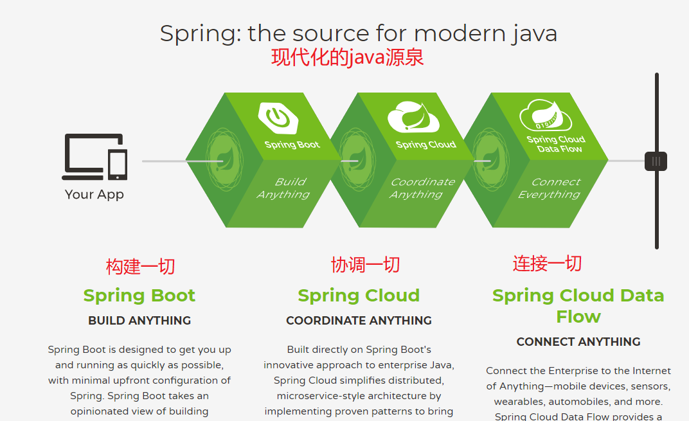
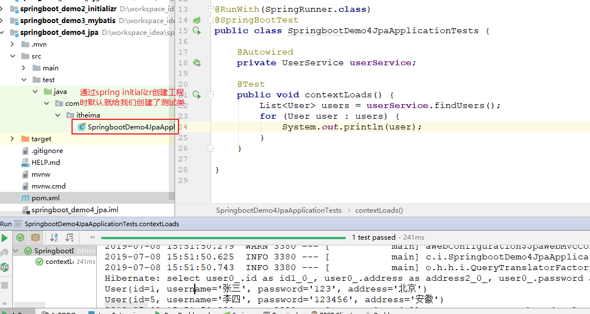

# SpringBoot

## 学习目标

- SpringBoot简介
  - Java开发发展史
  - SpringBoot和Spring关系
- SpringBoot快速入门
  - 传统Maven 构建SpringBoot
  - ==Spring构建方式构建SpringBoot[IDEA工具提供了相关的构建方式]==
- SpringBoot原理分析
  - 依赖关系管理
  - 自动配置
- SpringBoot配置文件使用
  - SpringBoot配置文件[==application.properties/application.yml==]
  - SpringBoot配置文件数据加载/解析
  - 热部署插件
- SpringBoot与其他框架集成
  - ==MyBatis==
  - ==JPA==
  - ==SpringData Redis==
  - ==定时任务==
- SpringBoot单元测试
- SpringBoot程序打包  jar/war    web->jar


## 1 SpringBoot简介

### 1.1 目标

- 理解SpringBoot

### 1.2 讲解

#### 1.2.1 java的开发方式

- 农耕时代java开发：

  - 基于java底层原生api，纯手工去实现，典型的栗子：servlet、jdbc、javascript、socket...

  - 针对这样低效开发方式，那么需要改革。框架就是拯救者，解放了农耕时代的程序猿，框架可以帮助我们做更多，程序猿主要负责业务的实现。

    

    

- 工业时代java开发：

  - 各种框架一顿搞：典型的栗子SSH、SSM、Vue、jquery、Netty...

  - 在工业时代使用框架虽然简化了我们的开发的代码，但是各种配置文件各种jar又一顿搞。微服务又成了拯救者，解放了工业时代的程序猿。让我们过上了小康生活。

    

    

- 现代化java开发：

  - 各种微服务齐活：服务注册与发现、负载均衡与熔断、网关等

  - 各种组件一起上：springboot、springcloud...

    


#### 1.2.2 SpringBoot简介

##### 1.2.2.1 spring开发经历的阶段

Spring 诞生时是 Java 企业版（Java Enterprise Edition，JEE，也称 J2EE）的轻量级代替品。无需开发重量级的 Enterprise JavaBean（EJB），Spring 为企业级Java 开发提供了一种相对简单的方法，通过依赖注入和面向切面编程，用简单的Java 对象（Plain Old Java Object，POJO）实现了 EJB 的功能。虽然 Spring 的组件代码是轻量级的，但它的配置却是重量级的。 

- 第一阶段：xml配置：在Spring 1.x时代，使用Spring开发满眼都是xml配置的Bean，随着项目的扩大，我们需要把xml配置文件放到不同的配置文件里，那时需要频繁的在开发的类和配置文件之间进行切换 
- 第二阶段：注解配置：在Spring 2.x 时代，随着JDK1.5带来的注解支持，Spring提供了声明Bean的注解（例如@Component、@Service），大大减少了配置量。
- 第三阶段：java配置管理 ：Annotation的出现是为了简化Spring的XML配置文件，但Annotation不如XML强大，所以无法完全取代XMl文件 。例如：@Configuration、@Import等。

所有这些配置都代表了开发时间的损耗。 因为在思考 Spring 特性配置和解决业务问题之间需要进行思维切换，**所以写配置挤占了写应用程序逻辑的时间**。除此之外，**项目的依赖管理也是件吃力不讨好的事情**。决定项目里要用哪些库就已经够让人头痛的了，你还要知道这些库的哪个版本和其他库不会有冲突，这难题实在太棘手。并且，依赖管理也是一种损耗，添加依赖不是写应用程序代码。一旦选错了依赖的版本，随之而来的不兼容问题毫无疑问会是生产力杀手。 

**Spring Boot 让这一切成为了过去。**

- **起步依赖**：本质是Maven项目对象模型中的标签。它定义其SpringBoot对他库的传递依赖，依赖加在一起即可支持某项功能。最厉害的就是这个，使得SpringBoot具备了构建一切的能力：整合所有牛×框架
- **自动配置**：基于约定优于配置思想，配置基本都可以走默认值。配置基本都是SpringBoot自动完成


##### 1.2.2.2 springboot简介

Spring Boot 是由 Pivotal 团队提供的全新框架，其设计目的是用来简化新 Spring 应用的初始搭建以及开发过程。该框架使用了特定的方式来进行配置，从而使开发人员不再需要定义样板化的配置。

Spring Boot 简化了基于Spring的应用开发，只需要**“run”**就能创建一个独立的、生产级别的Spring应用。Spring Boot为Spring平台及第三方库提供开箱即用的设置（提供默认设置），这样我们就可以简单的开始。多数Spring Boot应用只需要**很少**（额外）的Spring配置。我们可以使用SpringBoot创建java应用，并使用java –jar 启动它，或者采用传统的war部署方式。

我的理解，就是 Spring Boot 其实不是什么新的框架，它默认配置了很多框架的使用方式，就像 Maven 整合了所有的 Jar 包，Spring Boot 整合了所有的框架。SpringBoot不是对Spring功能的增强，而是提供一种快速使用Spring的开发方式（全新的开发方式）。



### 1.3 小结

- SpringBoot并不是一个新的开发语言

- Spring Boot 简化了基于Spring的应用开发
- SpringBoot简化了配置
- 能很容易整合很多第三方优秀框架


## 2 SpringBoot快速入门

### 2.1 目标

- 搭建SpringBoot环境

- 完成：开发一个web应用并完成字符串“hello springboot”在浏览器显示。


### 2.2 讲解

#### 2.2.1 springmvc实现回顾

实现步骤：

- 创建maven工程
- 导入相关依赖的jar包（例如：spring-web、spring-webmvc等）
- 编写springmvc核心配置文件
- 编写web.xml文件
- 编写XxxController


#### 2.2.2 SpringBoot实现

##### 2.2.2.1 方式一

(1)创建maven工程

创建一个maven工程（建议：java工程，也可以是web工程），无需勾选maven骨架。

1、添加起步依赖（依赖一个父工程）

2、添加web依赖


引来如下：

~~~xml
<!--父工程-->
<parent>
    <groupId>org.springframework.boot</groupId>
    <artifactId>spring-boot-starter-parent</artifactId>
    <version>2.1.6.RELEASE</version>
</parent>

<!--依赖-->
<dependencies>
    <dependency>
        <groupId>org.springframework.boot</groupId>
        <artifactId>spring-boot-starter-web</artifactId>
    </dependency>
</dependencies>
~~~


(2)工程jar依赖情况

此时我们可以发现工程自动引入了很多包,其中还包含tomcat包。


(3)引导程序

该程序是发布springboot应用的入口（只需要run一下）

~~~java
@SpringBootApplication
public class DemoApplication {

    public static void main(String[] args) {
        // 只需要run一下，就能发布一个springboot应用
        // 相当于之前将web工程发布到tomcat服务器，只是在springboot中集成了tomcat插件
        SpringApplication.run(DemoApplication.class,args);
    }
}
~~~


(4) 编写HelloController

在工程的src目录下创建`com.itheima.controller.HelloController`。

~~~java
@RestController
public class HelloController {


    /***
     * 请求 /hello  输出hello springboot!
     * @return
     */
    @RequestMapping(value = "/hello")
    public String hello(){
        return "hello springboot!";
    }
}
~~~


(5) 测试

在DemoApplication里运行主方法，空调数据如下图：


访问：http://localhost:8080/hello


##### 2.3.2.2 方式二（建议）

(1)创建spring initializr工程

通过idea工具创建工程时，不再选择maven了而是选择spring initializr。然后去勾选相关依赖。

- step1：新建module，选择spring initializr，然后下一步

  

- step2：填写项目相关信息

  

- step3：勾选需要的依赖

  

- step4：完成，工程的目录结构如下

  


(2)编写HelloController

在工程的src目录下创建`com.itheima.springbootdemo2.controller.HelloController`

~~~java
@RestController
public class HelloController {


    /***
     * 请求 /hello  输出hello springboot!
     * @return
     */
    @RequestMapping(value = "/hello")
    public String hello(){
        return "hello springboot! demo2!";
    }

}
~~~


(3)测试


访问：http://locahost:8080/hello


### 2.3 小结

- 搭建SpringBoot环境有2种方式
  - Maven工程直接导报
  - Spring Initializr方式
- 使用SpringBoot，我们只用关注业务逻辑，而不用关注业务


## 3 SpringBoot原理分析

### 3.1 目标

- 理解SpringBoot原理-起步依赖
- 理解SpringBoot自动配置


### 3.2 讲解

#### 3.2.1 起步依赖

我们可以打开pom.xml中的parent,并查看`spring-boot-starter-parent`信息。


从上面的`spring-boot-dependencies`的pom.xml中可以看出，坐标的版本，依赖管理，插件管理已经预先定义好了。SpringBoot工程继承Spring-boot-starter-parent后，已经锁定了版本等配置。起步依赖的作用是进行依赖传递 。用啥取啥，随用随取即可。我们开发中彻底不用关心：jar包的版本、依赖等问题了，大大降低版本冲突，版本过期，更新一个jar一下就需要升级一个tree的jar包。

相当于我们之前学习的过程中创建的父工程，在之前创建的父工程中，其中一个功能是用来统一管理jar包。这里的父工程其实作用是一样的。


#### 3.2.2 自动配置

(1)@SpringBootApplication

该注解是一个组合注解，包括如下注解


- @SpringBootConfiguration：与之前@Configuration注解一样，声明为一个配置类
- @ComponentScan：spring IoC容器的扫描包，默认扫描引导程序下的包以及子包，如果我们写的程序不在该包范围内，可以通过该注解指定。
- @EnableAutoConfiguration：springboot实现自动化配置的核心注解。


(2)@SpringBootConfiguration


通过这段我们可以看出，在这个注解上面，又有一个`@Configuration`注解。通过上面的注释阅读我们知道：这个注解的作用就是声明当前类是一个配置类，然后Spring会自动扫描到添加了`@Configuration`的类，并且读取其中的配置信息。而`@SpringBootConfiguration`是来声明当前类是SpringBoot应用的配置类，项目中只能有一个。所以一般我们无需自己添加。


(3)@EnableAutoConfiguration

`@EnableAutoConfiguration`告诉Spring Boot基于你所添加的依赖，去“猜测”你想要如何配置Spring。比如我们引入了`spring-boot-starter-web`，而这个启动器中帮我们添加了`tomcat`、`SpringMVC`的依赖。此时自动配置就知道你是要开发一个web应用，所以就帮你完成了web及SpringMVC的默认配置了！

自动配置：自己一般不用修改配置，默认的配置都给配好了。


### 3.3 小结

- 工程继承了`spring-boot-starter-parent`工程，`spring-boot-starter-parent`继承了`spring-boot-dependencies`,`spring-boot-dependencies`实现了jar包管理和版本锁定。工程引入`spring-boot-starter-web`依赖，该工程又依赖了其他web所需的jar包，maven依赖有传递性。
- 通过`@SpringBootApplication`注解完成自动配置，会将当前类作为一个配置类，并且会根据我们所引入的依赖猜测我们的配置，并实现自动配置。


## 4 SpringBoot配置文件使用

我们知道SpringBoot是基于约定的，所以很多配置都有默认值。如果想修改默认配置，可以使用application.properties或application.yml(application.yaml)自定义配置。SpringBoot默认从Resource目录加载自定义配置文件。application.properties是键值对类型(一直在用，而且默认生成)。application.yml是SpringBoot中一种新的配置文件方式。


### 4.1 目标

- 掌握application.properties配置
- 掌握application.yml语法
- 理解@value与@ConfigurationProperties的使用
- 会使用热部署插件


### 4.2 讲解

#### 4.2.1 application.properties

(1) 语法

- 格式：key=value

- 如果是修改SpringBoot中的默认配置，那么key则不能任意编写，必须参考SpringBoot官方文档。

- application.properties官方文档：

  <https://docs.spring.io/spring-boot/docs/current/reference/htmlsingle/> 


(2)案例

在resources目录下新建application.properties

~~~properties
#tomcat port
server.port=18081
#app context
server.servlet.context-path=/demo
~~~


此时运行，tomcat端口发生了变化，每次请求，需要加上/demo。


#### 4.2.2 application.yml

(1)语法

**普通数据：**

```properties
说明：
key: value（注意：冒号有一个空格）

示例：
name: tom
```

**对象数据或map**

~~~properties
说明：
key:
	key1: value1
	key2: value2

示例：
user:
	name: tom
	age: 23
	addr: beijing
~~~

**集合数据1：存储简单类型**

~~~properties
说明：
key:
	value1
	value2
或：
key: value1,value2

示例：
city:
	beijing
	anhui
	jiangxi
	shenzhen
或：
city: beijing,anhui,jiangxi,shenzhen
~~~

**集合数据2：存储对象类型**

~~~properties
说明：
key:
	key1: vlaue1
	key2: value2
	
示例：
student:
	- name: zhangsan
	  age: 23
	  addr: BJ
	- name: lisi
	  age: 25
	  addr: SZ
	
~~~


(2)案例

将springboot-demo1中的application.properties换成application.yml，代码如下：

~~~yaml
server:
  port: 18081
  servlet:
    context-path: /demo
~~~

如图：


#### 4.2.3 配置文件与配置类的属性映射方式(了解) 

(1)使用注解@Value映射 

@value注解将配置文件的值映射到Spring管理的Bean属性值 


(2)使用注解@ConfigurationProperties映射 

通过注解@ConfigurationProperties(prefix=''配置文件中的key的前缀")可以将配置文件中的配置自动与实体进行映射。 

使用@ConfigurationProperties方式必须提供Setter方法，使用@Value注解不需要Setter方法。 


注意使用该注解需要引入如下依赖：

```xml
<dependency>
	<groupId>org.springframework.boot</groupId>
	<artifactId>spring-boot-configuration-processor</artifactId>
	<optional>true</optional>
</dependency>
```


#### 4.2.4 热部署

(1)配置pom

针对每次修改代码都需要重新发布程序，在springboot中提供了热部署插件。只需要在pom文件中添加热部署依赖即可，如下所示

~~~xml
<!--热部署-->
<dependency>
    <groupId>org.springframework.boot</groupId>
    <artifactId>spring-boot-devtools</artifactId>
</dependency>
~~~


同时需要给工程添加一个插件

```xml
<build>
    <plugins>
        <plugin>
            <groupId>org.springframework.boot</groupId>
            <artifactId>spring-boot-maven-plugin</artifactId>
            <configuration>
                <fork>true</fork> <!-- 如果没有该配置，devtools不会生效 -->
            </configuration>
        </plugin>
    </plugins>
</build>
```


(2)开启自动构建工程

1、在idea的settings中勾选自动构建工程选项即可。如图所示：


2、Shift + Ctrl + Alt + /：选择registry，弹出框选择 compiler.automake.allow.when.app.running 勾选上即可。


测试访问`<http://localhost:18081/demo/hello>` 后台更改数据，无需重启服务，直接刷新页面就可以看到最新数据。


### 4.3 小结

- application.properties
- application.yml：2个空格表示当前对象的子属性，赋值 方式 属性名+：+空格+值    
- @value直接将配置文件中指定key的数据注入，@ConfigurationProperties可以根据key将属性注入到指定对象中。
- 热部署插件开启步骤：
  - 添加热部署依赖，添加插件包
  - IDEA开启自动编译


## 5 SpringBoot与其他框架集成

### 5.1 集成mybatis

#### 5.1.1 目标

- SpringBoot集成MyBatis
- SpringBoot集成MyBatis实现查询所有用户信息


#### 5.1.2 讲解

集成步骤：

```properties
1.搭建springboot工程
2.引入springboot相关依赖包
3.编写pojo
4.创建Dao接口以及Dao映射文件
5.编写Service调用Dao
6.编写Controller调用Service
7.编写配置文件，配置数据源地址和Tomcat端口
8.编写SpringBoot引导类
9.发布测试
```


##### 5.1.2.1 表结构介绍

查询所有用户列表。（建库、建表：略）

~~~sql
-- ----------------------------
-- Table structure for `user`
-- ----------------------------
DROP TABLE IF EXISTS `user`;
CREATE TABLE `user` (
`id` int(11) NOT NULL AUTO_INCREMENT,
`username` varchar(50) DEFAULT NULL,
`password` varchar(50) DEFAULT NULL,
`address` varchar(50) DEFAULT NULL,
PRIMARY KEY (`id`)
) ENGINE=InnoDB AUTO_INCREMENT=10 DEFAULT CHARSET=utf8;
-- ----------------------------
-- Records of user
-- ----------------------------
INSERT INTO `user` VALUES ('1', 'zhangsan', '123', '北京');
INSERT INTO `user` VALUES ('2', 'lisi', '123', '上海');
~~~


##### 5.1.2.2  创建工程

通过spring initializr创建maven工程`springboot-mysql-redis`，并且勾选相关依赖（web、数据库驱动、mybatis）。


`springboot-mysql-redis`的pom.xml依赖如下：

~~~xml
<?xml version="1.0" encoding="UTF-8"?>
<project xmlns="http://maven.apache.org/POM/4.0.0" xmlns:xsi="http://www.w3.org/2001/XMLSchema-instance"
	xsi:schemaLocation="http://maven.apache.org/POM/4.0.0 http://maven.apache.org/xsd/maven-4.0.0.xsd">
	<modelVersion>4.0.0</modelVersion>
	<parent>
		<groupId>org.springframework.boot</groupId>
		<artifactId>spring-boot-starter-parent</artifactId>
		<version>2.1.6.RELEASE</version>
		<relativePath/> <!-- lookup parent from repository -->
	</parent>
	<groupId>com.itheima</groupId>
	<artifactId>springboot-mybatis-redis</artifactId>
	<version>0.0.1-SNAPSHOT</version>
	<name>springboot-mybatis-redis</name>
	<description>Demo project for Spring Boot</description>

	<properties>
		<java.version>1.8</java.version>
	</properties>

	<dependencies>
		<dependency>
			<groupId>org.springframework.boot</groupId>
			<artifactId>spring-boot-starter-web</artifactId>
		</dependency>
		<dependency>
			<groupId>org.mybatis.spring.boot</groupId>
			<artifactId>mybatis-spring-boot-starter</artifactId>
			<version>2.0.1</version>
		</dependency>

		<dependency>
			<groupId>org.springframework.boot</groupId>
			<artifactId>spring-boot-devtools</artifactId>
			<scope>runtime</scope>
			<optional>true</optional>
		</dependency>
		<dependency>
			<groupId>mysql</groupId>
			<artifactId>mysql-connector-java</artifactId>
			<scope>runtime</scope>
		</dependency>
		<dependency>
			<groupId>org.springframework.boot</groupId>
			<artifactId>spring-boot-starter-test</artifactId>
			<scope>test</scope>
		</dependency>
	</dependencies>

	<build>
		<plugins>
			<plugin>
				<groupId>org.springframework.boot</groupId>
				<artifactId>spring-boot-maven-plugin</artifactId>
			</plugin>
		</plugins>
	</build>
</project>
~~~


##### 5.1.2.3 代码实现

(1)编写pojo

在工程的src目录下创建`com.itheima.domain.User`对象：

~~~java
public class User implements Serializable{

    private Integer id;
    private String username;
    private String password;
    private String address;
    // TODO getters、setters
}
~~~


(2)编写mapper接口以及映射文件

MyBatis的Dao：Dao接口、Dao接口对应的映射文件(xml)


1、编写mapper接口：在src目录下创建`com.itheima.mapper.UserMapper`

- 在接口中添加**@Mapper**注解（标记该类是一个Mapper接口，可以被SpringBoot自动扫描）

~~~java
@Mapper
public interface UserMapper {

    /**
     * 查询所有用户
     * @return
     */
    List<User> findAll();
}
~~~

2、编写映射文件：在工程的resources/mapper目录下创建UserMapper.xml


~~~xml
<?xml version="1.0" encoding="UTF-8" ?>
<!DOCTYPE mapper PUBLIC "-//mybatis.org//DTD Mapper 3.0//EN" "http://mybatis.org/dtd/mybatis-3-mapper.dtd" >
<mapper namespace="com.itheima.mapper.UserMapper">

    <!--查询所有用户-->
    <select id="findAll" resultType="user">
        SELECT * FROM user
    </select>

</mapper>
~~~


(3)编写service接口以及实现类

1、service接口：

创建`com.itheima.service.UserService`

~~~java
public interface UserService {
    /***
     * 查询所有
     * @return
     */
    List<User> findAll();
}
~~~


2、service实现类：

创建`com.itheima.service.impl.UserServiceImpl`

~~~java
@Service
public class UserServiceImpl implements UserService {

    @Autowired
    private UserMapper userMapper;

    /**
     * 查询所有
     * @return
     */
    @Override
    public List<User> findAll() {
        return userMapper.findAll();
    }
}
~~~


(5) 编写controller

在工程的src目录下创建`com.itheima.controller.UserController`：

~~~java
@RestController
@RequestMapping("/user")
public class UserController {

    @Autowired
    private UserService userService;

    /***
     * 查询所有用户
     * @return
     */
    @RequestMapping("/findAll")
    public List<User> findAll(){
        return userService.findAll();
    }
}
~~~


##### 5.1.2.4 配置application.properties

~~~properties
#连接数据库
spring.datasource.driver-class-name=com.mysql.cj.jdbc.Driver
spring.datasource.url=jdbc:mysql://localhost/springboot?useUnicode=true&characterEncoding=UTF-8&serverTimezone=UTC
spring.datasource.username=root
spring.datasource.password=itcast
#mybatis别名
mybatis.type-aliases-package=com.itheima.domain
#加载映射文件
mybatis.mapper-locations=classpath:mapper/*.xml
#设置日志，com.itheima.mapper：只查看该包下程序的日志
logging.level.com.itheima.mapper=debug
~~~


##### 5.1.2.5 发布程序并访问

访问地址：`<http://localhost:8080/user/findAll>`


#### 5.1.3 小结

- SpringBoot集成MyBatis
  - 引入相关依赖
  - 编写Dao接口，接口上需要添加==@Mapper==注解
  - ==配置文件中配置数据源、指定别名包、映射文件路径==
- SpringBoot集成MyBatis实现查询所有用户信息
  - 编写Dao接口和接口对应的XML映射文件
  - 编写对应的Service，注入Dao，并调用Dao
  - 编写Controller，调用Service


### 5.2 集成Spring Data Redis

Spring Data:  Spring 的一个子项目。用于简化数据库访问，支持**NoSQL**和**关系数据库存储**。其主要目标是使数据库的访问变得方便快捷。 


#### 5.2.1 目标

- 集成SpringDataRedis
- 查询用户，先去Redis中查询，如果有数据直接返回数据，没数据，则查询数据，并存入到Redis缓存，再返回数据


#### 5.2.2 讲解

(1)添加Redis启动器

这里我们就不在单独创建工程了，就直接在【5.1】章节中添加Redis启动器。

~~~xml
<!--redis-->
<dependency>
    <groupId>org.springframework.boot</groupId>
    <artifactId>spring-boot-starter-data-redis</artifactId>
</dependency>
~~~


(2)配置application

在application.properties文件中配置连接Redis的信息：

~~~properties
#redis，端口可以不填，默认就是6379
spring.redis.host=192.168.211.132
spring.redis.port=6379
~~~


(3)更新程序

更新UserServiceImpl类中的findAll方法。在该类中注入RedisTemplate对象。

~~~java
@Service
public class UserServiceImpl implements UserService {

    @Autowired
    private UserMapper userMapper;

    @Autowired
    private RedisTemplate redisTemplate;

    /**
     * 查询所有
     * @return
     */
    @Override
    public List<User> findAll() {
        String key = "UserList";
        //先看缓存中是否有数据
        List<User> users = (List<User>) redisTemplate.boundValueOps(key).get();

        //如果有，直接取缓存数据
        if(users!=null){
            return users;
        }

        //如果没有，则查询数据
        users = userMapper.findAll();

        //再将数据存入到缓存
        redisTemplate.boundValueOps(key).set(users);
        return  users;
    }
}
~~~


(4) 测试

请求`<http://localhost:8080/user/findAll>` 如果发生如下异常，说明javabean没有序列化,修改User对象,实现Serializable即可。


#### 5.2.3 小结

- 集成SpringDataRedis
  - 引入SpringDataRedis依赖
  - application.properties中配置Redis链接信息
  - 注入RedisTemplate，RedisTemplate实现了对Redis的增删查询操作


### 5.3 集成Spring Data JPA

什么是SpringData
Spring Data是一个用于简化数据访问，并支持云服务的开源框架。其主要目标是使得对数据的访问变得方便快捷，并支持map-reduce框架和云计算数据服务。 Spring Data可以极大的简化JPA的写法，可以在几乎不用写实现的情况下，实现对数据的访问和操作。除了CRUD外，还包括如分页、排序等一些常用的功能。
Spring Data的官网：http://projects.spring.io/spring-data/ 


#### 5.3.1 目标

- 集成SpringDataJPA

- 完成对user表的CRUD操作。


#### 5.3.2 讲解

集成步骤

```properties
1.创建工程
2.引入依赖
3.创建Pojo
4.配置Pojo注解
5.编写Dao，Dao需要集成JpaRepository<T,ID>
6.编写Service，并调用Dao实现增删改查
7.编写Controller，调用Service实现增删改查
8.测试
```


##### 5.3.2.1 代码实现

(1) 创建工程

创建工程`springboot-jpa`，并且勾选相关依赖（Spring Data JPA）。


`springboot-jpa`的pom.xml依赖如下：

~~~xml
<?xml version="1.0" encoding="UTF-8"?>
<project xmlns="http://maven.apache.org/POM/4.0.0" xmlns:xsi="http://www.w3.org/2001/XMLSchema-instance"
	xsi:schemaLocation="http://maven.apache.org/POM/4.0.0 http://maven.apache.org/xsd/maven-4.0.0.xsd">
	<modelVersion>4.0.0</modelVersion>
	<parent>
		<groupId>org.springframework.boot</groupId>
		<artifactId>spring-boot-starter-parent</artifactId>
		<version>2.1.6.RELEASE</version>
		<relativePath/> <!-- lookup parent from repository -->
	</parent>
	<groupId>com.itheima</groupId>
	<artifactId>springboot-jpa</artifactId>
	<version>0.0.1-SNAPSHOT</version>
	<name>springboot-jpa</name>
	<description>Demo project for Spring Boot</description>

	<properties>
		<java.version>1.8</java.version>
	</properties>

	<dependencies>
		<dependency>
			<groupId>org.springframework.boot</groupId>
			<artifactId>spring-boot-starter-data-jpa</artifactId>
		</dependency>
		<dependency>
			<groupId>org.springframework.boot</groupId>
			<artifactId>spring-boot-starter-web</artifactId>
		</dependency>

		<dependency>
			<groupId>mysql</groupId>
			<artifactId>mysql-connector-java</artifactId>
			<scope>runtime</scope>
		</dependency>
		<dependency>
			<groupId>org.springframework.boot</groupId>
			<artifactId>spring-boot-starter-test</artifactId>
			<scope>test</scope>
		</dependency>
	</dependencies>

	<build>
		<plugins>
			<plugin>
				<groupId>org.springframework.boot</groupId>
				<artifactId>spring-boot-maven-plugin</artifactId>
			</plugin>
		</plugins>
	</build>

</project>
~~~


(2)编写pojo

在工程的src目录下创建`com.itheima.domain.User`对象（会自动创建表）。

~~~java
@Entity
@Table(name = "user")
public class User {

    @Id
    @GeneratedValue(strategy = GenerationType.IDENTITY)
    private Integer id;
    @Column(name = "username")
    private String username;
    private String password;
    private String address;
    // TODO getters/setters
}
~~~

注解说明：

```properties
@Entity：表明为一个实体对象
@Table：指定映射的表
@Id：指定为主键
@GeneratedValue：指定注解的生成策略
    TABLE：使用一个特定的数据库表格来保存主键。 
    SEQUENCE：根据底层数据库的序列来生成主键，条件是数据库支持序列。 
    IDENTITY：主键由数据库自动生成（主要是自动增长型） 
    AUTO：主键由程序控制
    @Column：指定表的列明
```


(3)编写dao接口

在工程src目录下创建dao接口，需要继承JpaRepository对象（该对象完成对数据库的CRUD过程，并且支持分页查询、排序等功能）。

在src下创建`com.itheima.dao.UserDao`接口，代码如下：

~~~java
public interface UserDao extends JpaRepository<User,Integer> {
}
~~~


(4)编写service接口以及实现类

1、编写service接口：

~~~java
public interface UserService {

    List<User> findUsers();

    User findUserById(Integer id);

    void saveUser(User user);

    void updateUser(User user);

    void deleteUserById(Integer id);
}
~~~


2、编写service实现类：

在src下创建`com.itheima.service.impl.UserServiceImpl`代码如下：

~~~java
@Service
public class UserServiceImpl implements UserService {

    @Autowired
    private UserDao userDao;

    @Override
    public List<User> findUsers() {
        return userDao.findAll();
    }

    @Override
    public User findUserById(Integer id) {
        Optional<User> optional = userDao.findById(id);
        return optional.get();
    }

    @Override
    public void saveUser(User user) {
        userDao.save(user);
    }

    @Override
    public void updateUser(User user) {
        // 并没有update方法，如果id存在则执行更新操作
        userDao.save(user);
    }

    @Override
    public void deleteUserById(Integer id) {
        userDao.deleteById(id);
    }
}
~~~


(5)编写controller

在工程的src目录下创建`com.itheima.controller.UserController`。

~~~java
@RestController
@RequestMapping("/user")
public class UserController {

    @Autowired
    private UserService userService;

    @RequestMapping("/findUsers")
    public List<User> findUsers(){
        return userService.findUsers();
    }

    @RequestMapping("/findUserById/{id}")
    public User findUserById(@PathVariable Integer id){
        return userService.findUserById(id);
    }

    @RequestMapping("/saveUser")
    public void saveUser(User user){
        userService.saveUser(user);
    }

    @RequestMapping("/updateUser")
    public void updateUser(User user){
        userService.updateUser(user);
    }

    @RequestMapping("/deleteUserById/{id}")
    public void deleteUserById(@PathVariable Integer id){
        userService.deleteUserById(id);
    }
}
~~~


##### 5.3.2.2 配置application

在application.properties中配置相关JPA内容。

~~~properties
#连接数据库
spring.datasource.driver-class-name=com.mysql.cj.jdbc.Driver
spring.datasource.url=jdbc:mysql://localhost/springboot?useUnicode=true&characterEncoding=UTF-8&serverTimezone=UTC
spring.datasource.username=root
spring.datasource.password=itcast
#jpa 相关配置
spring.jpa.database=mysql
spring.jpa.show-sql=true
spring.jpa.hibernate.ddl-auto=update
spring.jpa.generate-ddl=true

#hibernate.ddl-auto，建表策略：
#update：每次运行程序，没有表会新建表，表内有数据不会清空，只会更新
#create：每次运行程序，没有表会新建表，表内有数据会清空
#create-drop：每次程序结束的时候会清空表
#validate：运行程序会校验数据与数据库的字段类型是否相同，不同会报错
~~~


##### 5.3.2.3 测试

测试：略。


#### 5.3.3 小结

- 集成SpringDataJPA
  - Dao需要继承JpaRepository<T,ID>
  - JpaRepository<T,ID>中已经实现了增删改查,可以拿着直接使用


### 5.4 集成定时器

1、在SpringBoot引导程序中添加开启定时任务注解：@EnableScheduling


2、编写定时任务程序

~~~java
@Component
public class TimeProgarm {

    /**
     * 掌握：cron表达式是一个字符串，字符串以5或6个空格隔开，分开共6或7个域，每一个域代表一个含义
     *  [秒] [分] [小时] [日] [月] [周] [年]
     *  [年]不是必须的域，可以省略[年]，则一共6个域
     *
     * 了解：
     *  fixedDelay：上一次执行完毕时间点之后多长时间再执行（单位：毫秒）
     *  fixedDelayString：同等，唯一不同的是支持占位符，在配置文件中必须有time.fixedDelay=5000
     *  fixedRate：上一次开始执行时间点之后多长时间再执行
     *  fixedRateString：同等，唯一不同的是支持占位符
     *  initialDelay：第一次延迟多长时间后再执行
     *  initialDelayString：同等，唯一不同的是支持占位符
     */
//    @Scheduled(fixedDelay = 5000)
//    @Scheduled(fixedDelayString = "5000")
//    @Scheduled(fixedDelayString = "${time.fixedDelay}")
//    @Scheduled(fixedRate = 5000)
//    // 第一次延迟1秒后执行，之后按fixedRate的规则每5秒执行一次
//    @Scheduled(initialDelay=1000, fixedRate=5000)
    @Scheduled(cron = "30 45 15 08 07 *")
    public void myTask(){
        System.out.println("程序执行了");
    }
}
~~~

备注：可以通过资料中提供的cron表达式工具去生成。

CronTrigger配置完整格式为： [秒][分] [小时][日] [月][周] [年]

| 序号 | 说明 | 是否必填 | 允许填写的值      | 允许的通配符  |
| ---- | ---- | -------- | ----------------- | ------------- |
| 1    | 秒   | 是       | 0-59              | , - * /       |
| 2    | 分   | 是       | 0-59              | , - * /       |
| 3    | 小时 | 是       | 0-23              | , - * /       |
| 4    | 日   | 是       | 1-31              | , - * ? / L W |
| 5    | 月   | 是       | 1-12或JAN-DEC     | , - * /       |
| 6    | 周   | 是       | 1-7或SUN-SAT      | , - * ? / L W |
| 7    | 年   | 否       | empty 或1970-2099 | , - * /       |

使用说明：

```properties
通配符说明:
* 表示所有值. 例如:在分的字段上设置 "*",表示每一分钟都会触发。

? 表示不指定值。使用的场景为不需要关心当前设置这个字段的值。

例如:要在每月的10号触发一个操作，但不关心是周几，所以需要周位置的那个字段设置为"?" 具体设置为 0 0 0 10 * ?

- 表示区间。例如 在小时上设置 "10-12",表示 10,11,12点都会触发。

, 表示指定多个值，例如在周字段上设置 "MON,WED,FRI" 表示周一，周三和周五触发

/ 用于递增触发。如在秒上面设置"5/15" 表示从5秒开始，每增15秒触发(5,20,35,50)。 在月字段上设置'1/3'所示每月1号开始，每隔三天触发一次。

L 表示最后的意思。在日字段设置上，表示当月的最后一天(依据当前月份，如果是二月还会依据是否是润年[leap]), 在周字段上表示星期六，相当于"7"或"SAT"。如果在"L"前加上数字，则表示该数据的最后一个。例如在周字段上设置"6L"这样的格式,则表示“本月最后一个星期五"

W 表示离指定日期的最近那个工作日(周一至周五). 例如在日字段上设置"15W"，表示离每月15号最近的那个工作日触发。如果15号正好是周六，则找最近的周五(14号)触发, 如果15号是周未，则找最近的下周一(16号)触发.如果15号正好在工作日(周一至周五)，则就在该天触发。如果指定格式为 "1W",它则表示每月1号往后最近的工作日触发。如果1号正是周六，则将在3号下周一触发。(注，"W"前只能设置具体的数字,不允许区间"-").

# 序号(表示每月的第几个周几)，例如在周字段上设置"6#3"表示在每月的第三个周六.注意如果指定"#5",正好第五周没有周六，则不会触发该配置(用在母亲节和父亲节再合适不过了) ；
```


## 6 SpringBoot单元测试

~~~java
@RunWith(SpringRunner.class)
@SpringBootTest
public class SpringbootDemo4JpaApplicationTests {

	@Test
	public void contextLoads() {
		
	}

}
~~~




扩展：SpringBoot还能集成哪些技术？(了解)

1. 集成 MongoDB
2. 集成 ElasticSearch
3. 集成 Memcached
4. 集成邮件服务
5. 集成RabbitMQ消息中间件
6. 集成Freemarker或者Thymeleaf 

.......


## 7 SpringBoot程序打包

### 7.1 打jar包

- 第一步：在项目的pom文件中指定项目的打包类型（可以不指定，默认就是jar）

  

- 第二步：将工程打成jar包

  - 方式一：直接在idea中执行如下操作

  

  - 方式二：通过命令执行

    ~~~shell
    1、通过cmd进入到工程的目录中，与pom.xml同级
    2、然后执行命令：mvn clean package [-Dmaven.test.skip=true] --->[]内为可选操作，排除测试代码，也就是说打包时跳过测试代码
    如下命令打包：mvn clean package -Dmaven.test.skip=true
    ~~~

- 运行程序：

  ```properties
  java -jar springboot_demo4_jpa-0.0.1-SNAPSHOT.jar
  -Xmx：最大堆内存
  -Xms：初始堆内存
  java -Xmx80m -Xms20m -jar springboot_demo4_jpa-0.0.1-SNAPSHOT.jar
  ```
  
  

  


### 7.2 打war包

- 第一步：在项目的pom文件中指定项目的打包类型（war）

  

- 第二步：创建ServletInitializer，需要继承SpringBootServletInitializer类。（该类相当于之前web工程的web.xml文件）

  

- 第三步：将xxx.war工程拷贝到tomcat发布运行：略。
