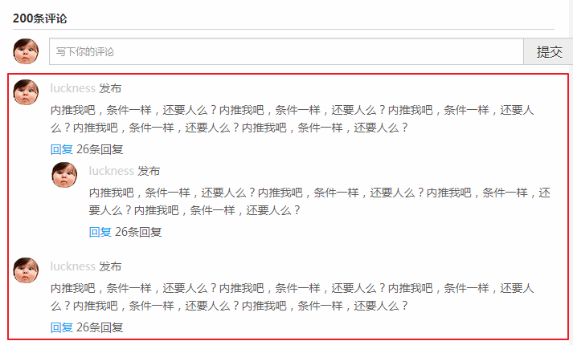
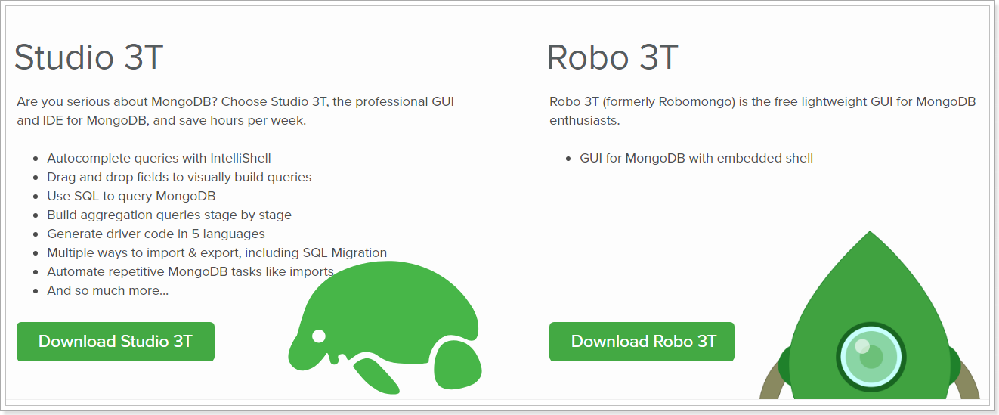
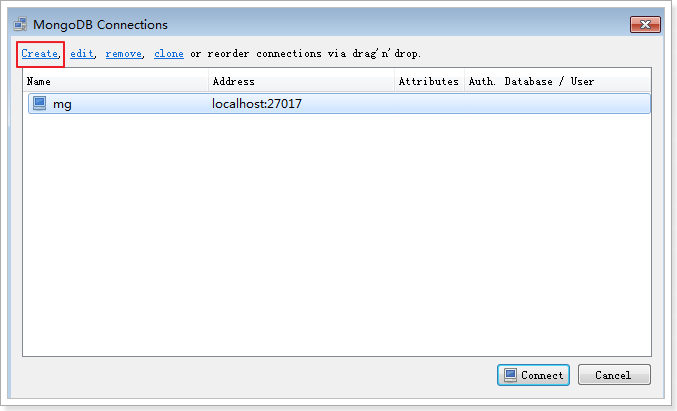
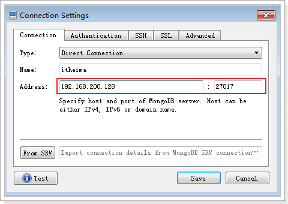

# day02-MongoDB和评论管理

# 学习目标

- [ ] 了解什么是MongoDB
- [ ] 掌握MongoDB的安装
- [ ] 掌握MongoDB的常用命令
- [ ] 掌握mongodb-driver的基本使用
- [ ] 掌握SpringDataMongoDB的使用
- [ ] 能够实现文章评论功能开发

# 第一章-MongoDB

## 知识点-MongoDB简介

### 1.目标

- [ ] 了解什么是MongoDB

### 2.路径

1. 为什么要使用MongoDB
2. 什么是MongoDB
3. MongoDB特点
4.  MongoDB体系结构
5. MongoDB数据类型

### 3.讲解

####3.1 为什么要使用MongoDB

 

文章评论功能存在以下特点：

1. 数据量大
2. 写入操作频繁
3. 价值较低

对于这样的数据，我们更适合使用MongoDB来实现数据的存储


#### 3.2 什么是MongoDB

​	MongoDB是一个基于分布式文件存储的数据库。由C++语言编写。旨在为WEB应用提供==可扩展的高性能数据存储解决方案==。
​	MongoDB是一个介于关系数据库和非关系数据库之间的产品，是非关系数据库当中功能最丰富，最像关系数据库的。它支持的数据结构非常松散，是类似json的bson格式，因此可以存储比较复杂的数据类型。

#### 3.3 MongoDB特点

​	Mongo最大的特点是它支持的查询语言非常强大，其语法有点类似于面向对象的查询语言，几乎可以实现类似关系数据库单表查询的绝大部分功能，而且还支持对数据建立索引。

它的特点是高性能、易部署、易使用，存储数据非常方便。主要功能特性有：

1. 面向集合存储，易存储对象类型的数据。
2. 模式自由。
3. 支持动态查询。
4. 支持完全索引，包含内部对象。
5. 支持查询。
6. 支持复制和故障恢复。
7. 使用高效的二进制数据存储，包括大型对象（如视频等）。
8. 自动处理碎片，以支持云计算层次的扩展性。
9. 支持RUBY，PYTHON，JAVA，C++，PHP，C#等多种语言。
10. 文件存储格式为BSON（一种JSON的扩展）。


#### 3.4 MongoDB体系结构

​	MongoDB 的逻辑结构是一种层次结构。主要由：文档(document)、集合(collection)、数据库(database)这三部分组成的。逻辑结构是面向用户的，用户使用 MongoDB 开发应用程序使用的就是逻辑结构。

1.  MongoDB 的文档（document），相当于关系数据库中的一行记录。
2.  多个文档组成一个集合（collection），相当于关系数据库的表。
3.  多个集合（collection），逻辑上组织在一起，就是数据库（database）。
4.  一个 MongoDB 实例支持多个数据库（database）。


文档(document)、集合(collection)、数据库(database)的层次结构如下图:


| MongoDb           | 关系型数据库Mysql |
| ----------------- | ----------------- |
| 数据库(databases) | 数据库(databases) |
| 集合(collections) | 表(table)         |
| 文档(document)    | 行(row)           |


#### 3.5 MongoDB数据类型

| 数据类型            | 描述                                                         |
| ------------------- | ------------------------------------------------------------ |
| String              | 字符串。存储数据常用的数据类型。在  MongoDB 中，UTF-8 编码的字符串才是合法的。 |
| Integer             | 整型数值。用于存储数值。根据你所采用的服务器，可分为  32 位或 64 位。 |
| Boolean             | 布尔值。用于存储布尔值（真/假）。                            |
| Double              | 双精度浮点值。用于存储浮点值。                               |
| Array               | 用于将数组或列表或多个值存储为一个键。                       |
| Timestamp           | 时间戳。记录文档修改或添加的具体时间。                       |
| Object              | 用于内嵌文档。                                               |
| Null                | 用于创建空值。                                               |
| Date                | 日期时间。用  UNIX 时间格式来存储当前日期或时间。你可以指定自己的日期时间：创建 Date 对象，传入年月日信息。 |
| Object  ID          | 对象  ID。用于创建文档的 ID。                                |
| Binary  Data        | 二进制数据。用于存储二进制数据。                             |
| Code                | 代码类型。用于在文档中存储  JavaScript 代码。                |
| Regular  expression | 正则表达式类型。用于存储正则表达式。                         |

特殊说明：

1. ObjectId

   ObjectId 类似唯一主键，可以很快的去生成和排序，包含 12 bytes，含义是：

   * 前 4 个字节表示创建 unix 时间戳，格林尼治时间 UTC 时间，比北京时间晚了 8 个小时
   * 接下来的 3 个字节是机器标识码
   * 紧接的两个字节由进程 id 组成 PID
   * 最后三个字节是随机数

   

   

   MongoDB 中存储的文档必须有一个 _id 键。这个键的值可以是任何类型的，默认是个 ObjectId 对象

   

2. 时间戳

   BSON 有一个特殊的时间戳类型，与普通的日期类型不相关。时间戳值是一个 64 位的值。其中：

   - 前32位是一个 time_t 值【与Unix新纪元（1970年1月1日）相差的秒数】
   - 后32位是在某秒中操作的一个递增的序数

   在单个 mongod 实例中，时间戳值通常是唯一的。

   

3. 日期

   表示当前距离 Unix新纪元（1970年1月1日）的毫秒数。日期类型是有符号的, 负数表示 1970 年之前的日期。

#### 3.6MongoDB和Redis比较【面试】

| 比较指标   | MongoDB                                                      | Redis                                                        | 比较说明                                                     |
| ---------- | ------------------------------------------------------------ | ------------------------------------------------------------ | ------------------------------------------------------------ |
| 实现语言   | c++                                                          | c/c++                                                        | -                                                            |
| 协议       | ==BSON,自定义二进制==                                        | ==类telnet(TCP/IP)==                                         | -                                                            |
| 性能       | ==依赖内存 (内存映射文件技术)==                              | ==依赖内存==                                                 | Redis优于MongoDB                                             |
| 可操作性   | 丰富的数据表达,索引;最类似于关系型数据库,支持丰富的查询语句  | 数据类型丰富,较少的IO                                        | -                                                            |
| 内存及存储 | 适合大数据量存储,依赖系统虚拟内存,采用镜像文件存储;内存占用率比较高,官方建议独立部署在64位系统 | Redis2.0后支持虚拟内存特性(VM) 突破物理内存限制;数据可以设置时效性,类似于memcache | 不同的应用场景,各有千秋                                      |
| 可用性     | 支持master-slave,replicatset(内部采用paxos选举算法,自动故障恢复),auto sharding机制,对客户端屏蔽了故障转移和切片机制 | 依赖客户端来实现分布式读写;主从复制时,每次从节点重新连接主节点都要依赖整个快照,无增量复制;不支持auto sharding,需要依赖程序设定一致性hash机制 | MongoDB优于Redis；单点问题上,MongoDB应用简单,相对用户透明,Redis比较复杂,需要客户端主动解决.(MongoDB一般使用replicasets和sharding相结合,replicasets侧重高可用性以及高可靠,sharding侧重性能,水平扩展) |
| 可靠性     | 从1.8版本后,采用binlog方式(类似Mysql) 支持持久化             | 依赖快照进行持久化;AOF增强可靠性;增强性的同时,影响访问性能   | mongodb在启动时，专门初始化一个线程不断循环（除非应用crash掉），用于在一定时间周期内来从defer队列中获取要持久化的数据并写入到磁盘的journal(日志)和mongofile(数据)处，当然它不是在用户添加记录时就写到磁盘上 |
| 一致性     | ==以前都版本不支持事务,靠客户端保证==  ==最新4.x的支持事务== | ==支持事务,比较脆,仅能保证事务中的操作按顺序执行==           | Redis优于MongoDB                                             |
| 数据分析   | 内置数据分析功能(mapreduce)                                  | 不支持                                                       | MongoDB优于Redis                                             |
| 应用场景   | ==海量数据存储和访问效率提升==                               | ==较小数据量的性能和运算==                                   | MongoDB优于Redis                                             |


## 知识点-MongoDB安装

### 1.目标

- [ ] 掌握MongoDB的安装

### 2.路径

1. window系统MongoDB安装
2. Docker 环境下MongoDB安装
3. 客户端的安装使用

### 3.讲解

####3.1 window系统MongoDB安装

* **安装**

		安装资料中的`mongodb-win32-x86_64-2008plus-ssl-3.2.10-signed.msi` 按照提示步骤安装即可。安装完成后，软件会安装在C:\Program Files\MongoDB 目录中

​	我们要启动的服务程序就是C:\Program Files\MongoDB\Server\3.2\bin目录下的mongod.exe，为了方便我们每次启动，我们可以像配置jdk一样，将C:\Program Files\MongoDB\Server\3.2\bin 设置到环境变量path中。


* **启动**

1. 创建一个文件夹`d:\data`，用于存放数据的目录data

2. 打开命令行窗口，执行以下命令

```bash
mongod --dbpath=D:\data
```

  

​	我们在启动信息中可以看到，mongoDB的默认端口是27017，如果我们想改变默认的启动端口，可以通过--port来指定端口，例如

```bash
mongod --dbpath=D:\data -port 8989
```

* **登录**

再打开一个新的命令行窗口，执行以下命令：（）

```bash
mongo 127.0.0.1:27017
```

以上命令中，如果ip是本地服务，端口号是27017，则后面的`127.0.0.1:27017`可以省略

* **退出**

```bash
exit
```

####3.2 Docker 环境下MongoDB安装

在Linux虚拟机中创建mongo容器，命令如下：

```bash
docker run -di --name=tensquare_mongo -p 27017:27017 mongo
```

在Window命令行窗口出入登录命令：

```bash
mongo 192.168.200.128
```

#### 3.3客户端的安装和使用

Mongodb有很多可视化工具，这里我们使用robomongo，可以访问官网：<https://robomongo.org/>



我们可以看到有两个版本Studio 3T和Robo 3T

Studio 3T是一个功能很强大的收费版。。。

Robo 3T前身就是Robomongo，是一个免费的可视化工具，我们使用他可以很轻松的进行Mongodb的管理。


在资料中找到robo3t-1.3.1-windows-x86_64-7419c406.exe并双击安装。打开后看到以下界面：



点击`Create`创建连接，进行如下配置即可：



### 4.小结

1. window里面安装: 避免中文和空格目录
2. docker环境
   + 下载镜像
   + 启动容器
3. 客户端

> 默认端口: 27017


## 知识点-常用命令

### 1.目标

- [ ] 掌握MongoDB的常用命令

### 2.路径

1. 数据库
2. 集合
3. 文档

### 3.讲解

####3.1 选择和创建数据库

选择和创建数据库的语法格式：

```bash
use 数据库名称
```


如果数据库存在则选择该数据库，如果数据库不存在则自动创建。以下语句创建commentdb数据库：

```bash
use commentdb
```


查看数据库：

```bash
show dbs
```


查看集合,需要先选择数据库之后，才能查看该数据库的集合：

```bash
show collections
```


#### 3.2 插入与查询文档

选择数据库后，使用集合来对文档进行操作，插入文档语法格式：

```bash
db.集合名称.insert(数据);
```

插入以下测试数据：

```bash
db.comment.insert({content:"十次方课程",userid:"1011"})
```


查询集合的语法格式：

```bash
db.集合名称.find()
```

查询spit集合的所有文档，输入以下命令：

```bash
db.comment.find()
```

​	发现文档会有一个叫_id的字段，这个相当于我们原来关系数据库中表的主键，当你在插入文档记录时没有指定该字段，MongoDB会自动创建，其类型是ObjectID类型。如果我们在插入文档记录时指定该字段也可以，其类型可以是ObjectID类型，也可以是MongoDB支持的任意类型。


输入以下测试语句:

```bash
db.comment.insert({_id:"1",content:"到底为啥出错",userid:"1012",thumbup:2020});
db.comment.insert({_id:"2",content:"加班到半夜",userid:"1013",thumbup:1023});
db.comment.insert({_id:"3",content:"手机流量超了咋办",userid:"1013",thumbup:111});
db.comment.insert({_id:"4",content:"坚持就是胜利",userid:"1014",thumbup:1223});
db.comment.insert({_id:"5",content:"手机没电了啊",userid:"1014",thumbup:923});
db.comment.insert({_id:"6",content:"这个手机好",userid:"1014",thumbup:123});
```


按一定条件来查询，比如查询userid为1013的记录，只要在find()中添加参数即可，参数也是json格式，如下：

```bash
db.comment.find({userid:'1013'})
```

只需要返回符合条件的第一条数据，我们可以使用findOne命令来实现：

```bash
db.comment.findOne({userid:'1013'})
```

返回指定条数的记录，可以在find方法后调用limit来返回结果，例如：

```bash
db.comment.find().limit(2)
```


#### 3.3 修改与删除文档

修改文档的语法结构：

```java
db.集合名称.update(条件,修改后的数据)
```

修改_id为1的记录，点赞数为1000，输入以下语句：

```bash
db.comment.update({_id:"1"},{thumbup:1000})
```

执行后发现，这条文档除了thumbup字段其它字段都不见了。

为了解决这个问题，我们需要使用修改器$set来实现，命令如下：

```java
db.comment.update({_id:"2"},{$set:{thumbup:2000}})
```

删除文档的语法结构：

```bash
db.集合名称.remove(条件)
```

以下语句可以将数据全部删除，慎用~

```bash
db.comment.remove({})
```

删除条件可以放到大括号中，例如删除thumbup为1000的数据，输入以下语句：

```bash
db.comment.remove({thumbup:1000})
```


####3.4 统计条数

统计记录条件使用count()方法。以下语句统计spit集合的记录数：

```bash
db.comment.count()
```

按条件统计 ，例如统计userid为1013的记录条数：

```bash
db.comment.count({userid:"1013"})
```


#### 3.5 模糊查询

MongoDB的模糊查询是通过正则表达式的方式实现的。格式为：

```bash
/模糊查询字符串/
```

查询评论内容包含“流量”的所有文档，代码如下：

```bash
db.comment.find({content:/流量/})
```

查询评论内容中以“加班”开头的，代码如下：

```BASH
db.comment.find({content:/^加班/})
```


#### 3.6 大于 小于 不等于

<, <=, >, >= 这个操作符也是很常用的，格式如下:

```bash
db.集合名称.find({ "field" : { $gt: value }}) // 大于: field > value
db.集合名称.find({ "field" : { $lt: value }}) // 小于: field < value
db.集合名称.find({ "field" : { $gte: value }}) // 大于等于: field >= value
db.集合名称.find({ "field" : { $lte: value }}) // 小于等于: field <= value
db.集合名称.find({ "field" : { $ne: value }}) // 不等于: field != value
```

查询评论点赞数大于1000的记录：

```bash
db.comment.find({thumbup:{$gt:1000}})
```


####3.7 包含与不包含

包含使用$in操作符

查询评论集合中userid字段包含1013和1014的文档：

```bash
db.comment.find({userid:{$in:["1013","1014"]}})
```


不包含使用$nin操作符

查询评论集合中userid字段不包含1013和1014的文档：

```bash
db.comment.find({userid:{$nin:["1013","1014"]}})
```


#### 3.8 条件连接 

我们如果需要查询同时满足两个以上条件，需要使用$and操作符将条件进行关联（相当于SQL的and）。格式为：

```bash
$and:[ {条件},{条件},{条件} ]
```

查询评论集合中thumbup大于等于1000 并且小于2000的文档：

```bash
db.comment.find({$and:[ {thumbup:{$gte:1000}} ,{thumbup:{$lt:2000} }]})
```


如果两个以上条件之间是或者的关系，我们使用操作符进行关联，与前面and的使用方式相同，格式为：

```bash
$or:[ {条件},{条件},{条件} ]
```

查询评论集合中userid为1013，或者点赞数小于2000的文档记录：

```bash
db.comment.find({$or:[ {userid:"1013"} ,{thumbup:{$lt:2000} }]})
```


#### 3.9 列值增长 

对某列值在原有值的基础上进行增加或减少，可以使用$inc运算符：

```bash
db.comment.update({_id:"2"},{$inc:{thumbup:1}})
```

### 4.小结

1. 语法下去过一遍就行


## 知识点-mongodb-driver使用

### 1.目标

- [ ] 掌握mongodb-driver的基本使用

### 2.路径

1. 什么是mongodb-driver
2. 使用, 使用Java代码进行CRUD

### 3.讲解

#### 3.1什么是mongodb-driver

​	mongodb-driver是mongo官方推出的java连接mongoDB的驱动包，相当于JDBC驱动。我们现在来使用mongodb-driver完成对Mongodb的操作。

添加以下依赖：

```xml
<dependency>
    <groupId>org.mongodb</groupId>
    <artifactId>mongodb-driver</artifactId>
    <version>3.10.1</version>
</dependency>
```

使用步骤:

1. 创建工程, 导入坐标
2. 创建MongoClient对象(相当于连接)
3. 获得要操作数据库
4. 获得要操作集合
5. ==调用集合提供的方法操作文档==
6. 释放资源


####3.2 查询所有

```java
@Test
public void test1() {
    //创建连接
    MongoClient client = new MongoClient("192.168.200.128");
    //打开数据库
    MongoDatabase commentdb = client.getDatabase("commentdb");
    //获取集合
    MongoCollection<Document> comment = commentdb.getCollection("comment");

    //查询
    FindIterable<Document> documents = comment.find();

    //查询记录获取文档集合
    for (Document document : documents) {
        System.out.println("_id：" + document.get("_id"));
        System.out.println("内容：" + document.get("content"));
        System.out.println("用户ID:" + document.get("userid"));
        System.out.println("点赞数：" + document.get("thumbup"));
    }
    //关闭连接
    client.close();
}
```


#### 3.3根据_id查询

每次使用都要用到MongoCollection，进行抽取：

```java
private MongoClient client;
private MongoCollection<Document> comment;

@Before
public void init() {
    //创建连接
    client = new MongoClient("192.168.200.128");
    //打开数据库
    MongoDatabase commentdb = client.getDatabase("commentdb");
    //获取集合
    comment = commentdb.getCollection("comment");
}

@After
public void after() {
    client.close();
}
```


测试根据_id查询：

```java
@Test
public void test2() {
    //查询
    FindIterable<Document> documents = comment.find(new BasicDBObject("_id", "1"));

    //查询记录获取文档集合
    for (Document document : documents) {
        System.out.println("_id：" + document.get("_id"));
        System.out.println("内容：" + document.get("content"));
        System.out.println("用户ID:" + document.get("userid"));
        System.out.println("点赞数：" + document.get("thumbup"));
    }
}
```


#### 3.4新增

```java
@Test
public void test3() {
    Map<String, Object> map = new HashMap();
    map.put("_id", "6");
    map.put("content", "很棒！");
    map.put("userid", "9999");
    map.put("thumbup", 123);

    Document document = new Document(map);

    comment.insertOne(document);
}
```


#### 3.5修改

```java
@Test
public void test4() {
    //修改的条件
    Bson filter = new BasicDBObject("_id", "6");
    //修改的数据
    Bson update = new BasicDBObject("$set", new Document("userid", "8888"));

    comment.updateOne(filter, update);
}
```

#### 3.6 删除

```java
@Test
public void test5() {
    //删除的条件
    Bson filter = new BasicDBObject("_id", "6");

    comment.deleteOne(filter);
}
```

### 4.小结

1. mongodb-driver: mongo官方提供的一个Java操作Mongo客户端 类似驱动
2. 如果有条件, 我们使用 new BasicDbObject()  
   + 一个BasicDbObject就相当于语法里面的一个{}
3. 我们使用mongodb-driver有些繁琐, 项目里面使用Spring-Data-mongo, 内部就是封装了mongodb-driver


# 第二章-文章评论

## 知识点-文章评论环境准备

### 1.目标

- [ ] 掌握文章评论环境准备

### 2.路径

1. 文章评论需要分析
2. 开发准备环境准备
3. 基本CRUD

### 3.讲解

####3.1 需求分析

评论集合结构：

| 专栏文章评论 | comment  |          |                           |
| ------------ | -------- | -------- | ------------------------- |
| 字段名称     | 字段含义 | 字段类型 | 备注                      |
| _id          | ID       | 文本     |                           |
| articleid    | 文章ID   | 文本     |                           |
| content      | 评论内容 | 文本     |                           |
| userid       | 评论人ID | 文本     |                           |
| parentid     | 评论ID   | 文本     | 如果为0表示文章的顶级评论 |
| publishdate  | 评论日期 | 日期     |                           |
| thumbup      | 点赞数   | 数字     |                           |

需要实现以下功能：

1. 基本增删改查API
2. 根据文章id查询评论
3. 评论点赞

#### 3.2 开发准备

​	SpringDataMongoDB是SpringData家族成员之一，用于操作MongoDb的持久层框架，封装了底层的==mongodb-driver==。本功能使用SpringDataMongoDB进行开发

步骤:

1. 添加SpringDataMongoDB起步依赖
2. application.yml配置MongoDB
3. 创建实体类(评论的)
4. 创建Dao接口继承MongoRepository接口


+ 在文章微服务添加依赖：

```xml
<dependency>
    <groupId>org.springframework.boot</groupId>
    <artifactId>spring-boot-starter-data-mongodb</artifactId>
</dependency>
```

+ 添加配置文件：

```yaml
  data:
    mongodb:
      database: commentdb
      host: 192.168.147.174
```

+ 创建实体类

```java
public class Comment implements Serializable {
    @Id
    private String _id;
    private String articleid;
    private String content;
    private String userid;
    private String parentid;
    private Date publishdate;
    private Integer thumbup;
}
```

#### 3.3基本CRUD

##### 3.1.1新增评论

`method:post `

`url:/comment`

+ CommentController

```java
@RestController
@RequestMapping("/comment")
@CrossOrigin
public class CommentController {

    @Autowired
    private CommentService commentService;

    //新增
    @RequestMapping(method = RequestMethod.POST)
    public Result add(@RequestBody Comment comment) {
        commentService.save(comment);
        return new Result(true, StatusCode.OK, "新增成功");
    }
}
```

+ CommentService

```java
@Service
public class CommentService {
    @Autowired
    private IdWorker idWorker;
    @Autowired
    private CommentRepository commentRepository;

    public void add(Comment comment) {
        String id = idWorker.nextId() + "";
        comment.set_id(id);
        //初始化数据
        comment.setPublishdate(new Date());
        comment.setThumbup(0);
        commentRepository.save(comment);
    }
}    
```

+ CommentRepository

```java
public interface CommentRepository extends MongoRepository<Comment,String>{

}
```

> 在com.tensquare.article.repository包下创建

##### 3.1.2删除评论

`method:delete `

`url:/comment/{id}`

+ CommentController

```java
@RequestMapping(value = "/{id}", method = RequestMethod.DELETE)
public Result deleteById(@PathVariable String id) {
    commentService.deleteById(id);
    return new Result(true, StatusCode.OK, "删除成功");
}
```

+ CommentService

```java
public void deleteById(String id) {
    commentRepository.deleteById(id);
}
```


##### 3.1.3修改评论

`method:put `

`url:/comment/{id}`

+ CommentController

```java
@RequestMapping(value = "/{id}", method = RequestMethod.PUT)
public Result update(@PathVariable String id,
@RequestBody Comment comment) {
    comment.set_id(id);
    commentService.update(comment);
    return new Result(true, StatusCode.OK, "修改成功");
}
```


+ CommentService

```java
public void update(Comment comment) {
    commentRepository.save(comment);
}
```


##### 3.1.4查询所有评论

`method:get `

`url:/comment`

- CommentController

```java
@RequestMapping(method = RequestMethod.GET)
public Result findAll() {
    List<Comment> list = commentService.findAll();
    return new Result(true, StatusCode.OK, "查询成功", list);
}
```


- CommentService

```java
public List<Comment> findAll() {
    return commentRepository.findAll();
}
```


##### 3.1.5根据id查询

`method:get `

`url:/comment/{id}`

- CommentController

```java
@RequestMapping(value = "{id}", method = RequestMethod.GET)
public Result findById(@PathVariable String id) {
    Comment comment = commentService.findById(id);
    return new Result(true, StatusCode.OK, "查询成功", comment);
}
```


- CommentService

```java
    public Comment findById(String id) {
        return commentRepository.findById(id).get();
    }
```


### 4.小结

1. SpringDataMongo 是SpringData家族一个框架, 内部封装了mongo-driver
2. 使用步骤
   + 添加起步依赖
   + 创建pojo
   + 创建一个Dao接口继承MongoRepository


## 知识点-功能实现

### 1.目标

- [ ] 能够实现文章评论功能开发

### 2.路径

1. 根据文章id查询评论
2. 评论点赞
3. 不能重复点赞

### 3.讲解

`method:get `

`url:/comment/article/{articleId}`

#### 3.1 根据文章id查询评论

+ Controller

```java
    @RequestMapping(value = "/article/{articleId}", method = RequestMethod.GET)
    public Result findByarticleId(@PathVariable String articleId) {
        List<Comment> list = commentService.findByarticleId(articleId);
        return new Result(true, StatusCode.OK, "查询成功", list);
    }
```

+ Service

```java
    public List<Comment> findByarticleId(String articleId) {
        return commentRepository.findByArticleid(articleId);
    }
```

+ dao

```java
public interface CommentRepository extends MongoRepository<Comment,String>{

    List<Comment> findByArticleid(String articleId);
}

```


####3.2 评论点赞

`method:put `

`url:/comment/thumbup/{id}`

##### 3.2.1方式一

先根据评论的id查询，再对点赞数加一

+ Controller

```java
@RequestMapping(value = "/thumbup/{id}", method = RequestMethod.PUT)
public Result thumbup(@PathVariable String id) {
    commentService.thumbup(id);
    return new Result(true, StatusCode.OK, "点赞成功");
}
```


+ Service

```java
public void thumbup(String id) {
    //方式一
    Comment comment = commentRepository.findById(id).get();
    comment.setThumbup(comment.getThumbup()+1);
    commentRepository.save(comment);
}
```


##### 3.2.2方式二

以上操作需要操作两次数据库，性能较低，service方法优化如下：

```java
public void thumbup(String id) {

    Query query = new Query();
    query.addCriteria(Criteria.where("_id").is(id));

    Update update = new Update();
    update.inc("thumbup",1);
    mongoTemplate.updateFirst(query,update,"comment");
}
```


#### 3.3 不能重复点赞

点赞功能完成后，发现可以重复点赞，我们应该改为一个人只能点赞一次。

可以使用评论id+用户id进行标记，一个用户只能点赞一次。可以使用redis保存点赞信息，速度较快

pom.xml添加依赖：

```xml
<dependency>
    <groupId>org.springframework.boot</groupId>
    <artifactId>spring-boot-starter-data-redis</artifactId>
</dependency>
```

在Linux虚拟机中创建redis容器：

```bash
docker run -di --name=tensquare_redis -p 6379:6379 redis
```

配置文件添加配置：

```yaml
  redis:
    host: 192.168.147.177
```

修改Controller方法：

```java
    //评论点赞
    @RequestMapping(value = "/thumbup/{id}", method = RequestMethod.PUT)
    public Result thumbup(@PathVariable String id) {
        String userId = "123";
        Object value = redisTemplate.opsForValue().get(userId + "_" + id);
        if(value != null){
            return new Result(false, StatusCode.REPERROR, "不能重复点赞");
        }

        commentService.thumbup(id);
        redisTemplate.opsForValue().set(userId + "_" + id,"ok");
        return new Result(true, StatusCode.OK, "点赞成功");
    }
```

### 4.小结

