# day05-消息通知系统改进

# 学习目标

- [ ] 了解最新消息上线主动索取方案
- [ ] 了解最新消息由系统主动推送方案
- [ ] 实现最新消息由RabbitMQ处理
- [ ] 了解IO编程和NIO编程
- [ ] 了解Netty的作用
- [ ] 了解Netty的核心组件
- [ ] 实现整合Netty和WebSocket
- [ ] 实现点对点消息的改进


# 第一章-消息通知系统改进

## 获取新消息通知的两种模式

### 1.目标

- [ ] 了解最新消息上线主动索取方案
- [ ] 了解最新消息由系统主动推送方案

### 2.路径

1. 获取新消息通知的两种模式介绍
2. 上线登录后向系统索取分析
3. 在线时系统向接收者主动推送

### 3.讲解

#### 3.1获取新消息通知的两种模式介绍

用户获取新的消息通知有两种模式

1. 上线登录后向系统主动索取

2. 在线时系统向接收者主动推送新消息

新消息提醒功能需要定时轮询接口的方式太低效，改进点如下

1. 将新消息提醒数据由tb_notice_fresh表转移到rabbitmq中，减轻数据库访问压力

2. 将轮询接口的伪推送改进为真正的使用全双工长连接进行的推送

   2.1 消息通知微服务加入netty框架，为页面中的websocket连接提供接入服务

   2.2 netty框架与rabbitmq对接，接收并下发新消息提醒数据

   2.2 将页面中的定时轮询接口代码替换为websocket连接和事件处理

#### 3.2 上线登录后向系统索取

此模式是接受者请求系统，系统将新的消息通知返回给接收者的模式，流程如下：

1. 接收者向服务端netty请求WebSocket连接
2. Netty服务吧连接放到自己的连接池中
3. Netty根据接受者信息向RabbitMQ查询消息
4. 如果有新消息，返回新消息通知
5. 使用WebSocket连接向，接收者返回==新消息的数量==


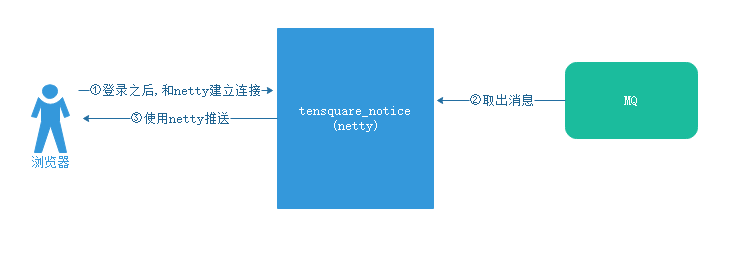


#### 3.3 在线时系统向接收者主动推送

此模式是系统将新的消息通知返回给接收者的模式，流程如下：

1. RabbitMQ将新消息数据推送给Netty
2. Netty从连接池中取出接收者的WebSocket连接
3. Netty通过接收者的WebSocket连接返回新消息的数量


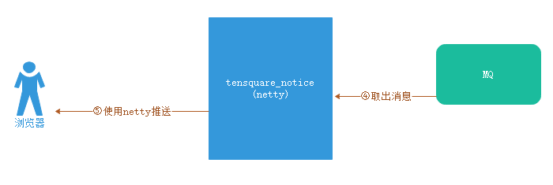 


### 4.小结

 


## 文章订阅群发消息改进

### 1.需求

- [ ] 实现最新消息由RabbitMQ处理

### 2.分析

1. 准备RabbitMQ消息中间件
2. 改进文章订阅功能，让交换机和队列进行绑定
3. 改进发布文章后群发消息通知功能

 

### 3.实现

#### 3.1准备RabbitMQ

在虚拟机中启动RabbitMQ

```bash
docker run -di --name=tensquare_rabbit -p 5671:5671 -p 5672:5672 -p 4369:4369 -p 15672:15672 -p 25672:25672 rabbitmq:management
```

访问地址：http://192.168.147.177:15672

登录账号： guest 

登录密码： guest

#### 3.2 修改文章微服务坐标和配置文件

- 修改tensquare_article微服务的pom.xml项目配置文件，添加如下依赖

```xml
<dependency>
    <groupId>org.springframework.boot</groupId>
    <artifactId>spring-boot-starter-amqp</artifactId>
</dependency>
```

+ 修改tensquare_article微服务的application.yml配置文件，文件位置如下

```yaml
  rabbitmq:
    host: 192.168.147.177
```

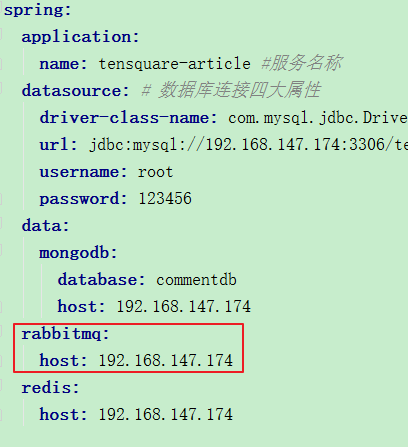 


#### 3.3 修改文章订阅功能代码

在ArticleService中原有的subscribe方法中，增加了几个业务逻辑

1. 定义Rabbitmq的direct类型的交换机(tensquare_subscribe)
2. 定义用户的Rabbitmq队列(article_subscribe_用户id)
3. 将队列通过路由键绑定或解绑direct交换机(路由键为作者id)

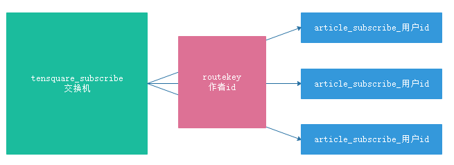 

+ 拷贝RabbitmqConfig.java到tensquare_article
+ 修改订阅代码

```java
    @Autowired
    private RabbitTemplate rabbitTemplate;

    @Autowired
    private DirectExchange exchange;

    @Autowired
    private RabbitAdmin rabbitAdmin;

    /**
     * 订阅
     *
     * @param userId
     * @param articleId
     * @return
     */
    public boolean subscribe(String userId, String articleId) {
        //1.根据文章Id获得文章作者Id
        String authorId = articleDao.selectById(articleId).getUserid();
        //2.存到Redis
        //当前用户关注的作者set
        String userKey = "article_subscribe_" + userId;
        //该作者被关注的用户set
        String authorKey = "article_author_" + authorId;

        Boolean isMember = redisTemplate.opsForSet().isMember(userKey, authorId);

        //创建queue
        Queue queue = new Queue("article_subscribe_" + userId, true);
        //声明exchange和queue的绑定关系，设置路由键为作者id
        Binding binding = BindingBuilder.bind(queue).to(exchange).with(authorId);

        //3.判断是否已经订阅
        if (isMember) {
            redisTemplate.opsForSet().remove(userKey, authorId);
            redisTemplate.opsForSet().remove(authorKey, userId);
            //进行解绑
            rabbitAdmin.removeBinding(binding);
            return false;
        } else {
            redisTemplate.opsForSet().add(userKey, authorId);
            redisTemplate.opsForSet().add(authorKey, userId);

            //进行绑定
            rabbitAdmin.declareQueue(queue);
            rabbitAdmin.declareBinding(binding);
            return true;
        }
    }
```

#### 3.4 发布文章触发群发消息

+ 修改ArticleService中的 add方法，在新增方法的最后面添加下面的代码：

```java
//入库成功后，发送mq消息，内容是消息通知id
rabbitTemplate.convertAndSend(RabbitmqConfig.EX_ARTICLE,authorId,article.getId());
```

+ 删除消息通知微服务中的 **新的通知提醒消息入库** 逻辑，因为现在新通知由RabbitMQ发送。修tensquare_notice微服务的NoticeService方法：

```java
@Transactional
public void save(Notice notice) {
    //初始化数据
    notice.setCreatetime(new Date());
    notice.setState("0");

    //通知消息入库
    notice.setId(idWorker.nextId() + "");
    noticeDao.insert(notice);

    //新的通知提醒消息入库
    //NoticeFresh noticeFresh = new NoticeFresh();
    //noticeFresh.setNoticeId(notice.getId());
    //noticeFresh.setUserId(notice.getReceiverId());
    //noticeFreshDao.insert(noticeFresh);

}
```

### 4.小结

1. 关注订阅的时候, 我们把交换机和队列进行了绑定, routekey是当前的作者的id
2. 文章作者发布了文章, 会向MQ发送消息


## 知识点-IO编程

### 1.目标

​	在开始了解Netty之前，先来实现一个客户端与服务端通信的程序，使用传统的IO编程和使用NIO编程有什么不一样。

### 2.路径

1. 传统IO编程 
2. NIO编程

### 3.讲解

#### 3.1 传统IO编程 

每个客户端连接过来后，服务端都会启动一个线程去处理该客户端的请求。阻塞I/O的通信模型示意图如下：

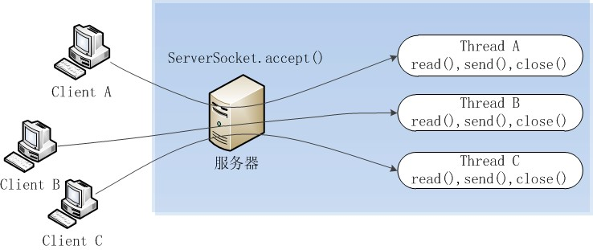


业务场景：客户端每隔两秒发送字符串给服务端，服务端收到之后打印到控制台。

服务端实现：

```java
public class IOServer {
    public static void main(String[] args) throws Exception {

        ServerSocket serverSocket = new ServerSocket(8000);

        while (true) {
            // (1) 阻塞方法获取新的连接
            Socket socket = serverSocket.accept();

            new Thread() {
                @Override
                public void run() {
                    String name = Thread.currentThread().getName();

                    try {
                        // (2) 每一个新的连接都创建一个线程，负责读取数据
                        byte[] data = new byte[1024];
                        InputStream inputStream = socket.getInputStream();
                        while (true) {
                            int len;
                            // (3) 按字节流方式读取数据
                            while ((len = inputStream.read(data)) != -1) {
                                System.out.println("线程" + name + ":" + new String(data, 0, len));
                            }
                        }
                    } catch (Exception e) {
                    }
                }
            }.start();
        }
    }
}
```


客户端实现：

```java
public class MyClient {

    public static void main(String[] args) {
        //测试使用不同的线程数进行访问
        for (int i = 0; i < 5; i++) {
            new ClientDemo().start();
        }
    }

    static class ClientDemo extends Thread {
        @Override
        public void run() {
            try {
                Socket socket = new Socket("127.0.0.1", 8000);
                while (true) {
                    socket.getOutputStream().write(("测试数据").getBytes());
                    socket.getOutputStream().flush();
                    Thread.sleep(2000);
                }
            } catch (Exception e) {
            }
        }
    }
}
```


​	从服务端代码中我们可以看到，在传统的IO模型中，每个连接创建成功之后都需要一个线程来维护，每个线程包含一个while死循环。

​	如果在用户数量较少的情况下运行是没有问题的，但是对于用户数量比较多的业务来说，服务端可能需要支撑成千上万的连接，IO模型可能就不太合适了。


如果有1万个连接就对应1万个线程，继而1万个while死循环，这种模型存在以下问题：

- 当客户端越多，就会创建越多的处理线程。线程是操作系统中非常宝贵的资源，同一时刻有大量的线程处于阻塞状态是非常严重的资源浪费。并且如果务器遭遇洪峰流量冲击，例如双十一活动，线程池会瞬间被耗尽，导致服务器瘫痪。 
- 因为是阻塞式通信，线程爆炸之后操作系统频繁进行线程切换，应用性能急剧下降。
- IO编程中数据读写是以字节流为单位，效率不高。


#### 3.2 NIO编程

​	NIO，也叫做new-IO或者non-blocking-IO，可理解为==非阻塞IO==。NIO编程模型中，新来一个连接不再创建一个新的线程，而是可以把这条连接直接绑定到某个固定的线程，然后这条连接所有的读写都由这个线程来负责，我们用一幅图来对比一下IO与NIO：


​	如上图所示，IO模型中，一个连接都会创建一个线程，对应一个while死循环，死循环的目的就是不断监测这条连接上是否有数据可以读。但是在大多数情况下，1万个连接里面同一时刻只有少量的连接有数据可读，因此，很多个while死循环都白白浪费掉了，因为没有数据。

​	而在NIO模型中，可以把这么多的while死循环变成一个死循环，这个死循环由一个线程控制。这就是NIO模型中选择器（Selector）的作用，一条连接来了之后，现在不创建一个while死循环去监听是否有数据可读了，而是直接把这条连接注册到**选择器**上，通过检查这个**选择器**，就可以批量监测出有数据可读的连接，进而读取数据。


举个栗子，在一家餐厅里，客人有点菜的需求，一共有100桌客人，有两种方案可以解决客人点菜的问题：

* 方案一：

  每桌客人配一个服务生，每个服务生就在餐桌旁给客人提供服务。如果客人要点菜，服务生就可以立刻提供点菜的服务。那么100桌客人就需要100个服务生提供服务，这就是IO模型，一个连接对应一个线程。

  

* 方案二：

  一个餐厅只有一个服务生（假设服务生可以忙的过来）。这个服务生隔段时间就询问所有的客人是否需要点菜，然后每一时刻处理所有客人的点菜要求。这就是NIO模型，所有客人都注册到同一个服务生，对应的就是所有的连接都注册到一个线程，然后批量轮询。

这就是NIO模型解决线程资源受限的方案，实际开发过程中，我们会开多个线程，每个线程都管理着一批连接，相对于IO模型中一个线程管理一条连接，消耗的线程资源大幅减少。


NIO的三大核心组件：通道（Channel）、缓冲（Buffer）、选择器（Selector）

- 通道（Channel）

  ​	是传统IO中的Stream(流)的升级版。Stream是单向的（inputstream和outputstream），Channel是双向的，既可以进行读操作，又可以进行写操作。

- 缓冲（Buffer）

  ​	Buffer可以理解为一块内存区域，可以写入数据，并且在之后读取它。

- 选择器（Selector）

  ​	选择器（Selector）可以实现一个单独的线程来监控多个注册在她上面的信道（Channel），通过一定的选择机制，实现多路复用的效果。


NIO相对于IO的优势：

1. IO是面向流的，每次都是从操作系统底层一个字节一个字节地读取数据，并且数据只能从一端读取到另一端，不能前后移动流中的数据。NIO则是面向缓冲区的，每次可以从这个缓冲区里面读取一块的数据，并且可以在需要时在缓冲区中前后移动。
2. IO是阻塞的，这意味着，当一个线程读取数据或写数据时，该线程被阻塞，直到有一些数据被读取，或数据完全写入，在此期间该线程不能干其他任何事情。而NIO是非阻塞的，不需要一直等待操作完成才能干其他事情，而是在等待的过程中可以同时去做别的事情，所以能最大限度地使用服务器的资源。
3. NIO引入了IO多路复用器selector。selector是一个提供channel注册服务的线程，可以同时对接多个Channel，并在线程池中为channel适配、选择合适的线程来处理channel。由于NIO模型中线程数量大大降低，线程切换效率因此也大幅度提高。


和前面一样的场景，使用NIO实现（复制代码演示效果即可）：

```java
public class NIOServer {
    public static void main(String[] args) throws IOException {
        // 负责轮询是否有新的连接
        Selector serverSelector = Selector.open();
        // 负责轮询处理连接中的数据
        Selector clientSelector = Selector.open();

        new Thread() {
            @Override
            public void run() {
                try {
                    // 对应IO编程中服务端启动
                    ServerSocketChannel listenerChannel = ServerSocketChannel.open();
                    listenerChannel.socket().bind(new InetSocketAddress(8000));
                    listenerChannel.configureBlocking(false);
                    // OP_ACCEPT表示服务器监听到了客户连接，服务器可以接收这个连接了
                    listenerChannel.register(serverSelector, SelectionKey.OP_ACCEPT);

                    while (true) {
                        // 监测是否有新的连接，这里的1指的是阻塞的时间为1ms
                        if (serverSelector.select(1) > 0) {
                            Set<SelectionKey> set = serverSelector.selectedKeys();
                            Iterator<SelectionKey> keyIterator = set.iterator();

                            while (keyIterator.hasNext()) {
                                SelectionKey key = keyIterator.next();

                                if (key.isAcceptable()) {
                                    try {
                                        // (1) 每来一个新连接，不需要创建一个线程，而是直接注册到clientSelector
                                        SocketChannel clientChannel = ((ServerSocketChannel) key.channel()).accept();
                                        clientChannel.configureBlocking(false);
                                        // OP_READ表示通道中已经有了可读的数据，可以执行读操作了（通道目前有数据，可以进行读操作了）
                                        clientChannel.register(clientSelector, SelectionKey.OP_READ);
                                    } finally {
                                        keyIterator.remove();
                                    }
                                }
                            }
                        }
                    }
                } catch (IOException ignored) {
                }
            }
        }.start();


        new Thread() {
            @Override
            public void run() {
                String name = Thread.currentThread().getName();
                try {
                    while (true) {
                        // (2) 批量轮询是否有哪些连接有数据可读，这里的1指的是阻塞的时间为1ms
                        if (clientSelector.select(1) > 0) {
                            Set<SelectionKey> set = clientSelector.selectedKeys();
                            Iterator<SelectionKey> keyIterator = set.iterator();

                            while (keyIterator.hasNext()) {
                                SelectionKey key = keyIterator.next();

                                if (key.isReadable()) {
                                    try {
                                        SocketChannel clientChannel = (SocketChannel) key.channel();
                                        ByteBuffer byteBuffer = ByteBuffer.allocate(1024);
                                        // (3) 读取数据以块为单位批量读取
                                        clientChannel.read(byteBuffer);
                                        byteBuffer.flip();
                                        System.out.println("线程" + name + ":" + Charset.defaultCharset().newDecoder().decode(byteBuffer)
                                                .toString());
                                    } finally {
                                        keyIterator.remove();
                                        key.interestOps(SelectionKey.OP_READ);
                                    }
                                }
                            }
                        }
                    }
                } catch (IOException ignored) {
                }
            }
        }.start();
    }
}
```


### 4.小结

| 场景           | BIO(传统的IO)      | NIO                                      |
| -------------- | ------------------ | ---------------------------------------- |
| 有新连接请求时 | 开一个新的线程处理 | 使用多路复用原理，一个线程处理           |
| 适用场景       | 连接数小且固定     | 连接数特别多，连接比较短（轻操作）的场景 |


## 知识点-Netty

### 1.目标

- [ ] 了解Netty的作用
- [ ] 了解Netty的核心组件

### 2.路径

1. 为什么使用Netty
2. Netty的事件驱动
3. 核心组件

### 3.讲解

#### 3.1 为什么使用Netty

我们已经有了NIO能够提高程序效率了，为什么还要使用Netty？

简单的说：Netty封装了JDK的NIO，让你用得更爽，你不用再写一大堆复杂的代码了。

官方术语：Netty是一个异步==事件驱动==的网络应用框架，用于快速开发可维护的高性能服务器和客户端。


下面是使用Netty不使用JDK原生NIO的一些原因：

- 使用JDK自带的NIO需要了解太多的概念，编程复杂
- Netty底层IO模型随意切换，而这一切只需要做微小的改动，就可以直接从NIO模型变身为IO模型
- Netty自带的拆包解包，异常检测等机制，可以从NIO的繁重细节中脱离出来，只需要关心业务逻辑
- Netty解决了JDK的很多包括空轮询在内的bug
- Netty底层对线程，selector做了很多细小的优化，精心设计的线程模型做到非常高效的并发处理
- 自带各种协议栈让你处理任何一种通用协议都几乎不用亲自动手
- Netty社区活跃，遇到问题随时邮件列表或者issue
- Netty已经历各大rpc框架，消息中间件，分布式通信中间件线上的广泛验证，健壮性无比强大


和IO编程一样的案例：

添加Netty依赖

```xml
<dependency>
    <groupId>io.netty</groupId>
    <artifactId>netty-all</artifactId>
    <version>4.1.5.Final</version>
</dependency>
```


服务端：

```java
public class NettyServer {
    public static void main(String[] args) {
        ServerBootstrap serverBootstrap = new ServerBootstrap();

        NioEventLoopGroup boos = new NioEventLoopGroup();
        NioEventLoopGroup worker = new NioEventLoopGroup();
        serverBootstrap
                .group(boos, worker)
                .channel(NioServerSocketChannel.class)
                .childHandler(new ChannelInitializer<NioSocketChannel>() {
                    protected void initChannel(NioSocketChannel ch) {
                        ch.pipeline().addLast(new StringDecoder());
                        ch.pipeline().addLast(new SimpleChannelInboundHandler<String>() {
                            @Override
                            protected void channelRead0(ChannelHandlerContext ctx, String msg) {
                                System.out.println(msg);
                            }
                        });
                    }
                })
                .bind(8000);
    }
}
```


客户端：

```java
public class NettyClient {
    public static void main(String[] args) throws InterruptedException {
        Bootstrap bootstrap = new Bootstrap();
        NioEventLoopGroup group = new NioEventLoopGroup();

        bootstrap.group(group)
                .channel(NioSocketChannel.class)
                .handler(new ChannelInitializer<Channel>() {
                    @Override
                    protected void initChannel(Channel ch) {
                        ch.pipeline().addLast(new StringEncoder());
                    }
                });

        Channel channel = bootstrap.connect("127.0.0.1", 8000).channel();

        while (true) {
            channel.writeAndFlush("测试数据");
            Thread.sleep(2000);
        }
    }
}
```

#### 3.2 Netty的事件驱动

例如很多系统都会提供 onClick() 事件，这个事件就代表鼠标按下事件。事件驱动模型的大体思路如下：

1. 有一个事件队列；
2. 鼠标按下时，往事件队列中增加一个点击事件；
3. 有个事件泵，不断循环从队列取出事件，根据不同的事件，调用不同的函数；
4. 事件一般都各自保存各自的处理方法的引用。这样，每个事件都能找到对应的处理方法；

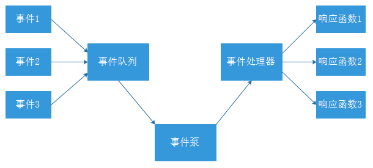


为什么使用事件驱动？

- 程序中的任务可以并行执行

- 任务之间高度独立，彼此之间不需要互相等待

- 在等待的事件到来之前，任务不会阻塞


Netty使用事件驱动的方式作为底层架构，包括：

- 事件队列（event queue）：接收事件的入口。
- 分发器（event mediator）：将不同的事件分发到不同的业务逻辑单元。
- 事件通道（event channel）：分发器与处理器之间的联系渠道。
- 事件处理器（event processor）：实现业务逻辑，处理完成后会发出事件，触发下一步操作。

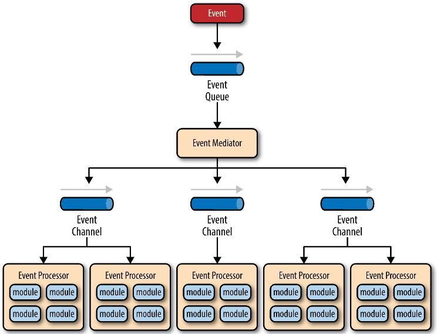

#### 3.3 核心组件

​	Netty 的功能特性图：

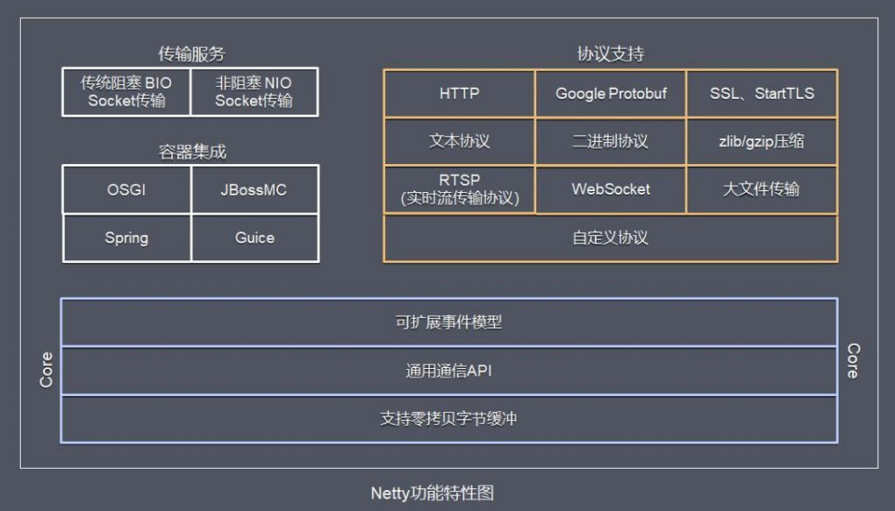


Netty 功能特性：

- 传输服务，支持 BIO 和 NIO。
- 容器集成：支持 OSGI、JBossMC、Spring、Guice 容器。
- 协议支持：HTTP、Protobuf、二进制、文本、WebSocket 等，支持自定义协议。


Netty框架包含如下的组件：

- ServerBootstrap ：用于接受客户端的连接以及为已接受的连接创建子通道，一般用于服务端。
- Bootstrap：不接受新的连接，并且是在父通道类完成一些操作，一般用于客户端的。


- Channel：对网络套接字的I/O操作，例如读、写、连接、绑定等操作进行适配和封装的组件。
- EventLoop：处理所有注册其上的channel的I/O操作。通常情况一个EventLoop可为多个channel提供服务。
- EventLoopGroup：包含有多个EventLoop的实例，用来管理 event Loop 的组件，可以理解为一个线程池，内部维护了一组线程。


- ChannelHandler和ChannelPipeline：例如一个流水线车间，当组件从流水线头部进入，穿越流水线，流水线上的工人按顺序对组件进行加工，到达流水线尾部时商品组装完成。流水线相当于`ChannelPipeline`，流水线工人相当于`ChannelHandler`，源头的组件当做event。
- ChannelInitializer：用于对刚创建的channel进行初始化，将ChannelHandler添加到channel的ChannelPipeline处理链路中。


-  ChannelFuture：与jdk中线程的Future接口类似，即实现并行处理的效果。可以在操作执行成功或失败时自动触发监听器中的事件处理方法。


上面的Netty框架包含如下的组件大概看的有点蒙，我们对之前编写的代码加上注释：

服务端：

```java
public class NettyServer {
    public static void main(String[] args) {
        // 用于接受客户端的连接以及为已接受的连接创建子通道，一般用于服务端。
        ServerBootstrap serverBootstrap = new ServerBootstrap();

        // EventLoopGroup包含有多个EventLoop的实例，用来管理event Loop的组件
        // 接受新连接线程
        NioEventLoopGroup boos = new NioEventLoopGroup();
        // 读取数据的线程
        NioEventLoopGroup worker = new NioEventLoopGroup();

        //服务端执行
        serverBootstrap
                .group(boos, worker)
                // Channel对网络套接字的I/O操作，
                // 例如读、写、连接、绑定等操作进行适配和封装的组件。
                .channel(NioServerSocketChannel.class)
                // ChannelInitializer用于对刚创建的channel进行初始化
                // 将ChannelHandler添加到channel的ChannelPipeline处理链路中。
                .childHandler(new ChannelInitializer<NioSocketChannel>() {
                    protected void initChannel(NioSocketChannel ch) {
                        // 组件从流水线头部进入，流水线上的工人按顺序对组件进行加工
                        // 流水线相当于ChannelPipeline
                        // 流水线工人相当于ChannelHandler
                        ch.pipeline().addLast(new StringDecoder());
                        ch.pipeline().addLast(new SimpleChannelInboundHandler<String>() {
                            //这个工人有点麻烦，需要我们告诉他干啥事
                            @Override
                            protected void channelRead0(ChannelHandlerContext ctx, String msg) {
                                System.out.println(msg);
                            }
                        });
                    }
                })
                .bind(8000);
    }
}
```


客户端：

```java
public class NettyClient {
    public static void main(String[] args) throws InterruptedException {
        // 不接受新的连接，并且是在父通道类完成一些操作，一般用于客户端的。
        Bootstrap bootstrap = new Bootstrap();

        // EventLoopGroup包含有多个EventLoop的实例，用来管理event Loop的组件
        NioEventLoopGroup group = new NioEventLoopGroup();

        //客户端执行
        bootstrap.group(group)
                // Channel对网络套接字的I/O操作，
                // 例如读、写、连接、绑定等操作进行适配和封装的组件。
                .channel(NioSocketChannel.class)
                // 用于对刚创建的channel进行初始化，
                // 将ChannelHandler添加到channel的ChannelPipeline处理链路中。
                .handler(new ChannelInitializer<Channel>() {
                    @Override
                    protected void initChannel(Channel ch) {
                        // 组件从流水线头部进入，流水线上的工人按顺序对组件进行加工
                        // 流水线相当于ChannelPipeline
                        // 流水线工人相当于ChannelHandler
                        ch.pipeline().addLast(new StringEncoder());
                    }
                });

        //客户端连接服务端
        Channel channel = bootstrap.connect("127.0.0.1", 8000).channel();

        while (true) {
            // 客户端使用writeAndFlush方法向服务端发送数据，返回的是ChannelFuture
            // 与jdk中线程的Future接口类似，即实现并行处理的效果
            // 可以在操作执行成功或失败时自动触发监听器中的事件处理方法。
            ChannelFuture future = channel.writeAndFlush("测试数据");
            Thread.sleep(2000);
        }
    }
}
```


### 4.小结

1. Netty: 高效的框架, 封装了NIO. 用来快速开发高性能、高可靠性的[网络服务器](https://baike.baidu.com/item/网络服务器/99096)和客户端程序。
2. Netty:
   + 基于事件驱动
   + 共有了线程, 不需要一个连接就创建一个线程. 一个连接就对应一个通道 Chanel
   + 每个通道 Chanel注册到EventLoop, 采取EventLoopGroup进行管理
   + 事件触发了(eg: 客户端连接, 客户端发送数据, 传输数据), 就可以通过Chanel Pipeline进行传输, 通过Chanel  Handler进行处理, 
   + 事件没触发 不会阻塞的, 并且事件都是独立的. 可以并行的


## 整合Netty和WebSocket取出消息推送

### 1.目标

​	我们需要使用netty对接websocket连接，实现双向通信，这一步需要有服务端的netty程序，用来处理客户端的websocket连接操作，例如建立连接，断开连接，收发数据等。

### 2.分析

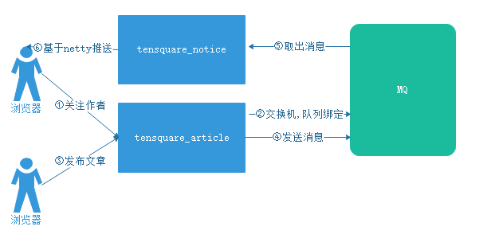


因为使用到了WebSocket和Netty，整合方式和以前有所不同，整合步骤：

1. 创建`NettyServer`。
2. 使用配置Bean创建Netty服务。编写`NettyConfig`。
3. 编写和WebSocket进行通讯处理类`MyWebSocketHandler`，进行MQ和WebSocket的消息处理。
4. 使用配置Bean创建Rabbit监听器容器，使用监听器。编写`RabbitConfig`。
5. 编写Rabbit监听器`SysNoticeListener`，用来获取MQ消息并进行处理。


五个类的关系如下图：

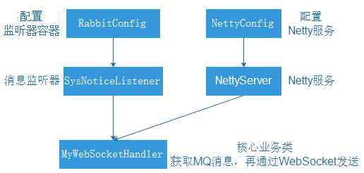


### 3.实现

#### 3.1 修改配置

1. 修改消息通知微服务模块tensquare_notice的pom文件，添加下面的dependency依赖

   ```xml
   <dependency>
       <groupId>org.springframework.boot</groupId>
       <artifactId>spring-boot-starter-amqp</artifactId>
   </dependency>		
   <dependency>
       <groupId>io.netty</groupId>
       <artifactId>netty-all</artifactId>
       <version>4.1.5.Final</version>
   </dependency>
   ```


2. 修改application.yml文件，添加下面的配置

   ```yaml
     rabbitmq:
       host: 192.168.147.177
   ```

#### 3.2 实现整合

+ 拷贝ApplicationContextProvider,NettyConfig,NettyServer,RabbitmqConfig到tensquare_notice

+ 创建MyWebSocketHandler继承SimpleChannelInboundHandler

```java
public class MyWebSocketHandler extends SimpleChannelInboundHandler<TextWebSocketFrame> {

    public static ObjectMapper objectMapper = new ObjectMapper();

    public static ConcurrentHashMap<String,Channel> map = new ConcurrentHashMap<String,Channel>();


    private static SimpleMessageListenerContainer simpleMessageListenerContainer = ApplicationContextProvider.getApplicationContext().getBean("sysNoticeContainer", SimpleMessageListenerContainer.class);

    @Override
    //channelHandlerContext:信道处理上下文对象
    //textWebSocketFrame: 数据对象【约定用户第一次连接传递数据{"userId":"1"}】
    protected void channelRead0(ChannelHandlerContext channelHandlerContext, TextWebSocketFrame textWebSocketFrame) throws Exception {
        //1.获得用户传输的数据
        String data = textWebSocketFrame.text();

        //2.解析数据获得userId
        String userId = objectMapper.readTree(data).get("userId").asText();

        //3.判断是否是第一次连接
        Channel channel = map.get(userId);

        //4.如果是, 建立连接, 把连接存到Map
        if(channel == null){
            channel = channelHandlerContext.channel();
            map.put(userId,channel);
        }

        //5.获得当前用户队列的消息(数量)
        RabbitAdmin rabbitAdmin = ApplicationContextProvider.getApplicationContext().getBean("rabbitAdmin", RabbitAdmin.class);
        String queueName = "article_subscribe_" + userId;//队列名字
        Properties properties = rabbitAdmin.getQueueProperties(queueName);//队列的配置对象

        int noticeCount = 0;
        if(properties != null){
            noticeCount = (int) properties.get(RabbitAdmin.QUEUE_MESSAGE_COUNT);
        }

        //6.把数据发送给用户
        HashMap countMap = new HashMap();
        countMap.put("sysNoticeCount", noticeCount);
        Result result = new Result(true, StatusCode.OK, "查询成功", countMap);
        channel.writeAndFlush(new TextWebSocketFrame(objectMapper.writeValueAsString(result)));

        //7.消费消息
         if (noticeCount > 0) {
            rabbitAdmin.purgeQueue("article_subscribe_" + userId, true);
        }

        //8.设置队列的监听
        simpleMessageListenerContainer.addQueueNames(queueName);

    }
}

```

+  创建SysNoticeListener

```java
package com.tensquare.notice.listener;


import com.fasterxml.jackson.databind.ObjectMapper;
import com.rabbitmq.client.Channel;
import com.tensquare.entity.Result;
import com.tensquare.entity.StatusCode;
import com.tensquare.notice.netty.MyWebSocketHandler;
import io.netty.handler.codec.http.websocketx.TextWebSocketFrame;
import org.springframework.amqp.core.Message;
import org.springframework.amqp.core.MessageListener;
import org.springframework.amqp.rabbit.listener.api.ChannelAwareMessageListener;

import java.util.HashMap;

/**
 * @Description:
 * @Author: yp
 */
public class SysNoticeListener implements ChannelAwareMessageListener {
    public static ObjectMapper objectMapper = new ObjectMapper();

    @Override
    public void onMessage(Message message, Channel channel) throws Exception {
        //1.获得队列名称
        String queueName = message.getMessageProperties().getConsumerQueue();

        //2.获得userId
        String userId = queueName.substring(queueName.lastIndexOf("_") + 1);

        //3.获得信道
        io.netty.channel.Channel nettyChannel = MyWebSocketHandler.map.get(userId);

        //4.判断用户是否在线
        if(nettyChannel != null){
            //5.发送消息
            HashMap countMap = new HashMap();
            countMap.put("sysNoticeCount", 1);
            Result result = new Result(true, StatusCode.OK, "查询成功", countMap);
            // 把数据通过WebSocket连接主动推送用户
            nettyChannel.writeAndFlush(new TextWebSocketFrame(objectMapper.writeValueAsString(result)));
        }


    }
}

```

#### 3.3测试


+ 拷贝`资料\02-测试页面\index.html`测试页面到tensquare_notice

+  启动tensquare-eureka，tensquare-user，tensquare-article，tensquare-notice四个微服务进行测试

当新增一个文章数据的时候，就会发消息，最终页面显示的效果：

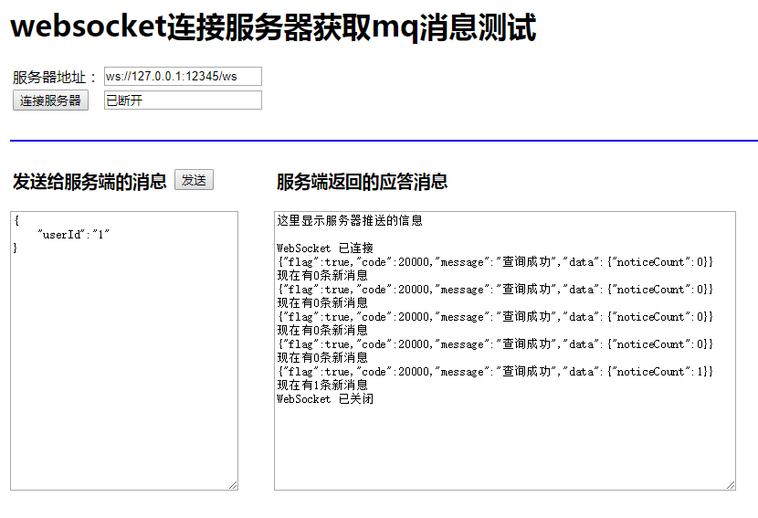

### 4.小结


## 实战_文章点赞点对点消息改进

### 1.需求

- [ ] 实现点对点消息的改进

### 2.分析

### 3.实现

#### 3.1 文章点赞功能改进

在ArticleService中原有的thumbup方法中，增加向用户的点对点消息队列发送消息的功能

改进后完整的代码如下

```java
  //文章点赞
    public void thumpup(String articleId, String userId) {
        Article article = articleDao.selectById(articleId);
        article.setThumbup(article.getThumbup() + 1);
        articleDao.updateById(article);

        //点赞成功后，需要发送消息给文章作者（点对点消息）
        Notice notice = new Notice();
        // 接收消息用户的ID
        notice.setReceiverId(article.getUserid());
        // 进行操作用户的ID
        notice.setOperatorId(userId);
        // 操作类型（评论，点赞等）
        notice.setAction("publish");
        // 被操作的对象，例如文章，评论等
        notice.setTargetType("article");
        // 被操作对象的id，例如文章的id，评论的id'
        notice.setTargetId(articleId);
        // 通知类型
        notice.setType("user");

        //保存消息
        noticeClient.save(notice);

        //1 创建Rabbit管理器
        RabbitAdmin rabbitAdmin = new RabbitAdmin(rabbitTemplate.getConnectionFactory());

        //2 创建队列，每个用户都有自己的队列，通过用户id进行区分
        Queue queue = new Queue("article_thumbup_" + article.getUserid(), true);
        rabbitAdmin.declareQueue(queue);
		
        //3 发送消息
        rabbitTemplate.convertAndSend("article_thumbup_"+article.getUserid(),articleId);

    }
```


#### 3.2 消息通知改进

1） 在com.tensquare.notice.listeners包下新建 UserNoticeListener类，添加如下代码

```java
public class UserNoticeListener implements ChannelAwareMessageListener {

    private static ObjectMapper MAPPER = new ObjectMapper();

    @Override
    public void onMessage(Message message, Channel channel) throws Exception {
        //获取用户id，可以通过队列名称获取
        String queueName = message.getMessageProperties().getConsumerQueue();
        String userId = queueName.substring(queueName.lastIndexOf("_") + 1);

        io.netty.channel.Channel wsChannel = MyWebSocketHandler.userChannelMap.get(userId);

        //判断用户是否在线
        if (wsChannel != null) {
            //如果连接不为空，表示用户在线
            //封装返回数据
            HashMap countMap = new HashMap();
            countMap.put("userNoticeCount", 1);
            Result result = new Result(true, StatusCode.OK, "查询成功", countMap);

            // 把数据通过WebSocket连接主动推送用户
            wsChannel.writeAndFlush(new TextWebSocketFrame(MAPPER.writeValueAsString(result)));
        }
    }
}
```


2） RabbitConfig改造如下

```java
@Configuration
public class RabbitConfig {

    @Bean("sysNoticeContainer")
    public SimpleMessageListenerContainer createSys(ConnectionFactory connectionFactory) {
        SimpleMessageListenerContainer container =
                new SimpleMessageListenerContainer(connectionFactory);
        //使用Channel
        container.setExposeListenerChannel(true);
        //设置自己编写的监听器
        container.setMessageListener(new SysNoticeListener());

        return container;
    }
    @Bean("userNoticeContainer")
    public SimpleMessageListenerContainer createUser(ConnectionFactory connectionFactory) {
        SimpleMessageListenerContainer container =
                new SimpleMessageListenerContainer(connectionFactory);
        //使用Channel
        container.setExposeListenerChannel(true);
        //设置自己编写的监听器
        container.setMessageListener(new UserNoticeListener());

        return container;
    }
}
```


3） MyWebSocketHandler改造如下

```java
public class MyWebSocketHandler extends SimpleChannelInboundHandler<TextWebSocketFrame> {

    private static ObjectMapper MAPPER = new ObjectMapper();

    // 送Spring容器中获取消息监听器容器,处理订阅消息sysNotice
    SimpleMessageListenerContainer sysNoticeContainer = (SimpleMessageListenerContainer) ApplicationContextProvider.getApplicationContext()
            .getBean("sysNoticeContainer");
    // 送Spring容器中获取消息监听器容器,处理点赞消息userNotice
    SimpleMessageListenerContainer userNoticeContainer = (SimpleMessageListenerContainer) ApplicationContextProvider.getApplicationContext()
            .getBean("userNoticeContainer");

    //从Spring容器中获取RabbitTemplate
    RabbitTemplate rabbitTemplate = ApplicationContextProvider.getApplicationContext()
            .getBean(RabbitTemplate.class);

    //存放WebSocket连接Map，根据用户id存放
    public static ConcurrentHashMap<String, Channel> userChannelMap = new ConcurrentHashMap();

    //用户请求WebSocket服务端，执行的方法
    @Override
    protected void channelRead0(ChannelHandlerContext ctx, TextWebSocketFrame msg) throws Exception {
        //约定用户第一次请求携带的数据：{"userId":"1"}
        //获取用户请求数据并解析
        String json = msg.text();
        //解析json数据，获取用户id
        String userId = MAPPER.readTree(json).get("userId").asText();


        //第一次请求的时候，需要建立WebSocket连接
        Channel channel = userChannelMap.get(userId);
        if (channel == null) {
            //获取WebSocket的连接
            channel = ctx.channel();

            //把连接放到容器中
            userChannelMap.put(userId, channel);
        }

        //只用完成新消息的提醒即可，只需要获取消息的数量
        //获取RabbitMQ的消息内容，并发送给用户
        RabbitAdmin rabbitAdmin = new RabbitAdmin(rabbitTemplate);
        //拼接获取队列名称
        String queueName = "article_subscribe_" + userId;
        //获取Rabbit的Properties容器
        Properties queueProperties = rabbitAdmin.getQueueProperties(queueName);

        //获取消息数量
        int noticeCount = 0;
        //判断Properties是否不为空
        if (queueProperties != null) {
            // 如果不为空，获取消息的数量
            noticeCount = (int) queueProperties.get("QUEUE_MESSAGE_COUNT");
        }

        //-----------------------------------------------------
        //拼接获取队列名称
        String userQueueName = "article_thumbup_" + userId;
        //获取Rabbit的Properties容器
        Properties userQueueProperties = rabbitAdmin.getQueueProperties(userQueueName);

        //获取消息数量
        int userNoticeCount = 0;
        //判断Properties是否不为空
        if (userQueueProperties != null) {
            // 如果不为空，获取消息的数量
            userNoticeCount = (int) userQueueProperties.get("QUEUE_MESSAGE_COUNT");
        }

        //封装返回的数据
        HashMap countMap = new HashMap();
        countMap.put("sysNoticeCount", noticeCount);
        countMap.put("userNoticeCount", userNoticeCount);
        Result result = new Result(true, StatusCode.OK, "查询成功", countMap);

        //把数据发送给用户
        channel.writeAndFlush(new TextWebSocketFrame(MAPPER.writeValueAsString(result)));

        //把消息从队列里面清空，否则MQ消息监听器会再次消费一次
        if (noticeCount > 0) {
            rabbitAdmin.purgeQueue(queueName, true);
        }
        if (userNoticeCount > 0) {
            rabbitAdmin.purgeQueue(userQueueName, true);
        }

        //为用户的消息通知队列注册监听器，便于用户在线的时候，
        //一旦有消息，可以主动推送给用户，不需要用户请求服务器获取数据
        sysNoticeContainer.addQueueNames(queueName);
        userNoticeContainer.addQueueNames(userQueueName);
    }
}
```


#### 3.3 测试点对点消息

1） 启动tensquare-eureka，tensquare-user，tensquare-article，tensquare-notice四个微服务进行测试

当作者的文章被点赞时，会收到点赞的新消息提示，最终页面显示的效果：

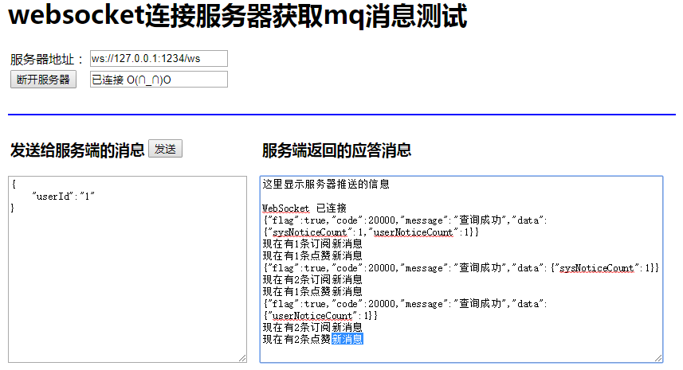
