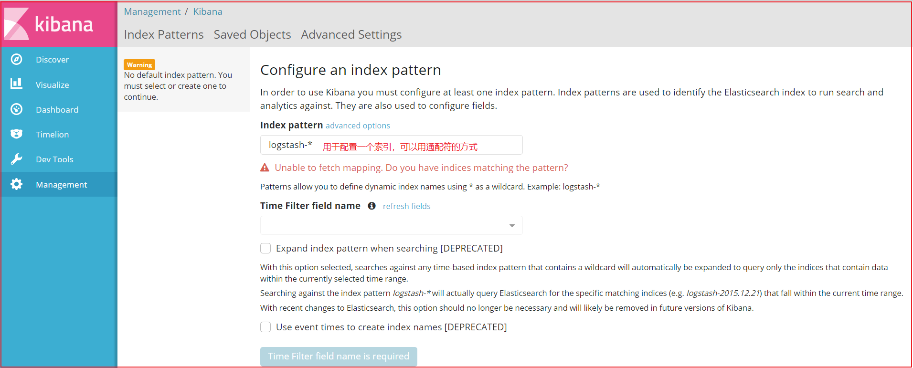
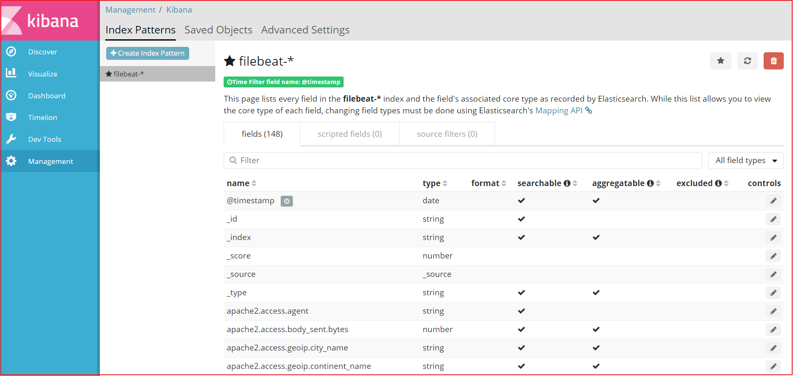
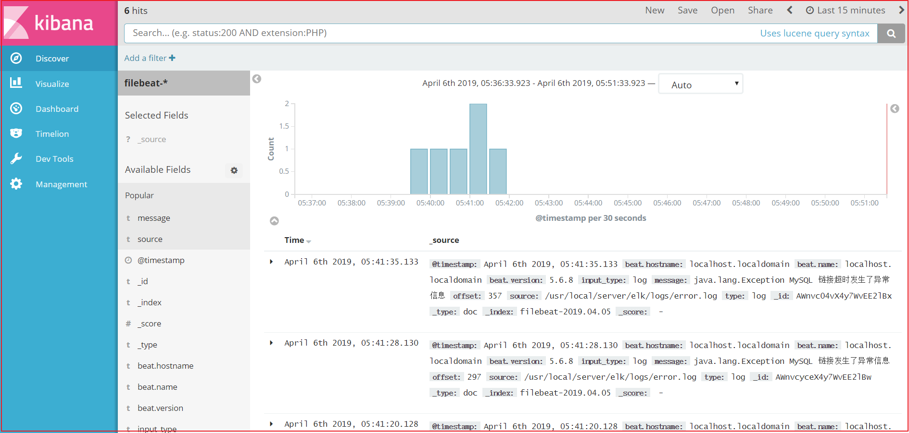
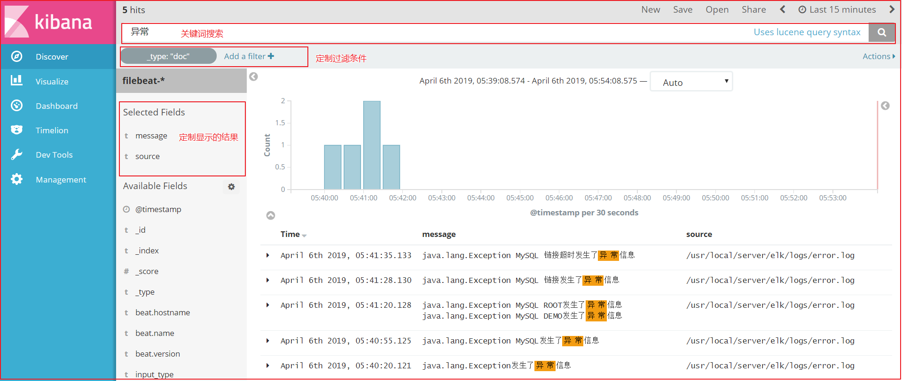
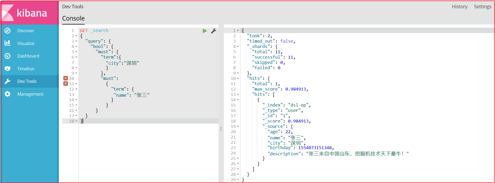
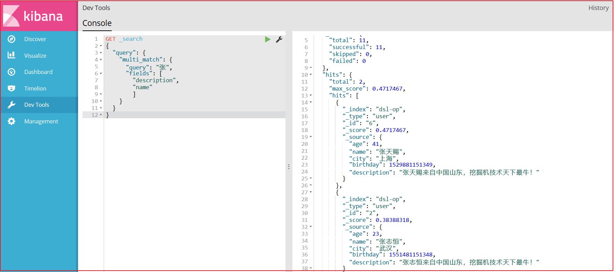

# 第5章 商品搜索

## 学习目标

- Elasticsearch安装
- IK分词器配置
- ES导入商品搜索数据
- 关键词搜索
- 分类统计
- Canal缓存同步
- 多条件搜索
- Kibana使用


## 1. Elasticsearch 安装 

我们之前已经使用过elasticsearch了，这里不再对它进行介绍了，直接下载安装，本章节将采用Docker安装，不过在市面上还有很多采用linxu安装，关于linux安装，已经提供了安装手册，这里就不讲了。


(1)docker镜像下载

```properties
docker pull elasticsearch:5.6.8
```

注意：由于镜像有570MB，所以提供的虚拟机里已经下载好了该镜像，如下图：


(2)安装es容器

```properties
docker run -di --name=changgou_elasticsearch -p 9200:9200 -p 9300:9300 elasticsearch:5.6.8
```

 9200端口(Web管理平台端口)  9300(服务默认端口)

浏览器输入地址访问：`http://192.168.211.132:9200/`


(3)开启远程连接

上面完成安装后，es并不能正常使用，elasticsearch从5版本以后默认不开启远程连接，程序直接连接会报如下错误：

```java
failed to load elasticsearch nodes : org.elasticsearch.client.transport.NoNodeAvailableException: None of the configured nodes are available: [{#transport#-1}{5ttLpMhkRjKLkvoY7ltUWg}{192.168.211.132}{192.168.211.132:9300}]
```

我们需要修改es配置开启远程连接，代码如下：

登录容器

```properties
docker exec -it changgou_elasticsearch /bin/bash
```

查看目录结构 输入: dir

```properties
root@07f22eb41bb5:/usr/share/elasticsearch# dir
NOTICE.txt  README.textile  bin  config  data  lib  logs  modules  plugins
```

进入config目录

```properties
cd config
```

查看文件

```properties
root@07f22eb41bb5:/usr/share/elasticsearch/config# ls
elasticsearch.yml  log4j2.properties  scripts
```

修改elasticsearch.yml文件

```properties
root@07f22eb41bb5:/usr/share/elasticsearch/config# vi elasticsearch.yml
bash: vi: command not found
```

vi命令无法识别，因为docker容器里面没有该命令，我们可以安装该编辑器。

安装vim编辑器

```properties
apt-get update
apt-get install vim
```

安装好了后，修改elasticsearch.yml配置，如下图：

```properties
vi elasticsearch.yml
```

修改如下图：


同时添加下面一行代码：

```properties
cluster.name: my-application
```

重启docker

```properties
docker restart changgou_elasticsearch
```

(4)系统参数配置

重启后发现重启启动失败了，这时什么原因呢？这与我们刚才修改的配置有关，因为elasticsearch在启动的时候会进行一些检查，比如最多打开的文件的个数以及虚拟内存区域数量等等，如果你放开了此配置，意味着需要打开更多的文件以及虚拟内存，所以我们还需要系统调优 

修改vi /etc/security/limits.conf ，追加内容 (nofile是单个进程允许打开的最大文件个数 soft nofile 是软限制 hard nofile是硬限制 )

```
* soft nofile 65536
* hard nofile 65536
```

修改vi /etc/sysctl.conf，追加内容 (限制一个进程可以拥有的VMA(虚拟内存区域)的数量 )

```
vm.max_map_count=655360
```

执行下面命令 修改内核参数马上生效

```
sysctl -p
```

重新启动虚拟机，再次启动容器，发现已经可以启动并远程访问 

```
reboot
```


(5)跨域配置

修改elasticsearch/config下的配置文件：elasticsearch.yml，增加以下三句命令，并重启:

```properties
http.cors.enabled: true
http.cors.allow-origin: "*"
network.host: 127.0.0.1
```

其中：
http.cors.enabled: true：此步为允许elasticsearch跨域访问，默认是false。
http.cors.allow-origin: "*"：表示跨域访问允许的域名地址（*表示任意）。

重启

```properties
 docker restart changgou_elasticsearch
```


小提示：如果想让容器开启重启，可以执行下面命令

```properties
docker update --restart=always 容器名称或者容器id
```


## 2. IK分词器安装 

(1)安装ik分词器

IK分词器下载地址https://github.com/medcl/elasticsearch-analysis-ik/releases

将ik分词器上传到服务器上，然后解压，并改名字为ik

```properties
unzip elasticsearch-analysis-ik-5.6.8.zip
mv elasticsearch ik
```

将ik目录拷贝到docker容器的plugins目录下

```properties
docker cp ./ik changgou_elasticsearch:/usr/share/elasticsearch/plugins
```


(2)IK分词器测试

访问：`http://192.168.211.132:9200/_analyze?analyzer=ik_smart&pretty=true&text=我是程序员`


访问：`http://192.168.211.132:9200/_analyze?analyzer=ik_max_word&pretty=true&text=我是程序员`


## 3. 数据导入ES

### 3.1 SpringData Elasticsearch介绍

#### 3.1.1 SpringData介绍

Spring Data是一个用于简化数据库访问，并支持云服务的开源框架。其主要目标是使得对数据的访问变得方便快捷，并支持map-reduce框架和云计算数据服务。 Spring Data可以极大的简化JPA的写法，可以在几乎不用写实现的情况下，实现对数据的访问和操作。除了CRUD外，还包括如分页、排序等一些常用的功能。

Spring Data的官网：http://projects.spring.io/spring-data/


#### 3.1.2 SpringData ES介绍

Spring Data ElasticSearch 基于 spring data API 简化 elasticSearch操作，将原始操作elasticSearch的客户端API 进行封装 。Spring Data为Elasticsearch项目提供集成搜索引擎。Spring Data Elasticsearch POJO的关键功能区域为中心的模型与Elastichsearch交互文档和轻松地编写一个存储库数据访问层。 官方网站：http://projects.spring.io/spring-data-elasticsearch/ 


### 3.2 搜索工程搭建

创建搜索微服务工程，changgou-service-search,该工程主要提供搜索服务以及索引数据的更新操作。

(1)API工程搭建

首先创建search的API工程,在changgou-service-api中创建changgou-service-search-api，如下图：


pom.xml如下：

```xml
<?xml version="1.0" encoding="UTF-8"?>
<project xmlns="http://maven.apache.org/POM/4.0.0"
         xmlns:xsi="http://www.w3.org/2001/XMLSchema-instance"
         xsi:schemaLocation="http://maven.apache.org/POM/4.0.0 http://maven.apache.org/xsd/maven-4.0.0.xsd">
    <parent>
        <artifactId>changgou-service-api</artifactId>
        <groupId>com.changgou</groupId>
        <version>1.0-SNAPSHOT</version>
    </parent>
    <modelVersion>4.0.0</modelVersion>
    <artifactId>changgou-service-search-api</artifactId>

    <dependencies>
        <!--goods API依赖-->
        <dependency>
            <groupId>com.changgou</groupId>
            <artifactId>changgou-service-goods-api</artifactId>
            <version>1.0-SNAPSHOT</version>
        </dependency>
        <!--SpringDataES依赖-->
        <dependency>
            <groupId>org.springframework.boot</groupId>
            <artifactId>spring-boot-starter-data-elasticsearch</artifactId>
        </dependency>
    </dependencies>
</project>
```


(2)搜索微服务搭建

在changgou-service中搭建changgou-service-search微服务，并进行相关配置。

**pom.xml配置**

```xml
<?xml version="1.0" encoding="UTF-8"?>
<project xmlns="http://maven.apache.org/POM/4.0.0"
         xmlns:xsi="http://www.w3.org/2001/XMLSchema-instance"
         xsi:schemaLocation="http://maven.apache.org/POM/4.0.0 http://maven.apache.org/xsd/maven-4.0.0.xsd">
    <parent>
        <artifactId>changgou-service</artifactId>
        <groupId>com.changgou</groupId>
        <version>1.0-SNAPSHOT</version>
    </parent>
    <modelVersion>4.0.0</modelVersion>
    <artifactId>changgou-service-search</artifactId>

    <dependencies>
        <!--goods api依赖-->
        <dependency>
            <groupId>com.changgou</groupId>
            <artifactId>changgou-service-goods-api</artifactId>
            <version>1.0-SNAPSHOT</version>
        </dependency>

        <!--依赖search api-->
        <dependency>
            <groupId>com.changgou</groupId>
            <artifactId>changgou-service-search-api</artifactId>
            <version>1.0-SNAPSHOT</version>
        </dependency>
    </dependencies>

</project>
```


**application.yml配置**

```properties
server:
  port: 18086
  connection-timeout: 10000
spring:
  application:
    name: search
  data:
    elasticsearch:
      cluster-name: my-application
      cluster-nodes: 192.168.211.132:9300
  couchbase:
    env:
      timeouts:
        socket-connect: 10000
eureka:
  client:
    service-url:
      defaultZone: http://127.0.0.1:7001/eureka
  instance:
    prefer-ip-address: true
feign:
  hystrix:
    enabled: true

hystrix:
  command:
    default:
      execution:
        isolation:
          thread:
            timeoutInMilliseconds: 10000
```

配置说明：

```properties
connection-timeout:服务连接超时时间
socket-connect：HTTP请求超时时间
timeoutInMilliseconds：feign连接超时时间
cluster-name：Elasticsearch的集群节点名称，这里需要和Elasticsearch集群节点名称保持一致
cluster-nodes：Elasticsearch节点通信地址
```


(3)启动类

创建SearchApplication作为搜索微服务工程的启动类，代码如下：

```java
@SpringBootApplication(exclude={DataSourceAutoConfiguration.class})
@EnableEurekaClient
public class SearchApplication {

    public static void main(String[] args) {
        /**
        * Springboot整合Elasticsearch 在项目启动前设置一下的属性，防止报错
        * 解决netty冲突后初始化client时还会抛出异常
        * availableProcessors is already set to [12], rejecting [12]
        ***/
        System.setProperty("es.set.netty.runtime.available.processors", "false");
        SpringApplication.run(SearchApplication.class,args);
    }
}
```

分别创建对应的包，dao、service、controller，如下图：


### 3.3 数据导入

现在需要将数据从数据库中查询出来，然后将数据导入到ES中。


数据导入流程如下：

```properties
1.请求search服务,调用数据导入地址
2.根据注册中心中的注册的goods服务的地址，使用Feign方式查询所有已经审核的Sku
3.使用SpringData Es将查询到的Sku集合导入到ES中
```


#### 3.3.1 文档映射Bean创建

搜索商品的时候，会根据如下属性搜索数据,并且不是所有的属性都需要分词搜索，我们创建JavaBean，将JavaBean数据存入到ES中要以搜索条件和搜索展示结果为依据，部分关键搜索条件分析如下：

```properties
1.可能会根据商品名称搜素，而且可以搜索商品名称中的任意一个词语，所以需要分词
2.可能会根据商品分类搜索，商品分类不需要分词
3.可能会根据商品品牌搜索，商品品牌不需要分词
4.可能会根据商品商家搜索，商品商家不需要分词
5.可能根据规格进行搜索，规格时一个键值对结构，用Map
```

根据上面的分析，我们可以在changgou-service-search-api工程中创建com.changgou.search.pojo.SkuInfo，如下

```java
@Document(indexName = "skuinfo",type = "docs")
public class SkuInfo implements Serializable {
    //商品id，同时也是商品编号
    @Id
    private Long id;

    //SKU名称
    @Field(type = FieldType.Text, analyzer = "ik_smart")
    private String name;

    //商品价格，单位为：元
    @Field(type = FieldType.Double)
    private Long price;

    //库存数量
    private Integer num;

    //商品图片
    private String image;

    //商品状态，1-正常，2-下架，3-删除
    private String status;

    //创建时间
    private Date createTime;

    //更新时间
    private Date updateTime;

    //是否默认
    private String isDefault;

    //SPUID
    private Long spuId;

    //类目ID
    private Long categoryId;

    //类目名称
    @Field(type = FieldType.Keyword)
    private String categoryName;

    //品牌名称
    @Field(type = FieldType.Keyword)
    private String brandName;

    //规格
    private String spec;

    //规格参数
    private Map<String,Object> specMap;

	//...略
}
```


#### 3.3.2 搜索审核通过Sku

修改changgou-service-goods微服务，添加搜索审核通过的Sku，供search微服务调用。下面都是针对goods微服务的操作。

修改SkuService接口，添加根据状态查询Sku方法，代码如下：

```java
/**
 * 根据状态查询SKU列表
 */
List<Sku> findByStatus(String status);
```


修改SkuServiceImpl，添加根据状态查询Sku实现方法，代码如下：

```java
/**
 * 根据状态查询SKU列表
 */
public List<Sku> findByStatus(String status){
    Example example = new Example(Sku.class);
    Example.Criteria criteria = example.createCriteria();
    criteria.andEqualTo("status",status);
    return  skuMapper.selectByExample(example);
}
```


修改com.changgou.goods.controller.SkuController，添加根据审核状态查询Sku方法，代码如下：

```java
/***
 * 根据审核状态查询Sku
 * @param status
 * @return
 */
@GetMapping("/status/{status}")
public Result<List<Sku>> findByStatus(@PathVariable String status){
    List<Sku> list = skuService.findByStatus(status);
    return new Result<List<Sku>>(true,StatusCode.OK,"查询成功",list);
}
```


#### 3.3.3 Sku导入ES实现

(1) Feign配置

修改changgou-service-goods-api工程，在com.changgou.goods.feign.SkuFeign上添加findSkuList方法，代码如下：

```java
@FeignClient(name="goods")
@RequestMapping(value = "/sku")
public interface SkuFeign {

    /***
     * 根据审核状态查询Sku
     * @param status
     * @return
     */
    @GetMapping("/status/{status}")
    Result<List<Sku>> findByStatus(@PathVariable String status);
}
```


(2) Dao创建

修改changgou-service-search工程，创建com.changgou.search.dao.SkuEsMapper,该接口主要用于索引数据操作，主要使用它来实现将数据导入到ES索引库中，代码如下：

```java
@Repository
public interface SkuEsMapper extends ElasticsearchRepository<Sku,Long> {
}
```


(3) 服务层创建

修改changgou-service-search工程，创建com.changgou.search.service.SkuService,代码如下：

```java
public interface SkuService {

    /***
     * 导入SKU数据
     */
    void importSku();
}
```


修改changgou-service-search工程，创建com.changgou.search.service.impl.SkuServiceImpl,实现Sku数据导入到ES中，代码如下：

```java
@Service
public class SkuServiceImpl implements SkuService {

    @Autowired
    private SkuFeign skuFeign;

    @Autowired
    private SkuEsMapper skuEsMapper;

    /**
     * 导入sku数据到es
     */
    @Override
    public void importSku(){
        //调用changgou-service-goods微服务
        Result<List<Sku>> skuListResult = skuFeign.findByStatus("1");
        //将数据转成search.Sku
        List<SkuInfo> skuInfos=  JSON.parseArray(JSON.toJSONString(skuListResult.getData()),SkuInfo.class);
        for(SkuInfo skuInfo:skuInfos){
            Map<String, Object> specMap= JSON.parseObject(skuInfo.getSpec()) ;
            skuInfo.setSpecMap(specMap);
        }
        skuEsMapper.saveAll(skuInfos);
    }
}
```


(4)控制层配置

修改changgou-service-search工程，在com.changgou.search.controller.SkuController类中添加如下方法调用上述导入方法，代码如下：

```java
@RestController
@RequestMapping(value = "/search")
@CrossOrigin
public class SkuController {

    @Autowired
    private SkuService skuService;

    /**
     * 导入数据
     * @return
     */
    @GetMapping("/import")
    public Result search(){
        skuService.importSku();
        return new Result(true, StatusCode.OK,"导入数据到索引库中成功！");
    }
}
```


(5)修改启动类

启动类中需要开启Feign客户端，并且需要添加ES包扫描，代码如下：

```java
@SpringBootApplication(exclude={DataSourceAutoConfiguration.class})
@EnableEurekaClient
@EnableFeignClients(basePackages = "com.changgou.goods.feign")
@EnableElasticsearchRepositories(basePackages = "com.changgou.search.dao")
public class SearchApplication {

    public static void main(String[] args) {
        /**
        * Springboot整合Elasticsearch 在项目启动前设置一下的属性，防止报错
        * 解决netty冲突后初始化client时还会抛出异常
        * java.lang.IllegalStateException: availableProcessors is already set to [12], rejecting [12]
        ***/
        System.setProperty("es.set.netty.runtime.available.processors", "false");
        SpringApplication.run(SearchApplication.class,args);
    }
}
```


(6)测试

调用http://localhost:18086/search/import进行测试

打开es-head可以看到如下数据：


## 4. 关键字搜索


我们先使用SpringDataElasticsearch实现一个简单的搜索功能，先实现根据关键字搜索，从上面搜索图片可以看得到，每次搜索的时候，除了关键字外，还有可能有品牌、分类、规格等，后台接收搜索条件使用Map接收比较合适。


### 4.1 服务层实现

修改search服务的com.changgou.search.service.SkuService,添加搜索方法，代码如下：

```java
/***
 * 搜索
 * @param searchMap
 * @return
 */
Map search(Map<String, String> searchMap);
```


修改search服务的com.changgou.search.service.impl.SkuServiceImpl,添加搜索实现方法,代码如下：

```java
@Autowired
private ElasticsearchTemplate esTemplate;

/**
 * 搜索数据
 * @param searchMap
 * @return
 */
@Override
public Map search(Map<String, String> searchMap) {
    //1.条件构建
    NativeSearchQueryBuilder builder = buildBasicQuery(searchMap);

    //2.搜索列表
    Map resultMap = searchList(builder);

    return resultMap;
}


/***
 * 数据搜索
 * @param builder
 * @return
 */
private Map searchList(NativeSearchQueryBuilder builder){
    Map resultMap=new HashMap();//返回结果
    //查询解析器
    NativeSearchQuery searchQuery = builder.build();
    Page<SkuInfo> skuPage =  esTemplate.queryForPage(searchQuery,SkuInfo.class);

    //存储对应数据
    resultMap.put("rows",skuPage.getContent());
    resultMap.put("totalPages",skuPage.getTotalPages());
    return resultMap;
}

/**
 * 构建基本查询
 * @param searchMap
 * @return
 */
private NativeSearchQueryBuilder buildBasicQuery(Map<String,String> searchMap) {
    // 查询构建器
    NativeSearchQueryBuilder nativeSearchQueryBuilder = new NativeSearchQueryBuilder();
    if(searchMap!=null){
        //1.关键字查询
        if(!StringUtils.isEmpty(searchMap.get("keywords"))){
            nativeSearchQueryBuilder.withQuery(QueryBuilders.matchQuery("name",searchMap.get("keywords")));
        }
    }
    return nativeSearchQueryBuilder;
}
```

为了让搜索更清晰，我们将每个步骤封装成独立的方法了。


### 4.2 控制层实现

修改com.changgou.search.controller.SkuController，在控制层调用Service层即可，代码如下：

```java
/**
 * 搜索
 * @param searchMap
 * @return
 */
@PostMapping
public Map search(@RequestBody(required = false) Map searchMap){
    return  skuService.search(searchMap);
}
```


### 4.3 测试

使用Postman工具，输入http://localhost:18086/search

选中POST提交


## 5. 分类统计

### 5.1 分类统计分析

看下面的SQL语句，我们在执行搜索的时候，第1条SQL语句是执行搜，第2条语句是根据分类名字分组查看有多少分类，大概执行了2个步骤就可以获取数据结果以及分类统计，我们可以发现他们的搜索条件完全一样。

```sql
-- 查询所有
SELECT * FROM tb_sku WHERE name LIKE '%手机%';
-- 根据分类名字分组查询
SELECT category_name FROM  tb_sku WHERE name LIKE '%手机%' GROUP BY category_name;
```


我们每次执行搜索的时候，需要显示商品分类名称，这里要显示的分类名称其实就是符合搜素条件的所有商品的分类集合，我们可以按照上面的实现思路，使用ES根据分组名称做一次分组查询即可实现。


### 5.2 分类统计实现

修改search微服务的com.changgou.search.service.impl.SkuServiceImpl类，添加一个分类分组搜索，代码如下：

```java
/**
 * 查询分类列表
 * @param builder
 * @return
 */
public List<String> searchCategoryList(QueryBuilder builder) {
    List<String> list=new ArrayList<>();
    // 查询构建器
    NativeSearchQueryBuilder queryBuilder = new NativeSearchQueryBuilder();
    // 1 查询条件
    queryBuilder.withQuery(builder);
    //查询聚合分类  skuCategoryGroupby给聚合分组结果起个别名
    String skuCategoryGroupby = "skuCategory";
    queryBuilder.addAggregation(AggregationBuilders.terms(skuCategoryGroupby).field("categoryName"));

    //执行搜索
    AggregatedPage<Sku> result = esTemplate.queryForPage(queryBuilder.build(), Sku.class);
    //获取聚合分类结果
    Aggregations aggs = result.getAggregations();
    //获取分组结果
    StringTerms terms = aggs.get(skuCategoryGroupby);

    //返回分类名称
    List<String> sku_categoryList = terms.getBuckets().stream().map(b -> b.getKeyAsString()).collect(Collectors.toList());
    return sku_categoryList;
}
```


搜索方法中调用上面分类分组搜索，代码如下：


上图代码如下：

```java
//3.分类搜索
List<String> categoryList = searchCategoryList(builder);
resultMap.put("categoryList",categoryList);
```


### 5.3 测试

请求http://localhost:18086/search


## 6. 多条件搜索

多条件搜索是指根据商品分类、商品品牌、商品规格搜索，效果如下：


### 6.1 多条件搜索分析

要想实现上面的条件搜索，首先必须能查询多条件，并显示多条件，然后根据多条件执行搜索操作，我们可以按照下图思路实现：


我们假设商品分类名称唯一，可以按照如下3个步骤实现搜索数据的存储。

```properties
1.查询所有商品分类，并将商品分类存储到Redis中，key=商品分类名称，value=模板ID
2.查询所有商品分类对应的品牌数据，并将分类品牌数据存入到Redis中，key=分类名字，value=品牌的JSON数据集合
3.查询所有模板对应的规格数据，并将规格数据存入到Redis中，key=模板ID，value=规格数据集合
```

完成上面3个步骤后，页面就可以显示对应的搜索条件了。

每次搜索的时候，先将所有商品分类查询出来(上面已经实现)，用户点击对应的分类的时候，将分类名字作为key到Redis中获取对应的品牌信息，于是品牌动态显示就可以实现了。

后台根据用户所选的商品分类，将分类名字作为key，去Redis中查询对应的模板ID。

根据所查询到的模板ID，将模板ID作为key，去Redis中查询对应的规格集合数据，此时可以实现规格动态显示。


### 6.2 搜索条件数据缓存

修改changgou-service-goods的application.yml文件，添加redis配置


上图代码如下：

```properties
  redis:
    host: 192.168.211.132
    port: 6379
```


#### 6.2.1 分类数据缓存

在entity.CacheKey中添加商品分类缓存的key

```java
/**
 * 商品分类
 */
public static String CATEGORY="CATEGORY";
```


(1) Service层

修改goods微服务,创建com.changgou.goods.service.CacheService接口，并添加保存缓存的方法，代码如下：

```java
public interface CacheService {
    /***
     * 刷新分类缓存
     */
    void saveCategoryToRedis();
}
```


修改goods微服务创建com.changgou.goods.service.impl.CacheServiceImpl,在类中添加保存缓存实现方法，代码如下：

```java
@Service
public class CacheServiceImpl  implements CacheService{

    @Autowired
    private RedisTemplate redisTemplate;

    @Autowired
    private CategoryMapper categoryMapper;

    /**
     * 将分类列表数据装入缓存
     */
    @Override
    public void saveCategoryToRedis(){
        //将商品分类数据放入缓存
        List<Category> list = categoryMapper.selectAll();
        for(Category category:list){
            //以商品名称作为KEY  ,以模板ID作为值
            redisTemplate.boundHashOps(CacheKey.CATEGORY).put(category.getName(),category.getTemplateId());
        }
    }
}
```


(2) 控制层

修改goods微服务，添加com.changgou.goods.controller.CacheController，添加一个refreshCache方法，调用Service刷新缓存，代码如下：

```java
@RestController
@RequestMapping("/cache")
public class CacheController {

    @Autowired
    private CacheService cacheService;

    /**
     * 全部载入缓存
     * @return
     */
    @RequestMapping("/refresh")
    public Result refreshCache(){
        //刷新分类缓存
        cacheService.saveCategoryToRedis();
        return new Result(true, StatusCode.OK,"装入成功");
    }
}
```


(3) 测试

访问http://localhost:18081/cache/refresh

Redis中数据如下：


#### 6.2.2 分类品牌数据缓存

(1) 表结构分析

一个品牌有可能隶属于多个分类，例如：华为，除了做手机之外，还做路由器、电脑设备、穿戴类的手环等，一个道理，一个分类下有可能有多个品牌，所以他们之间的关系属于多对多关系，这里通过tb_category_brand表来建立关联关系。

分类-品牌中间表

| 列名        | 类型    | 说明   |
| ----------- | ------- | ------ |
| category_id | int(11) | 分类ID |
| brand_id    | int(11) | 品牌ID |

SQL语句如下：

```sql
CREATE TABLE `tb_category_brand` (
  `category_id` int(11) NOT NULL COMMENT '分类ID',
  `brand_id` int(11) NOT NULL COMMENT '品牌ID',
  PRIMARY KEY (`category_id`,`brand_id`)
) ENGINE=InnoDB DEFAULT CHARSET=utf8;
```


我们需要查询每个分类对应的品牌数据，可以借助中间表关联查询来实现，SQL语句如下：

```sql
SELECT tb.* FROM tb_brand tb,tb_category_brand tcb WHERE tb.id=tcb.brand_id AND tcb.category_id=?
```


(2) Dao层实现

修改BrandMapper接口，添加如下查询方法，代码如下：

```java
public interface BrandMapper extends Mapper<Brand> {

    /****
     * 分类对应的品牌数据
     * @param id
     * @return
     */
    @Select("SELECT tb.* FROM tb_brand tb,tb_category_brand tcb  WHERE tb.id=tcb.brand_id  AND tcb.category_id=#{cid}")
    List<Brand> categoryBrands(Integer id);
}
```


(3) Service层实现

修改com.changgou.goods.service.CacheService，添加如下查询方法：

```java
/***
 * 缓存所有品牌数据
 */
void saveBrandToRedis();
```


修改CacheKey，添加品牌的缓存Key

```java
/**
 * 品牌缓存key
 */
public static String BRAND="BRAND";
```


修改com.changgou.goods.service.impl.CacheServiceImpl,添加查询实现，代码如下：

```java
@Autowired
private BrandMapper brandMapper;

/***
 * 缓存所有品牌数据
 */
@Override
public void saveBrandToRedis(){
    //查询所有分类
    List<Category> categories = categoryMapper.selectAll();
    for (Category category : categories) {
        //查询分类对应的品牌数据
        List<Brand> brands = brandMapper.categoryBrands(category.getId());
        if(brands!=null && brands.size()>0){
            //数据存储到Redis中
            redisTemplate.boundHashOps(CacheKey.BRAND).put(category.getName(),brands);
        }
    }
}
```


(4) 控制层实现

修改com.changgou.goods.controller.CacheController,添加品牌缓存方法调用，代码如下：


上图代码如下：

```java
//缓存所有品牌数据
cacheService.saveBrandToRedis();
```


(5) 测试

访问http://localhost:18081/cache/refresh

效果如下：


#### 6.2.3 规格数据缓存

(1) 表结构分析

每个规格配置都隶属于一个模板，规格表结构如下：

```sql
CREATE TABLE `tb_spec` (
  `id` int(11) NOT NULL AUTO_INCREMENT COMMENT 'ID',
  `name` varchar(50) DEFAULT NULL COMMENT '名称',
  `options` varchar(2000) DEFAULT NULL COMMENT '规格选项',
  `seq` int(11) DEFAULT NULL COMMENT '排序',
  `template_id` int(11) DEFAULT NULL COMMENT '模板ID',
  PRIMARY KEY (`id`)
) ENGINE=InnoDB AUTO_INCREMENT=40 DEFAULT CHARSET=utf8;
```

模板表结构如下：

```sql
CREATE TABLE `tb_template` (
  `id` int(11) NOT NULL AUTO_INCREMENT COMMENT 'ID',
  `name` varchar(50) DEFAULT NULL COMMENT '模板名称',
  `spec_num` int(11) DEFAULT '0' COMMENT '规格数量',
  `para_num` int(11) DEFAULT '0' COMMENT '参数数量',
  PRIMARY KEY (`id`)
) ENGINE=InnoDB AUTO_INCREMENT=44 DEFAULT CHARSET=utf8;
```


要想按照我们上面分析的要求将模板对应的规格数据存入到Redis缓存，有2种实现方式，如下分析：

```properties
1.先查询查询出所有模板，然后循环查询模板对应的规格数据，再将规格数据和模板一起对应存储到Redis中。
2.一次性从tb_spec中查询出来，然后根据template_id分组即可,再将规格数据和模板一起对应存储到Redis中。
```

我们这里采用第1种实现方案。


(2) Service层

修改entity.CacheKey，添加规格缓存的key，代码如下;

```java
/**
 * 规格
 */
public static String SPEC="SPEC";
```


修改com.changgou.goods.service.CacheService，添加如下方法：

```java
/***
 * 查询所有规格数据，并存入到Redis缓存
 */
void saveSpecListToRedis();
```


修改com.changgou.goods.service.impl.CacheServiceImpl，添加如下方法,实现获取规格数据并缓存：

```java
@Autowired
private TemplateMapper templateMapper;

@Autowired
private SpecMapper specMapper;

/****
 * 所有规格数据缓存
 */
@Override
public void saveSpecListToRedis(){
    //查询所有模板
    List<Template> templates = templateMapper.selectAll();

    //循环所有模板
    for (Template template : templates) {
        //获取每个模板对应的规格数据
        List<Spec> specs = templateSpecList(template.getId());

        if(specs!=null && specs.size()>0){
            //将规格数据存入到Redis缓存
            redisTemplate.boundHashOps(CacheKey.SPEC).put(template.getId(),specs);
        }
    }
}

/***
 * 模板规格列表查询
 * @param templateId
 * @return
 */
public List<Spec> templateSpecList(Integer templateId){
    Spec spec = new Spec();
    spec.setTemplateId(templateId);
    return specMapper.select(spec);
}
```


(3) 控制层

修改com.changgou.goods.controller.CacheController的refreshCache方法，添加规格方法调用


上图代码如下：

```java
//缓存所有规格数据
cacheService.saveSpecListToRedis();
```


(4) 测试

访问http://localhost:18081/cache/refresh

测试结果：


### 6.3 Canal同步缓存

修改changgou-service-canal微服务工程的CanalDataEventListener类，添加对changgou_goods数据库的`tb_category`和`tb_category`两张表的监控，一旦发现数据变更，直接调用上面写好的缓存加载方法即可。

(1)feign配置

在changgou-service-goods-api中添加CacheFeign，代码如下：

```java
@FeignClient(name="goods")
@RequestMapping("/cache")
public interface CacheFeign {

    /**
     * 全部载入缓存
     * @return
     */
    @RequestMapping("/refresh")
    Result refreshCache();
}
```


(2)数据监控同步调用

修改CanalDataEventListener,添加监控代码，代码如下

```java
@Autowired
private CacheFeign cacheFeign;

/***
 * 规格、分类数据修改监听
 * 同步数据到Redis
 * @param eventType
 * @param rowData
 */
@ListenPoint(destination = "example", schema = "changgou_goods", table = {"tb_category","tb_spec","tb_category_brand","tb_brand"}, eventType = {CanalEntry.EventType.UPDATE,CanalEntry.EventType.INSERT,CanalEntry.EventType.DELETE})
public void onEventCustomSpecCategoryUpdate(CanalEntry.EventType eventType, CanalEntry.RowData rowData) {
    //只要对应的表做了增删改，就重新加载缓存
    Result result = cacheFeign.refreshCache();
}
```


### 6.4 搜索条件查询


上面通过了一系列方式实现了搜索条件的缓存，接着在项目中，根据上述流程图，将缓存的搜索条件取出作为结果响应。


#### 6.4.1 品牌查询


在用户没有选择分类的时候，默认显示第1个分类的对应的品牌，可以先判断用户是否选择了分类，如果没有选择，则查询第1个分类对应的品牌，否则查询用户选择的分类的品牌。当然，用户如果选择了分类，其实连分类的分组搜索都不需要做。

代码实现如下：


上图代码如下：

```java
@Autowired
private RedisTemplate redisTemplate;

/**
 * 搜索数据
 * @param searchMap
 * @return
 */
@Override
public Map search(Map<String, String> searchMap) {
    //1.条件构建
    NativeSearchQueryBuilder builder = buildBasicQuery(searchMap);

    //2.搜索列表
    Map resultMap = searchList(builder);

    //3.分类搜索
    String categoryName = searchMap!=null? searchMap.get("category"):"";
    if(StringUtils.isEmpty(categoryName)){
        //搜素分类
        List<String> categoryList = searchCategoryList(builder);
        resultMap.put("categoryList",categoryList);
    }

    //4.查询分类对应的品牌
    if(StringUtils.isEmpty(categoryName)){
        //如果用户没有选中分类，则搜索第1个分类对应的品牌数据
        List<String> categoryList = (List<String>) resultMap.get("categoryList");
        categoryName = categoryList.get(0);
    }
    List<Brand> brands = (List<Brand>) redisTemplate.boundHashOps(CacheKey.BRAND).get(categoryName);
    resultMap.put("brandList",brands);

    return resultMap;
}
```


#### 6.4.2 规格查询

先根据分类名称获取模板ID，再根据模板ID查询对应的规格集合数据，实现代码如下：


上图代码如下：

```java
/**
 * 搜索数据
 * @param searchMap
 * @return
 */
@Override
public Map search(Map<String, String> searchMap) {
    //...略

    //5.查询分类对应的模板规格
    List<Spec> specs = templateSpec(categoryName);
    resultMap.put("specList",specs);
    return resultMap;
}

/***
 * 查询模板对应的规格数据
 * @param categoryName
 * @return
 */
public List<Spec> templateSpec(String categoryName){
    //查询分类对应的模板ID
    Object templateId =  redisTemplate.boundHashOps(CacheKey.CATEGORY).get(categoryName);

    //根据模板ID获取对应的规格
    if(templateId!=null){
        List<Spec> specs = (List<Spec>) redisTemplate.boundHashOps(CacheKey.SPEC).get(templateId);
        return specs;
    }
    return null;
}
```


#### 6.4.3 测试

请求http://localhost:18086/search


测试结果如下：

```json
{
  "totalPages": 1,
  "categoryList": [
    "手机",
    "老花镜",
    "真皮包"
  ],
  "specList": [
    {
      "id": 27,
      "name": "网络制式",
      "options": "3G,4G",
      "seq": null,
      "templateId": 42
    },
    {
      "id": 39,
      "name": "测试",
      "options": "实施,学习,实施,测试,显示,s11",
      "seq": 1,
      "templateId": 42
    }
  ],
  "brandList": [
    {
      "id": 1115,
      "name": "HTC",
      "image": "",
      "letter": "H",
      "seq": null
    },
    {
      "id": 2032,
      "name": "OPPO",
      "image": "http://img10.360buyimg.com/popshop/jfs/t2119/133/2264148064/4303/b8ab3755/56b2f385N8e4eb051.jpg",
      "letter": "O",
      "seq": null
    }
  ],
  "rows": [
    {
      "id": 30437874771,
      "name": "华为（HUAWEI） 华为nova3 手机 亮黑色 全网通(6G+64G)",
      "price": 88000,
      "num": 10000,
      "image": "https://m.360buyimg.com/mobilecms/s720x720_jfs/t1/22933/33/2149/129095/5c1a1ddfE2b67fb6d/13babd295962baeb.jpg!q70.jpg.webp",
      "status": "1",
      "createTime": "2019-04-30T16:00:00.000+0000",
      "updateTime": "2019-04-30T16:00:00.000+0000",
      "isDefault": null,
      "spuId": 3020152973200,
      "categoryId": 0,
      "categoryName": "手机",
      "brandName": "华为",
      "spec": "{'颜色': '蓝色', '版本': '6GB+64GB'}",
      "sellerId": null,
      "sellerName": null,
      "specMap": {
        "颜色": "蓝色",
        "版本": "6GB+64GB"
      }
    }
  ]
}
```


## 7. Kibana使用(了解)

我们上面使用的是elasticsearch-head插件实现数据查找的，但是elasticsearch-head的功能比较单一，我们这里需要一个更专业的工具实现对日志的实时分析，也就是我们接下来要讲的kibana。

Kibana 是一款开源的数据分析和可视化平台，它是 Elastic Stack 成员之一，设计用于和 Elasticsearch 协作。您可以使用 Kibana 对 Elasticsearch 索引中的数据进行搜索、查看、交互操作。您可以很方便的利用图表、表格及地图对数据进行多元化的分析和呈现。

Kibana 可以使大数据通俗易懂。它很简单，基于浏览器的界面便于您快速创建和分享动态数据仪表板来追踪 Elasticsearch 的实时数据变化。

搭建 Kibana 非常简单。您可以分分钟完成 Kibana 的安装并开始探索 Elasticsearch 的索引数据 — 没有代码、不需要额外的基础设施。


### 7.1  Kibana下载安装

我们项目中不再使用linux，直接使用Docker，所有这里就不演示在windows的下载安装了。

(1)镜像下载

```properties
docker pull docker.io/kibana:5.6.8
```

为了节省时间，虚拟机中已经存在该版本的镜像了.

(2)安装kibana容器

执行如下命令，开始安装kibana容器

```properties
docker run -it -d -e ELASTICSEARCH_URL=http://192.168.211.132:9200 --name kibana --restart=always -p 5601:5601 kibana:5.6.8
```

ELASTICSEARCH_URL=http://192.168.211.132:9200：是指链接的ES地址

restart=always:每次服务都会重启，也就是开启启动

5601:5601:端口号


(3)访问测试

访问`http://192.168.211.132:5601`如下：


### 7.2 Kibana使用

#### 7.2.1 配置索引

要使用Kibana，您必须至少配置一个索引。索引用于标识Elasticsearch索引以运行搜索和分析。它们还用于配置字段。 



我们修改索引名称的匹配方式即可，下面2个选项不用勾选。点击create，会展示出当前配置的索引的域信息，如下图：



域的每个标题选项分别代表如下意思：


#### 7.2.2 数据搜索

Discover为数据搜索部分，可以对日志信息进行搜索操作。



可以使用Discover实现数据搜索过滤和搜索条件显示以及关键词搜索，如下图：




#### 7.2.3 DSL语句使用

##### 7.2.3.1 Query DSL结构化查询介绍

Query DSL是一个Java开源框架用于构建类型安全的SQL查询语句。采用API代替传统的拼接字符串来构造查询语句。目前Querydsl支持的平台包括JPA,JDO，SQL，Java Collections，RDF，Lucene，Hibernate Search。elasticsearch提供了一整套基于JSON的查询DSL语言来定义查询。
Query DSL当作是一系列的抽象的查询表达式树(AST)特定查询能够包含其它的查询，(如 bool ), 有些查询能够包含过滤器(如 constant_score), 还有的可以同时包含查询和过滤器 (如 filtered). 都能够从ES支持查询集合里面选择任意一个查询或者是从过滤器集合里面挑选出任意一个过滤器, 这样的话，我们就可以构造出任意复杂（maybe 非常有趣）的查询了。


5.3.3.2 term过滤

term主要用于精确匹配，如字符串、数值、日期等（不适合情况：1.列中除英文字符外有其它值 2.字符串值中有冒号或中文 3.系统自带属性如_version） 

如下案例：

```json
GET _search
{
  "query": {
    "term": {
      "city": "深圳"
    }
  }
}
```

效果如下：


##### 7.2.3.2 terms 过滤

terms 跟 term 有点类似，但 terms 允许指定多个匹配条件。 如果某个字段指定了多个值，那么文档需要一起去做匹配 。

案例如下：

```json
GET _search
{
  "query": {
    "terms": {
      "city": [
        "深圳",
        "天津"
      ]
    }
  }
}
```


果如下：


##### 7.2.3.3 range 过滤

range过滤允许我们按照指定范围查找一批数据。例如我们查询年龄范围

案例如下：

```json
GET _search
{
  "query": {
    "range": {
      "age": {
        "gte": 30,
        "lte": 40
      }
    }
  }
}
```

上图效果如下：


##### 7.2.3.4 exists过滤

exists 过滤可以用于查找文档中是否包含指定字段或没有某个字段，类似于SQL语句中的IS_NULL条件 

案例如下：

```json
GET _search
{
  "query": {
    "exists":   {
        "field": "name"
    }
  }
}
```

效果如下：


##### 7.2.3.5 bool 过滤

bool 过滤可以用来合并多个过滤条件查询结果的布尔逻辑，它包含一下操作符：

- must : 多个查询条件的完全匹配,相当于 and。
- must_not : 多个查询条件的相反匹配，相当于 not。
- should : 至少有一个查询条件匹配, 相当于 or。

这些参数可以分别继承一个过滤条件或者一个过滤条件的数组：

案例如下：

```json
GET _search
{
  "query": {
    "bool": {
      "must": {
        "term":{
          "city":"深圳"
          }
        },
        "must": 
          {
            "term": {
             "name": "张三" 
            }
          }
      }
  }
}
```

效果如下：




##### 7.2.3.6 match_all 查询

可以查询到所有文档，是没有查询条件下的默认语句。 

案例如下：

```json
GET _search
{
  "query": {
    "match_all": {}
  }
}
```

效果如下：


##### 7.2.3.7 match 查询

match查询是一个标准查询，不管你需要全文本查询还是精确查询基本上都要用到它。

如果你使用 match 查询一个全文本字段，它会在真正查询之前用分析器先分析match一下查询字符：

案例如下：

```json
GET _search
{
  "query": {
    "match": {
      "description": "中国挖掘机"
    }
  }
}
```

效果如下：


7.2.3.8 prefix 查询

以什么字符开头的，可以更简单地用 prefix ,例如查询所有以张开始的用户描述

案例如下：

```json
GET _search
{
  "query": {
    "prefix": {
      "description": "张"
    }
  }
}
```

效果如下：


7.2.3.9 multi_match 查询

multi_match查询允许你做match查询的基础上同时搜索多个字段，在多个字段中同时查一个 

案例如下：

```json
GET _search
{
  "query": {
    "multi_match": {
      "query": "张",
      "fields": [
        "description",
        "name"
        ]
    }
  }
}
```

效果如下：




